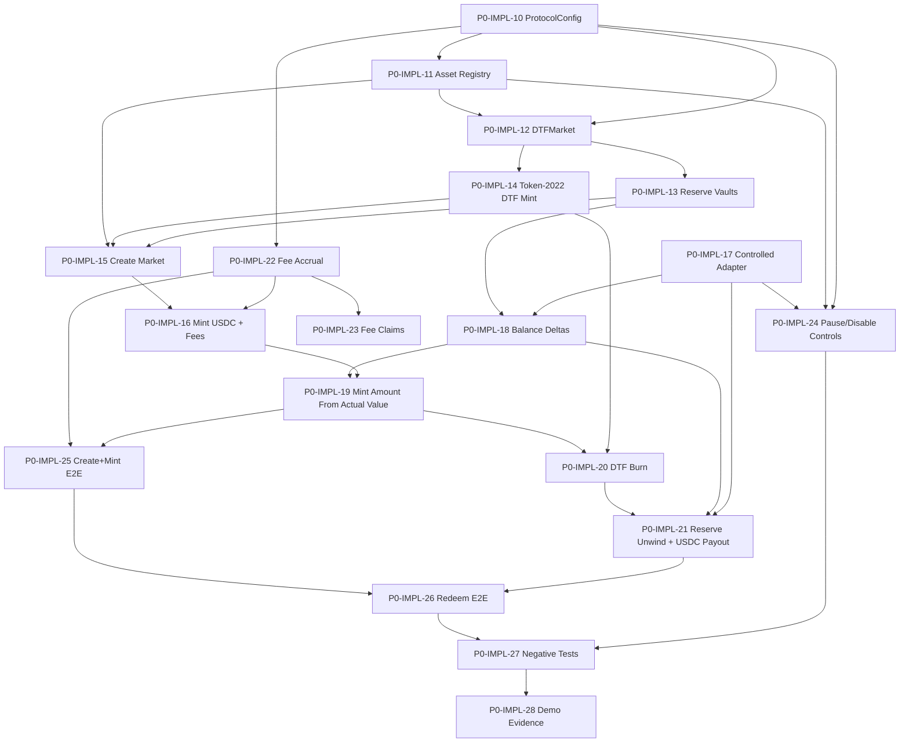

# P0 Axis Core Implementation Issue Map

## 1. Current Status

Axis Core P0 is past the initial foundation planning batch, but it is not yet implementation-complete.

The existing `axis_core` GitHub issue batch is:

| Issue | Scope | Status Interpretation |
|---|---|---|
| #1 `P0-CORE-00` | scaffold | Foundation task exists |
| #2 `P0-CORE-01` | CI | Foundation task exists |
| #3 `P0-TEST-02` | LiteSVM scaffold | Test foundation task exists |
| #4 `P0-TOKEN-03` | Token-2022 DTF mint/burn spike | Spike task exists |
| #5 `P0-SPEC-04` | account model proposal | Spec task exists |
| #6 `P0-SPEC-05` | instruction surface proposal | Spec task exists |
| #7 `P0-ROUTE-06` | ApprovedRoute model proposal | Spec task exists |
| #8 `P0-FEE-07` | fee accounting proposal | Spec task exists |
| #9 `P0-CPI-08` | controlled adapter test path | Test/spike task exists |
| #10 `P0-DOCS-09` | legacy pattern extraction | Research task exists |

These issues are mostly scaffold, spec, spike, and research work. The next batch should convert the accepted requirement areas into parent implementation issues, then break the active milestones into smaller executable leaf issues.

P0 Core must not be interpreted as full mainnet readiness. P0 proves the reserve-backed DTF lifecycle in deterministic local/integration tests, likely using a controlled adapter. Production venue readiness, public launch readiness, secondary-market product readiness, and auction/ClearCorrection readiness remain separate gates.

This map synthesizes `requirements/00-requirements-overview.md` through `requirements/19-axis-core-implementation-rfc.md`, with the traceability matrix used as the requirement-to-implementation bridge. The modified `requirements/20-stocktoken-xstocks-raydium-execution-requirements.md` file was not changed by this planning task.

## 2. What Is Already Done

- Requirement documents define the protocol boundary, DTF market model, mint/redeem behavior, CPI execution model, pricing/NAV assumptions, asset policy, admin controls, fee model, integration boundary, validation plan, and auction boundary.
- The traceability matrix maps core requirement areas to implementation surfaces.
- The implementation RFC establishes the new `axis-core` repository direction, contract-first scope, Pinocchio/no_std stack direction, and P0/P1/P2 split.
- The initial GitHub issue batch covers repository setup, CI, LiteSVM scaffold, Token-2022 spike, account/instruction/route/fee proposals, controlled adapter planning, and legacy safety-pattern extraction.
- The documents consistently reject backend/app state, quotes, target weights, and legacy client-submitted accounting as protocol truth.
- The documents consistently define auction, ClearCorrection, and Axis-controlled JIT liquidity as P2/research/v1.1 unless explicitly reopened.

## 3. What Is Missing

- Implemented ProtocolConfig state and initialization.
- Implemented asset registry, asset policy flags, and supported asset validation.
- Implemented DTFMarket account, PDA conventions, and DTF market status model.
- Implemented reserve vault creation and validation.
- Implemented Token-2022 DTF mint authority wiring and supply validation.
- Implemented `create_market`.
- Implemented USDC-side mint entry, fee separation, controlled execution, reserve delta validation, and DTF mint amount calculation.
- Implemented DTF burn, reserve unwind, actual USDC output validation, and USDC payout.
- Implemented creator/protocol fee accrual and explicit fee claim paths.
- Implemented pause, asset disable, route disable, and exit-only controls.
- Deterministic LiteSVM tests proving create_market, mint, redeem, fee separation, balance deltas, rollback behavior, and negative cases.
- Demo evidence package showing contract-level proof for Devnet/Titan review without claiming production Titan integration.

## 4. P0 Core MVP Definition

P0 Core MVP is:

- initialize protocol config
- define supported assets
- create DTF market
- create / validate reserve vaults
- initialize or connect Token-2022 DTF mint authority
- USDC-side mint entry
- fee separation from reserve/NAV
- approved controlled execution path
- actual reserve balance delta validation
- DTF mint based on actual reserve value
- DTF burn on redeem
- reserve unwind through controlled path
- USDC payout
- pause / emergency controls
- deterministic LiteSVM tests

P0 may use a controlled adapter to prove accounting and transaction behavior. That does not satisfy production Orca/Raydium readiness.

## 5. Devnet / Titan Demo Definition

The minimal Devnet / Titan partner-demo proof is contract-level evidence, not production integration:

- GitHub repo with clean Axis Core implementation
- deterministic tests showing create_market / mint / redeem
- reserve vault balances before/after
- DTF Token-2022 mint/burn evidence
- fee reserve separation evidence
- controlled adapter execution evidence
- known limitations clearly documented

Titan is a distribution/routing partner narrative. The demo does not require Titan integration inside Axis Core, and it must not imply that Titan is the required mint/redeem execution venue.

## 6. Explicit Non-Goals

- Do not write contract code from this planning task.
- Do not modify the `axis_core` implementation repository from this planning task.
- Do not create GitHub issues directly from this planning task.
- Do not port the legacy Axis product model into Axis Core.
- Do not require direct multi-asset basket deposit/withdraw for P0 Core.
- Do not use target weights as protocol reserve truth.
- Do not use DTF-denominated treasury fees for v1 P0.
- Do not use an internal total_supply mirror as protocol truth when the mint supply can be validated.
- Do not authorize execution from opaque Jupiter route bytes.
- Do not use raw legacy SPL Token account parsing patterns where modern typed validation is needed.
- Do not treat controlled adapter success as production venue readiness.
- Do not claim public Devnet, Devnet/Titan demo, or controlled-adapter tests prove mainnet readiness.
- Do not make backend, app, database, quote, or route-plan values protocol truth.
- Do not count fees as reserves or NAV backing.

## 7. Legacy Contract Boundary

Legacy Axis contracts are reference-only. They may inform safety patterns such as:

- PDA-owned custody
- PDA re-derivation
- pause / emergency controls
- actual pre/post vault balance delta checks
- post-CPI source-drain bounds
- controlled malicious-adapter testing

Legacy product-model code should not be reused directly. The new Axis Core is USDC-in, reserve-backed DTF minting, DTF burn, reserve unwind, and USDC-out. The legacy direct basket deposit/withdraw model, target-weight mint accounting, Jupiter route authorization, and PFDA/auction assumptions are outside the P0 Core implementation path.

## 8. Auction Boundary

P0 Core does not block on auction, ClearCorrection, Axis-controlled JIT liquidity, or LVR capture.

Auction remains important, but belongs to P2 / research / v1.1 design track unless explicitly reopened.

Axis Core should remain architecturally compatible with future auction/JIT activation, but compatibility is not activation. A DTF market is not auction-enabled, JIT-enabled, or LVR-mitigated unless the separate Axis Auction Program path is explicitly implemented, validated, and activated for that market.

## 9. Milestones

| Milestone | Issues | Goal |
|---|---:|---|
| M1 Protocol State Foundation | P0-IMPL-10 to P0-IMPL-14 | Protocol config, asset registry, market account, vault PDA model, Token-2022 authority |
| M2 Market Creation | P0-IMPL-15 | End-to-end `create_market` with market/vault/mint validation |
| M3 Mint Lifecycle | P0-IMPL-16 to P0-IMPL-19 | USDC intake, fee separation, controlled execution, balance deltas, DTF mint amount |
| M4 Redeem Lifecycle | P0-IMPL-20 to P0-IMPL-21 | DTF burn, pro-rata unwind, controlled execution, actual USDC payout |
| M5 Fees and Safety Controls | P0-IMPL-22 to P0-IMPL-24 | Fee accrual, explicit fee claims, pause/disable controls |
| M6 Validation and Demo Evidence | P0-IMPL-25 to P0-IMPL-28 | LiteSVM happy paths, negative paths, Devnet/Titan evidence package |

## 10. Proposed Issue Map

`P0-IMPL-10` through `P0-IMPL-28` are parent / epic issues. They define implementation areas and review boundaries, but they are not intended to be the full leaf-level implementation backlog.

| Parent Issue | Title | Primary Scope | Suggested Owner | Depends On |
|---|---|---|---|---|
| P0-IMPL-10 | Implement ProtocolConfig account and initialize instruction | Protocol config, authorities, fee config seed values | Toby, ADP review | #1, #5, #6, #8 |
| P0-IMPL-11 | Implement supported asset registry and asset config state | Asset registry, policy flags, execution limits | Toby, ADP review | P0-IMPL-10 |
| P0-IMPL-12 | Implement DTFMarket account and PDA derivation | Market account, status, creator/fee fields, PDA rules | Toby, ADP review | P0-IMPL-10, P0-IMPL-11 |
| P0-IMPL-13 | Implement reserve vault PDA creation and validation | Reserve vault PDA authority and token-account checks | Toby | P0-IMPL-12 |
| P0-IMPL-14 | Wire Token-2022 DTF mint authority and supply validation | DTF mint authority, mint/burn wiring, supply validation | Toby, ADP review | #4, P0-IMPL-12 |
| P0-IMPL-15 | Implement create_market instruction | Market validation, weights, assets, vaults, DTF mint | Toby, ADP review | P0-IMPL-11 to P0-IMPL-14 |
| P0-IMPL-16 | Implement mint instruction USDC intake and fee separation | USDC input, net allocation, fee custody separation | Toby, ADP review | P0-IMPL-15, P0-IMPL-22 |
| P0-IMPL-17 | Implement controlled adapter execution interface | Approved controlled test adapter path | Toby | #7, #9, P0-IMPL-11 |
| P0-IMPL-18 | Implement pre/post reserve balance delta validation | Actual reserve and USDC delta accounting helper/path | Toby | P0-IMPL-13, P0-IMPL-17 |
| P0-IMPL-19 | Implement DTF mint amount calculation from actual reserve value | Pricing/NAV framework and DTF mint amount | ADP, Toby implementation | P0-IMPL-16, P0-IMPL-18 |
| P0-IMPL-20 | Implement redeem DTF burn path | Redeem share, pre-redeem supply, DTF burn | Toby, ADP review | P0-IMPL-14, P0-IMPL-19 |
| P0-IMPL-21 | Implement reserve unwind and USDC payout path | Approved unwind route, min_usdc_out, actual USDC payout | Toby | P0-IMPL-17, P0-IMPL-18, P0-IMPL-20 |
| P0-IMPL-22 | Implement creator/protocol fee accrual state | Fee state, fee vault, mint accrual, zero redeem fee | ADP, Toby implementation | #8, P0-IMPL-10, P0-IMPL-12 |
| P0-IMPL-23 | Implement fee claim instruction | Claim creator/protocol fee without touching reserves | Toby, ADP review | P0-IMPL-22 |
| P0-IMPL-24 | Implement pause, asset disable, and route disable controls | Pause and emergency exit-only controls | Toby, ADP review | P0-IMPL-10, P0-IMPL-11, P0-IMPL-17 |
| P0-IMPL-25 | Add end-to-end LiteSVM create_market + mint test | Deterministic happy path with balances and fees | Toby | P0-IMPL-15 to P0-IMPL-19, P0-IMPL-22 |
| P0-IMPL-26 | Add end-to-end LiteSVM redeem test | Deterministic redeem with DTF burn and USDC payout | Toby | P0-IMPL-20, P0-IMPL-21, P0-IMPL-25 |
| P0-IMPL-27 | Add negative tests for wrong vault / wrong route / unauthorized signer | Failure and rollback coverage | Toby | P0-IMPL-24 to P0-IMPL-26 |
| P0-IMPL-28 | Add Devnet/Titan demo evidence script and README | Contract-level demo evidence and limitations | Toby, Muse review | P0-IMPL-25 to P0-IMPL-27 |

Parent issue draft files are stored in `docs/issues/axis-core/p0-implementation/`.

The first executable leaf backlog is stored in `docs/issues/axis-core/p0-leaf-m1-m3/` and expands only M1, M2, and M3.

## 11. Dependency Graph

## 12. Owner Map

Default owner assumptions:

- Toby: scaffold, CI, tests, LiteSVM, Token-2022 validation, implementation-heavy tasks.
- ADP: account model, instruction surface, ApprovedRoute, fee accounting, protocol design-heavy tasks.
- Muse: final review, product/protocol decision owner, Titan demo scope, launch boundary, auction boundary.

| Owner | Primary Responsibilities In This Batch |
|---|---|
| Toby | Implement state/instruction/test issues, wire Token-2022, build controlled adapter path, produce LiteSVM and demo evidence |
| ADP | Review ProtocolConfig, asset policy, DTFMarket, route model, fee model, mint/redeem accounting formulas |
| Muse | Confirm P0 scope, Devnet/Titan demo boundary, launch non-claims, auction/ClearCorrection deferral |

## 13. First 7-Day Execution Plan

Day 1:
- Close or approve the spec outputs from #5, #6, #7, and #8 enough to unblock implementation naming and account layout.
- Start P0-IMPL-10 and P0-IMPL-11.

Day 2:
- Complete ProtocolConfig initialization and asset registry state skeleton.
- Start DTFMarket account and PDA derivation.

Day 3:
- Implement reserve vault validation and Token-2022 DTF mint authority wiring.
- Confirm whether DTF mint is created by Axis Core or validated as an externally initialized Token-2022 mint for P0.

Day 4:
- Implement create_market happy path and validation failures for asset count, duplicate assets, weight sum, max weight, and disabled creation.

Day 5:
- Implement USDC mint entry, mint fee separation, fee accrual state, controlled adapter interface, and balance delta helpers.

Day 6:
- Implement actual-added-value mint amount path and begin end-to-end LiteSVM create_market + mint test.

Day 7:
- Stabilize mint E2E, enumerate redeem blockers, and prepare a short review memo for ADP/Muse covering exact unresolved math/layout questions.

## 14. Risks and Blockers

- Exact account layouts and instruction account ordering still require engineering review.
- Token-2022 extension set and whether Axis creates or validates the DTF mint must be finalized.
- Fixed-point representation, decimals normalization, rounding, and dust handling are unresolved and affect mint/redeem formulas.
- PricingSourceRegistry depth for P0 is not fully specified. P0 may need a constrained ManualFixedPrice path for deterministic tests while preserving the production pricing boundary.
- ApprovedRoute account granularity is still open: route-based, asset-pair-based, venue-based, or pool-based.
- Fee custody layout and claim authorization need final review before implementation.
- Controlled adapter validates Core accounting but must be labeled as non-production.
- Production venue readiness remains blocked until Orca Whirlpool and Raydium CPMM CPI paths are validated separately.
- Public Devnet is optional. A Devnet/Titan demo must not become a proxy for mainnet readiness.
- Auction/ClearCorrection/JIT scope may distract from P0 unless Muse keeps the boundary explicit.

## 15. Review Checklist

- Does every issue reference requirement IDs or requirement areas?
- Does the issue map start after the existing GitHub issue batch?
- Are `P0-IMPL-10` through `P0-IMPL-28` treated as parent / epic issues, not the complete leaf backlog?
- Are only M1-M3 expanded into immediate leaf issues?
- Does P0 prove create_market, mint, redeem, fee separation, and actual balance deltas?
- Does the map avoid treating target weights, quotes, app/backend state, or route plans as protocol truth?
- Does the map avoid treating fees as reserves or NAV backing?
- Does the map avoid treating controlled adapters as production venue readiness?
- Does the map preserve public Devnet as optional?
- Does the map define Devnet/Titan evidence as contract-level proof rather than Titan integration inside Axis Core?
- Does the map keep production Orca/Raydium readiness outside P0 Core while still acknowledging it as a mainnet launch gate?
- Does the map keep auction, ClearCorrection, and Axis-controlled JIT liquidity out of P0 Core blockers?
- Does the map clearly separate Toby, ADP, and Muse responsibilities?
- Are open engineering questions captured rather than hidden inside implementation issues?

## 16. Parent vs Leaf Issue Strategy

`P0-IMPL-10` through `P0-IMPL-28` are parent / epic issues. They are useful for grouping related work, preserving requirement traceability, assigning review ownership, and giving Toby / ADP / Muse a readable implementation roadmap.

Implementation work should happen through smaller leaf issues. A parent issue should be considered complete only after its leaf issues are implemented, tested, reviewed, and any parent-level acceptance criteria are satisfied.

Only M1-M3 are expanded immediately:

- M1 Protocol State Foundation
- M2 Market Creation
- M3 Mint Lifecycle

M4-M6 remain parent issues until the mint path is stable. Redeem, fee claims, pause/disable controls, broader LiteSVM negative tests, and Devnet/Titan demo evidence should be expanded after create_market and mint accounting have proven stable enough that downstream issue boundaries are not churned by account-layout or math changes.

The expected total P0 issue count is likely 50+ once M4-M6 are expanded. The current M1-M3 leaf expansion adds the first executable backlog without pretending that the parent issue map is complete enough for all implementation work.

Scope boundaries still apply:

- Controlled adapter work proves local P0 accounting behavior only, not production venue readiness.
- Titan demo evidence remains contract-level partner proof, not Titan integration inside Axis Core.
- Auction, ClearCorrection, and Axis-controlled JIT liquidity remain non-blocking P2 / research / v1.1 scope unless explicitly reopened.
- Backend/app state, route plans, quotes, and target weights are not protocol accounting truth.
- Fees are not reserves and are excluded from NAV backing.
- Production Orca/Raydium readiness is not part of M1-M3 leaf execution.
