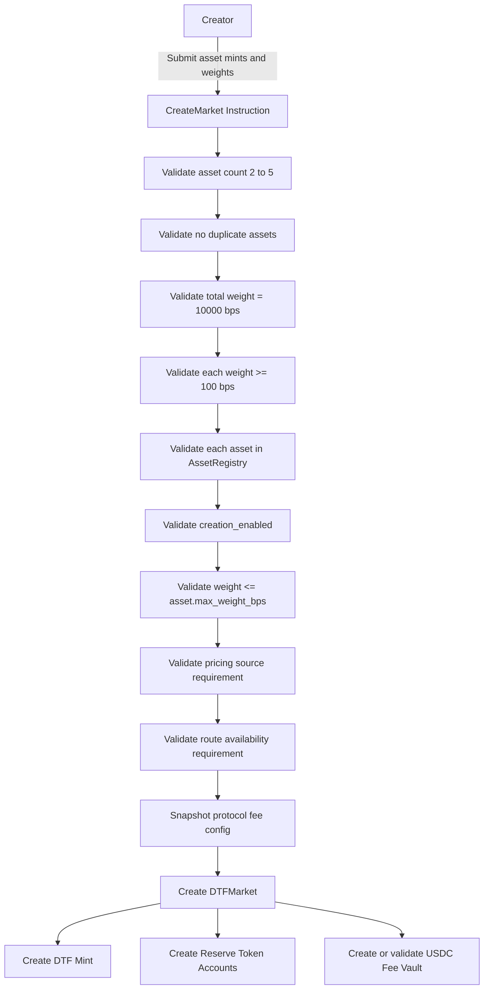
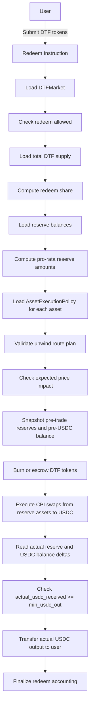
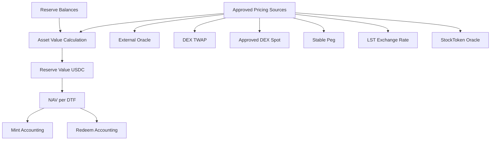
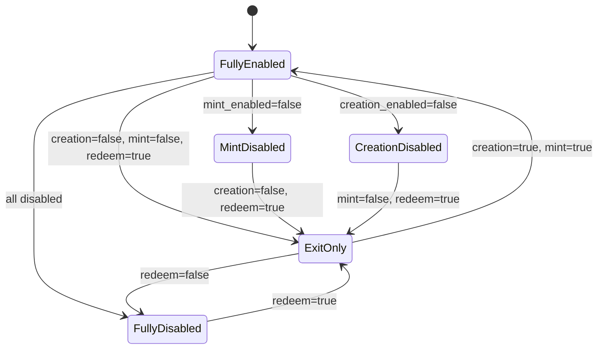
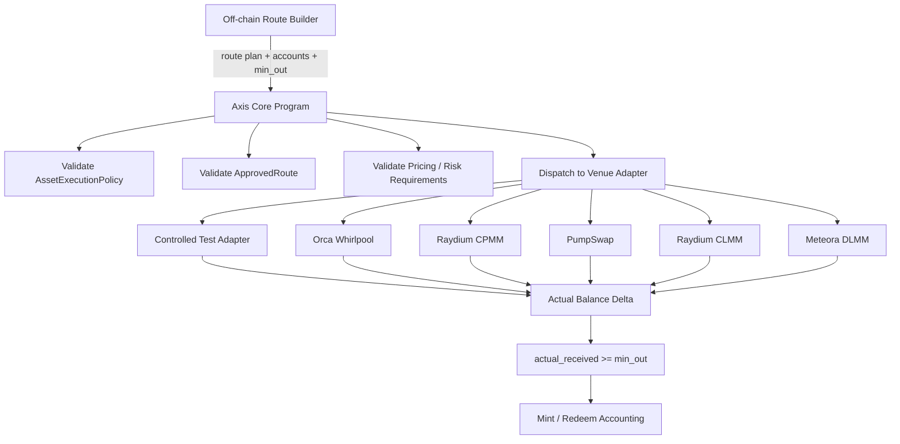
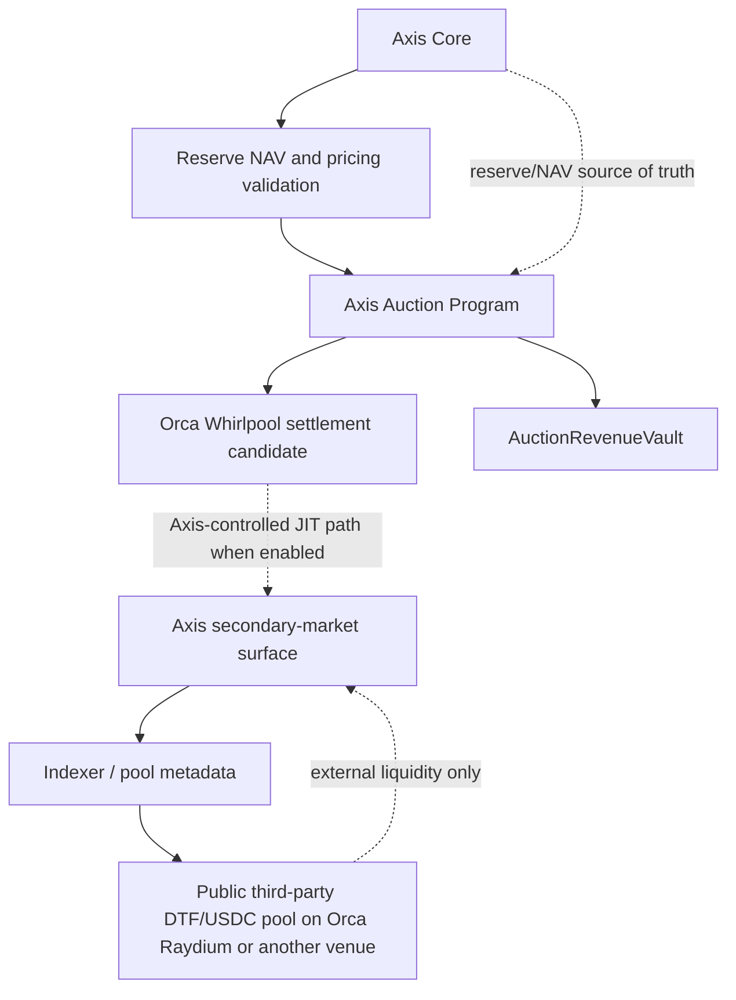
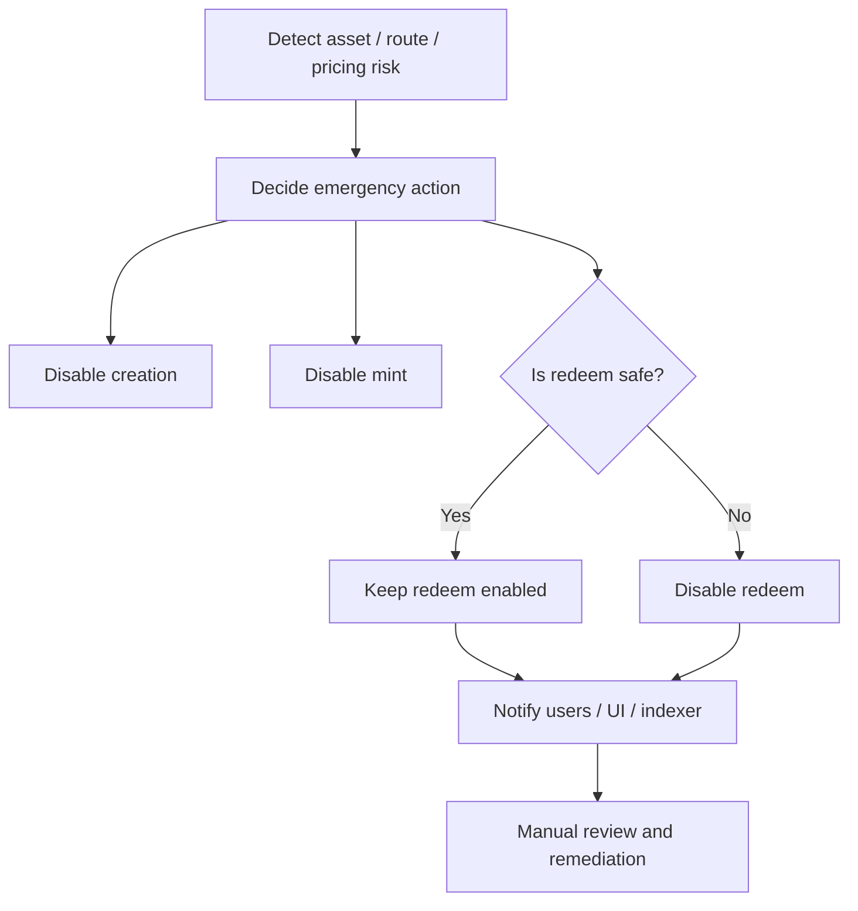

# Axis v1 統合マスター仕様書（Requirements & Implementation RFC）

> **目的**: 本書は `requirements/00` 〜 `requirements/19` の各要件ドキュメントを統合し、Axis v1 の全体像を社内エンジニアリングレビューおよび GitHub issue 化のために、日本語で読みやすく整理したマスター仕様である。
>
> **本書の位置づけ**: 各要件ドキュメントが一次情報（source of truth）であり、本書はそれらを要約・整理したものである。数値・要件ID・式・安全制約が個別ドキュメントと食い違う場合は、各 `requirements/NN-*.md` を正とする。
>
> **重要な約束**: 本書は新しいプロトコル決定や新機能を導入しない。確定事項（Confirmed）・提案（Proposal）・検証必須（Validation Required）・未解決（Open Question）を明確に区別する。

## 凡例（ステータス表記）

| 表記 | 意味 |
|---|---|
| **確定 (Confirmed)** | 合意済みの決定事項。実装の前提とする。 |
| **提案 (Proposal)** | 推奨方向だがエンジニアリングレビューが必要。 |
| **検証必須 (Validation Required)** | 実装/テスト/mainnet-fork 等で検証してから採用。 |
| **未解決 (Open Question)** | 未決定。default を勝手に設定しない。 |

主要な英語技術用語（DTF, Axis Core, ApprovedRoute, PricingSource, NAV, CPI, Token-2022, Surfpool, LVR, ClearCorrection, Role A/B/C など）は、明確さのため英語のまま用いる。

---

## 目次

1. [Executive Summary](#1-executive-summary)
2. [Axis v1の目的](#2-axis-v1の目的)
3. [DTFの定義](#3-dtfの定義)
4. [Confirmed Decisions（確定事項一覧）](#4-confirmed-decisions確定事項一覧)
5. [Axis Coreの責任範囲](#5-axis-coreの責任範囲)
6. [DTF Market要件](#6-dtf-market要件)
7. [Mint要件](#7-mint要件)
8. [Redeem要件](#8-redeem要件)
9. [Pricing / NAV要件](#9-pricing--nav要件)
10. [Execution Policy / Risk Controls](#10-execution-policy--risk-controls)
11. [Asset Universe](#11-asset-universe)
12. [Fee Model](#12-fee-model)
13. [Production Venue Integration](#13-production-venue-integration)
14. [App / Backend / Route Builder Boundary](#14-app--backend--route-builder-boundary)
15. [Secondary Market / ClearCorrection / Auction Scope](#15-secondary-market--clearcorrection--auction-scope)
16. [Admin / Safety](#16-admin--safety)
17. [Pre-mainnet Validation](#17-pre-mainnet-validation)
18. [Non-functional Requirements](#18-non-functional-requirements)
19. [Axis Core Implementation RFC](#19-axis-core-implementation-rfc)
20. [Traceability Matrix](#20-traceability-matrix)
21. [Open Questions / Engineering Review Items](#21-open-questions--engineering-review-items)

---

## 1. Executive Summary

Axis v1 は、Solana 上の **オープンな reserve-backed DTF プロトコル**である。ユーザーは USDC で DTF を mint し、Axis Core が承認された venue への CPI swap を通じて裏付け資産（reserve assets）を構成し、program 管理下の reserve vault に保管する。redeem 時には DTF を burn し、reserve を USDC に unwind してユーザーへ返す。

**Axis v1 の中核的な性質（確定）:**

- DTF は 2〜5 資産のバスケットを actual reserve assets で裏付ける position token である。
- mint/redeem の入出力は USDC。会計の真実（accounting truth）は常に **on-chain の actual balance delta** であり、quote/estimate ではない。
- mint/redeem は **all-or-nothing**。失敗時は fee を accrue せず、DTF を mint/burn しない。
- Fee model は v1 launch から必須: `mint_fee_bps = 100`、`redeem_fee_bps = 0`、creator/protocol = 40%/60%、claim-based accrual、fee custody は reserve custody と分離。
- mainnet 到達には **2つの production venue path**（Orca Whirlpool + Raydium CPMM fallback）の検証が必要。controlled adapter はテスト専用で mainnet readiness には不十分。
- **public Devnet は必須の validation path ではない**。readiness は検証エビデンスに基づく（local / LiteSVM / local validator / mainnet-fork / venue CPI / app smoke / guarded mainnet）。

**スコープ境界として特に重要（確定）:**

- **backend / frontend / DB / route builder は protocol truth ではない**。Axis Core の on-chain 検証が唯一の権威。
- 第三者が作る public DTF/USDC pool は **external liquidity** であり、Axis-native liquidity ではない。Axis は LVR mitigation を主張しない。
- **Auction / ClearCorrection / Axis-controlled JIT liquidity は P0 ブロッカーではない**。Axis Core とは別プログラム（Axis Auction Program）であり、technical spike と per-market activation gate で別途ゲートされる。launch-day に必須なのは「secondary-market surface（提示面）」であって native liquidity の本番有効化ではない。

実装方針（RFC, doc 19）では、新規リポジトリ `axis-core` を Rust + Pinocchio/no_std で構築し、Token-2022 を DTF mint の既定候補とし、Surfpool による mainnet-fork 検証を行う。Auction/ClearCorrection/JIT は P2（spike/v1.1/research）に置く。

---

## 2. Axis v1の目的

> **この章で決まっていること**: プロダクト目標（USDCで2〜5資産のDTFをcreate/mint/hold/redeem）、プロトコル目標（open・reserve-backed・deterministic accounting・controlled execution・外部routerに非依存）。
> **この章で未確定なこと**: 初期 mainnet の asset universe 範囲、初期ローンチ形態（invite-only / partner-only / public）。
> **実装時にレビューが必要なこと**: 3〜5資産の execution feasibility（2資産ライフサイクル安定後に検証可）。

出典: [`00-requirements-overview.md`](../requirements/00-requirements-overview.md)

### 2.1 プロダクト目標（確定）

ユーザーが以下を行えること:

```txt
1. 2〜5資産のDTFを作成する
2. target weightsを定義する
3. USDCでDTFをmintする
4. Axisが裏付け資産をCPI swapで構成する
5. DTFトークンを保有する
6. DTFをUSDCにredeemする
```

### 2.2 プロトコル目標（確定）

```txt
- open
- reserve-backed
- deterministic in accounting
- controlled in execution
- per-asset / per-transaction limits の下で安全
- 外部routerから独立
- 将来のrouter統合と互換
```

外部システム（route discovery, quote building, account assembly, UI価格, distribution/routing, public pool流動性, secondary-market indexing）は補助に使えるが、**Axis Core の会計に必須であってはならない**。

### 2.3 実装フェーズ（確定／一部 検証・提案）

Phase 0（docs/design freeze）〜 Phase 8（guarded mainnet candidate）が定義されている。要点:

- **Phase 1**: 最小の reserve-backed DTF ライフサイクルを deterministic local/integration test で証明。**2資産DTFのend-to-endは必須**、3〜5資産はaccount構造をサポート。**mock accountingは不可、実トークン移動と actual balance delta 検証が必須**。
- **Phase 2**: local validator / LiteSVM / mainnet-fork で mixed decimals・min_out失敗・disabled asset/route・paused/emergency・all-or-nothing を検証。compute/account 使用量を測定。
- **Phase 3**: mainnet前に production venue path を検証（SDKがrouteをquoteできるだけでは不十分）。
- **Phase 5（提案/spike）**: Axis-controlled JIT settlement の technical spike（Orca Whirlpool想定、single-transaction優先、Jito bundleはfallbackのみ）。**8月ローンチのブロッカーではない**。
- **Phase 8**: guarded mainnet candidate。既知ブロッカーは「解決」または「明示的に受容」。

---

## 3. DTFの定義

> **この章で決まっていること**: DTF = Dex Traded Fund。actual reserve assets で裏付けられた tradable position token。
> **この章で未確定なこと**: なし（定義は確定）。
> **実装時にレビューが必要なこと**: なし。

出典: [`01-definitions-and-decision-log.md`](../requirements/01-definitions-and-decision-log.md) §1

**DTF（Dex Traded Fund）**は、creator が定義した target position に対応する裏付け資産（actual underlying reserve assets）を持ち、その資産価値と周辺の market design に基づいて売買される position token である。

- 日本語定義: 「DTFは、作成者が定義した目標ポジションに対応する裏側資産を持ち、その資産価値と市場設計に基づいて売買されるポジショントークンである。」
- 拒否されたモデル（確定）: USDC-only reserve wrapper による synthetic exposure。Axis の DTF reserve は **構成に対応する実資産そのもの**を保有する。

---

## 4. Confirmed Decisions（確定事項一覧）

> **この章で決まっていること**: decision log（`01`）および各要件docの確定事項の集約。すべて 確定。
> **この章で未確定なこと**: 本章には未確定事項を含めない（未確定は §21 に集約）。
> **実装時にレビューが必要なこと**: 個別の式・account layout は §19 / §21 を参照。

出典: [`01-definitions-and-decision-log.md`](../requirements/01-definitions-and-decision-log.md) §1–§28、および各要件doc

### 4.1 構成・会計の基本定数

| 項目 | 値 | 出典 |
|---|---|---|
| `min_assets_per_dtf` | 2 | 01 §6 |
| `max_assets_per_dtf` | 5 | 01 §6 |
| `total_weight_bps` | 10000 | 02 DTF-004 |
| `global_min_weight_bps` | 100（=1%） | 01 §11 |
| `hard_min_allocation_usdc` | 1 USDC | 01 §10 |
| `initial_nav` | 1 USDC（`total_supply == 0` 時） | 01 §9 |
| `market_tvl_cap` | none（市場TVL上限を設けない） | 01 §4 |

### 4.2 Fee Model（確定）

| 項目 | 値 |
|---|---|
| `mint_fee_bps` | 100 |
| `redeem_fee_bps` | 0 |
| `creator_share_bps` | 4000 |
| `protocol_share_bps` | 6000 |
| `max_mint_fee_bps` | 300 |
| `max_redeem_fee_bps` | 0 |

Fee invariants（要約）: fee は USDC 側で徴収 / mint fee は reserve composition の前に控除 / redeem に明示的 exit fee なし / creator・protocol fee は **mint時のみ** accrue / **claim-based**（即時送金しない） / creator は per-market で bps を変更不可 / market fee config は作成後 immutable / fee custody は reserve custody と分離 / accrued fee は NAV と reserve backing に含めない。

### 4.3 実行・venue（確定）

- mint入力 = USDC、redeem出力 = USDC（01 §8）。
- target weights は意図、**actual reserve balances が会計価値**。NAV を target weights だけで計算してはならない（01 §7）。
- Risk control は **per-asset / per-transaction** policy で行い、market TVL cap は使わない（01 §12）。
- off-chain = route discovery / account assembly、on-chain = execution / verification（01 §13）。
- 最初の CPI spike 候補は **Orca Whirlpool**（01 §14）。adapter ベース。
- Jupiter の route availability ≠ Axis CPI readiness（01 §15）。
- mainnet readiness には **2つの production venue path**（Orca Whirlpool + Raydium CPMM fallback）が必要。
- **public Devnet は必須でない**（01 §20）。

### 4.4 Secondary market / Auction の境界（確定された境界・スコープ）

decision log §21–§28 で確定している「境界」は本書 §15 で詳述する。要点:

- §21: launch-day から secondary-market surface を提供する（ただし全market で native auction/JIT を本番有効化することは要件ではない）。
- §22: public 第三者 DTF/USDC pool は **external liquidity**。index は可、reserve/会計には含めない。
- §23: Axis-native LVR mitigation は **Axis-controlled auction/JIT settlement を使う市場のみ**に適用。DTFトークンやpairの一般属性ではない。
- §24: native JIT の preferred research path は **Orca上の Axis-controlled JIT**、最初の settlement venue 候補は Orca Whirlpool。
- §25: 全DTF marketは architecturally compatible だが、**compatibility ≠ activation**。activation は per-market の gate 通過後のみ。
- §26: ClearCorrection / NAV Correction Auction は **別プログラム（Axis Auction Program）**。Axis Core が reserve/NAV/会計の権威。
- §27: ClearCorrection の settlement は **single-transaction優先**、Jito bundle は条件付きfallbackのみ。
- §28: auction revenue は reserve・NAV・mint/redeem fee と分離（`AuctionRevenueVault` 等）。

---

## 5. Axis Coreの責任範囲

> **この章で決まっていること**: Axis Core が担う on-chain責務と、Coreが担わない範囲（投資助言・off-chain真実・auction winner選定など）。Titan境界。
> **この章で未確定なこと**: Auction Programとの最終的なinstruction/account境界（§15・§19参照）。
> **実装時にレビューが必要なこと**: PricingSourceRegistry の P0 実装範囲、ApprovedRoute 検証モデル。

出典: [`00`](../requirements/00-requirements-overview.md)、[`01`](../requirements/01-definitions-and-decision-log.md) §2/§3/§26、[`19`](../requirements/19-axis-core-implementation-rfc.md) §9

### 5.1 Axis Core が責任を持つもの（確定）

```txt
- DTF market creation
- DTF mint lifecycle（USDC intake → 構成 → DTF mint）
- reserve custody / reserve accounting
- redeem execution（DTF burn → reserve unwind → USDC payout）
- pricing source validation
- NAV calculation
- execution policy validation
- approved CPI route validation
- fee accrual / creator・protocol fee split
- balance delta validation
- pause / admin controls
```

### 5.2 Axis Core が責任を持たないもの（確定）

```txt
- 投資助言 / 収益保証
- frontend portfolio表示の真実性
- off-chain metadata / DB analytics の真実性
- public pool価格の保証
- auction winner選定（v1）
- ClearCorrection（P0には含めない）
- external pool への LVR保護
```

### 5.3 Titan境界（確定）

```txt
Axis Core = issuance, mint, redeem, reserves, accounting
Titan     = routing, distribution, external route layer
```

決定: **「Axis First. Titan Compatible. Controlled Execution.」** Titanが未統合でも Axis は独立して動作しなければならない。Titan統合は Axis Core のスコープ外。

---

## 6. DTF Market要件

> **この章で決まっていること**: market構造（creator, DTF mint, 2〜5資産, weights, reserve accounts, fee config, status）、作成時バリデーション（DTF-001..017）。
> **この章で未確定なこと**: 市場レベルの SetFee instruction は v1 に存在しない（将来specがあれば別）。
> **実装時にレビューが必要なこと**: reserve account の derivation、DTF mint authority model、fee vault の derivation/検証。

出典: [`02-dtf-market-requirements.md`](../requirements/02-dtf-market-requirements.md)

### 6.1 要件サマリ（確定: DTF-001 〜 DTF-017）

| ID | 内容 |
|---|---|
| DTF-001 | 最低2資産（`asset_count >= 2`） |
| DTF-002 | 最大5資産（`asset_count <= 5`） |
| DTF-003 | 重複資産禁止 |
| DTF-004 | weight合計 = 10000 bps |
| DTF-005 | 各weight >= 100 bps |
| DTF-006 | 各weight <= `asset.max_weight_bps` |
| DTF-007 | 各資産は AssetRegistry に存在 |
| DTF-008 | 各資産は `creation_enabled == true` |
| DTF-009 | market-level TVL cap は要求しない |
| DTF-010 | 資産ごとに Axis 管理の reserve token account |
| DTF-011 | market ごとに一意の DTF mint（Axis管理authority） |
| DTF-012 | status: `Created / Active / Paused / Deprecated` |
| DTF-013 | creator・fee state を保持（creator, creator_fee_destination, mint/redeem fee bps, creator/protocol share） |
| DTF-014 | fee config は protocol config から導出（creatorはカスタム不可） |
| DTF-015 | fee config は作成後 immutable |
| DTF-016 | accrued fee（creator/protocol）を追跡。reserves/NAV には含めない |
| DTF-017 | fee custody は reserve custody と分離 |

### 6.2 Market作成ワークフロー（fee config snapshot を含む）



### 6.3 落としてはならない安全制約

- fee config は creator がカスタム不可・作成後 immutable（DTF-014/015）。
- accrued fee は reserves でも NAV でもない（DTF-016）。
- fee custody は reserve custody と厳密に分離。fee claim は reserve balance を変えない（DTF-017）。

---

## 7. Mint要件

> **この章で決まっていること**: mint会計チェーン（gross → fee → net → CPI → actual delta → added value → minted_dtf）、MINT-001..019。
> **この章で未確定なこと**: なし（式・不変条件は確定）。
> **実装時にレビューが必要なこと**: 初期NAV/初期supplyの扱い、rounding/dust、pre-trade NAV snapshotの実装。

出典: [`03-mint-requirements.md`](../requirements/03-mint-requirements.md)

### 7.1 中核ルール（確定）

> **DTF mint量は net actual reserve value に基づく。gross user input でも quote でもない。** 会計の真実は actual reserve balance delta。

### 7.2 Mint会計チェーン（確定）

```txt
mint_fee_usdc            = gross_user_usdc_in × mint_fee_bps / 10000
net_usdc_for_composition = gross_user_usdc_in - mint_fee_usdc
creator_fee_usdc         = mint_fee_usdc × creator_share_bps / 10000
protocol_fee_usdc        = mint_fee_usdc - creator_fee_usdc
asset_allocation_usdc_i  = net_usdc_for_composition × weight_bps_i / 10000
actual_received_i        = post_reserve_balance_i - pre_reserve_balance_i
actual_added_value_usdc  = Σ(actual_received_asset_i × approved_price_i)
minted_dtf               = actual_added_value_usdc / pre_trade_nav
```

v1 launch定数: `mint_fee_bps = 100`、`creator_share_bps = 4000`、`protocol_share_bps = 6000`、`initial_nav = 1 USDC`。
例: 1000 USDC mint → fee 10（creator 4 / protocol 6）、net 990 で構成。

### 7.3 要件サマリ（確定: MINT-001 〜 MINT-019）

主要点: USDC入力必須（001）/ market status検証（002）/ 配分前にfee控除（003）/ **allocationはnetから計算**（004）/ 各net allocation >= 1 USDC（005）/ <= max_trade_usdc（006）/ mint_enabled必須（007）/ approved route（008）/ **min_out を actual received に対して強制**（009）/ **balance deltaで実受領を測定**（010）/ minted_dtfはactual added value（011）/ supply 0 なら initial NAV=1（012）/ reserve変更前に pre-trade NAV を snapshot（013）/ **all-or-nothing**（014）/ pricing source検証（015）/ price impact検証（016）/ creator・protocol fee を accrue（017）/ fee と reserve の分離維持（018）/ event/log出力（019）。

### 7.4 Mintワークフロー

```mermaid
flowchart TD
    User[User] -->|Deposit USDC| Mint[Mint Instruction]
    Mint --> Market[Load DTFMarket]
    Market --> Status[Check market active]
    Status --> FeeConfig[Load market fee config]
    FeeConfig --> Gross[Measure gross user USDC input]
    Gross --> MintFee[Calculate mint fee]
    MintFee --> NetUSDC[Compute net USDC for composition]
    NetUSDC --> Weights[Load market target weights]
    Weights --> Policy[Load AssetExecutionPolicy for each asset]
    Policy --> Allocation[Compute net USDC allocation per asset]
    Allocation --> MinAlloc[Check allocation >= 1 USDC]
    MinAlloc --> MaxTrade[Check allocation <= max_trade_usdc]
    MaxTrade --> RoutePlan[Validate route plan]
    RoutePlan --> PriceImpact[Check expected price impact]
    PriceImpact --> PricingSource[Validate pricing sources]
    PricingSource --> PreState[Snapshot pre-trade reserves and pre-trade NAV]
    PreState --> FeeCustody[Move or retain mint fee in fee custody]
    FeeCustody --> CPI[Execute CPI swaps using net USDC]
    CPI --> Delta[Read actual reserve balance deltas]
    Delta --> MinOut[Check actual_received >= min_out]
    MinOut --> Pricing[Fetch approved prices]
    Pricing --> Value[Compute actual_added_value_usdc]
    Value --> FeeAccrual[Accrue creator and protocol fees]
    FeeAccrual --> MintDTF[Mint DTF tokens from actual added value]
    MintDTF --> User
```



### 7.5 落としてはならない安全制約

- fee は gross から計算、reserve構成は net のみ（003/004）。
- min_out / actual_added_value は **actual balance delta** から導出、quote不可（009/010/011）。
- reserve変更前に pre-trade NAV を snapshot、初回 NAV=1（012/013）。
- **all-or-nothing**: 失敗時は full revert。**failed mint は fee を accrue せず DTF を mint しない**（014）。

---

## 8. Redeem要件

> **この章で決まっていること**: `redeem_fee_bps = 0`、`user_usdc_out = actual_usdc_received`、min_usdc_out必須、REDEEM-001..019。
> **この章で未確定なこと**: paused/deprecated時のexit-only挙動は emergency policy 依存（条件分岐）。
> **実装時にレビューが必要なこと**: 決定論的rounding、reserve drain防止の実装。

出典: [`04-redeem-requirements.md`](../requirements/04-redeem-requirements.md)

### 8.1 中核ルール（確定）

v1定数: `redeem_fee_bps = 0`、`max_redeem_fee_bps = 0`。明示的 Axis exit fee なし。ただし real market execution を伴うため **min_usdc_out は必須**（execution spread は Axis fee ではない）。

```txt
redeem_share          = dtf_amount_in / total_supply_before
redeem_asset_amount_i = reserve_balance_i × redeem_share
actual_usdc_received  = post_usdc_balance - pre_usdc_balance
user_usdc_out         = actual_usdc_received      （redeem_fee_bps = 0）
```

### 8.2 要件サマリ（確定: REDEEM-001 〜 REDEEM-019）

主要点: market DTFトークン入力（001）/ status検証（002）/ **exit-only時もredeemを維持**（003）/ pre-redeem supplyから share計算（004）/ pro-rata reserve量（005）/ reserve account検証（006）/ redeem_enabled（007）/ approved unwind route（008）/ **min_usdc_out強制**（009）/ **balance deltaで実USDC測定**（010）/ user_usdc_out = actual（011）/ **v1はcreator/protocol fee accrueなし**（012）/ execution spreadをfeeと混同しない（013）/ price impact検証（014）/ 必要箇所でpricing source検証（015）/ **all-or-nothing**（016）/ reserve会計維持（017）/ fee/reserve分離維持（018）/ event/log（019）。

### 8.3 Redeemワークフロー



### 8.4 落としてはならない安全制約

- v1は redeem fee 0、creator/protocol/exit fee の控除・accrueなし（011/012）。
- execution spread（venue spread/slippage/price impact）は **Axis fee ではない**（013）。
- redeem_share は pre-redeem supply から。ユーザーは pro-rata 以上を引き出せない（004/005/017）。
- **all-or-nothing**: 失敗時、DTFを恒久burnしない・reserveを恒久移動しない・USDCを渡さない（016）。

---

## 9. Pricing / NAV要件

> **この章で決まっていること**: NAVは actual reserve balances ベース、fee vault/accrued feeはNAVから除外、UI/quote価格は会計の真実でない、PRICE-001..013。
> **この章で未確定なこと**: なし（要件は直接記述）。
> **実装時にレビューが必要なこと**: PricingSource account定義、freshness/deviation checkの実装、LST/StableのPricing path。

出典: [`06-pricing-nav-requirements.md`](../requirements/06-pricing-nav-requirements.md)

### 9.1 NAV式（確定）

```txt
asset_value_usdc_i = reserve_balance_i × approved_price_i
reserve_value_usdc = Σ asset_value_usdc_i
nav_per_dtf        = reserve_value_usdc / total_dtf_supply
initial_nav        = 1 USDC                （supply == 0 時）

mint:   actual_added_value_usdc = Σ(actual_received_asset_i × approved_price_i)
        minted_dtf = actual_added_value_usdc / pre_trade_nav
redeem: actual_usdc_received = post_usdc_balance - pre_usdc_balance

deviation_bps = abs(execution_price - reference_price) / reference_price × 10000
require deviation_bps <= max_pricing_deviation_bps
```

### 9.2 要件サマリ（確定: PRICE-001 〜 PRICE-013）

- PRICE-001: NAVは actual reserve balances。**target weightsを使わない。accrued fee と fee vault は reserve value/NAV から除外**。
- PRICE-002: supply 0 で initial_nav = 1 USDC。
- PRICE-003/004: pricing source は資産別。Registry種別: `ExternalOracle, DexTwap, DexSpot, StablePeg, LstExchangeRate, StockTokenOracle`。
- PRICE-005: oracle freshness（`max_staleness_slots`）。stale は fail。
- PRICE-006: DEX spot は厳格cap（StockToken の spot-only は fail）。
- PRICE-007: StablePeg は depeg check。
- PRICE-008: LST = `lst_sol_exchange_rate × sol_usd_price`（stale は fail）。
- PRICE-009: StockToken は manual review 必須。
- PRICE-010: **UI price != accounting price**。
- PRICE-011: pricing deviation check。
- PRICE-012/013: mint は actual added value と pre-trade NAV、redeem は actual USDC delta。

Pricing Tiers: Oracle Required（stable/LST/StockToken/majors）、TWAP Allowed（meme blue-chip/mid-cap/一部DeFi）、Spot with Strict Caps（long-tail/experimental）、Disabled Until Pricing Source。

### 9.3 NAVワークフロー



### 9.4 落としてはならない安全制約

- NAVは actual reserve token account balances のみ。target weights禁止。
- accrued fee と fee vault/custody は NAV/reserve value から除外。
- UI/indexer/quote 価格は会計の最終ソースにならない。on-chain approved pricing source が支配。
- stale 価格（oracle, LST rate, SOL/USD）は fail、depegは fail、deviation超過は fail。

---

## 10. Execution Policy / Risk Controls

> **この章で決まっていること**: market TVL capなし、per-asset/per-tx policy、preset table、exit-only emergency mode、POLICY-001..012。
> **この章で未確定なこと**: なし（preset値は確定。資産ごとのoverrideは運用判断）。
> **実装時にレビューが必要なこと**: AssetExecutionPolicy account、preset定数、override処理、single mint max helper。

出典: [`07-execution-policy-risk-controls.md`](../requirements/07-execution-policy-risk-controls.md)

### 10.1 リスクモデル（確定）

`market_tvl_cap = none`。リスクは per-asset / per-transaction の AssetExecutionPolicy で制御。controls: composition rules, asset max weight, max trade per tx, max price impact, min_out, approved route, pricing deviation, actual balance delta check, asset flags。

### 10.2 Default Policy Presets（確定: POLICY-004）

| Category | max_trade_usdc | max_weight_bps | max_price_impact_bps |
|---|---|---|---|
| Core / Stable / LST | 50,000 | 10000 | 100 |
| Major / Blue-chip | 10,000 | 5000 | 200 |
| Volatile / Mid-cap | 1,000 | 2500 | 300 |
| Long-tail | 250 | 1000 | 500 |
| StockToken / Restricted | 1,000 | 2000 | 300 |

`hard_min_allocation_usdc = 1`（POLICY-003）。preset は資産ごとに override 可（POLICY-005）。

### 10.3 重要なポリシー（確定）

- POLICY-006: mint allocation は **net_usdc_for_composition** から計算（grossではない）。`1 USDC <= allocation <= max_trade_usdc`。
- POLICY-008: price impact/slippage/execution spread は execution-quality control であり **protocol fee ではない**。
- POLICY-008b: **min_out（mint）/ min_usdc_out（redeem）は必須**。actual balance delta に対して検証、未指定は fail、下回れば full revert。
- POLICY-009: `single_mint_max_usdc = min(asset.max_trade_usdc / asset.weight_fraction)`（例: 10% long-tail で max_trade 250 → 2,500 USDC）。
- POLICY-011: emergency exit-only mode（creation=false, mint=false, redeem=true, rebalance=false）。
- POLICY-012: venue は明示的 approve 必須、controlled adapter はテスト専用、mainnet は2 production venue path 必要。

### 10.4 Asset Policy State Machine



### 10.5 落としてはならない安全制約

- market TVL cap はないが、各 mint/redeem は必ず per-asset policy に制約される。
- min_out/min_usdc_out は必須、actual delta検証、下回れば full revert。
- execution spread を creator/protocol fee として記録しない。
- emergency exit-only は常に redeem を許可しつつ creation/mint/rebalance を停止。

---

## 11. Asset Universe

> **この章で決まっていること**: 500資産の curated universe（カテゴリ別配分）、readiness/route/pricing status、ASSET-001..009（flag独立）。
> **この章で未確定なこと**: `SPIKE_CANDIDATE`（旧 `DEVNET_SPIKE_CANDIDATE`）の最終status名。
> **実装時にレビューが必要なこと**: AssetRegistry schema、category/readiness/pricing tier enum、初期 universe の ingestion。

出典: [`08-asset-universe-requirements.md`](../requirements/08-asset-universe-requirements.md)

### 11.1 500資産 universe 配分（確定）

| Category | Count |
|---|---|
| Meme Blue-chip | 50 |
| Meme Mid-cap | 100 |
| Meme Long-tail | 150 |
| StockToken | 75 |
| Solana DeFi / Infra | 50 |
| AI / DePIN / Agent | 40 |
| Stable / LST / Yield | 25 |
| Experimental | 10 |
| **Total** | **500** |

選定軸: Narrative Value / Execution Feasibility / Safety・Legibility。これは「流動性上位500」ではない。

### 11.2 要件サマリ（確定: ASSET-001 〜 ASSET-009）

- ASSET-002: universe 収録 ≠ launch-ready execution。
- ASSET-003: readiness status: `LAUNCH_READY, SPIKE_CANDIDATE, ROUTE_REQUIRED, PRICING_REQUIRED, MINT_REQUIRED, OPEN_SLOT, DEFERRED`。
- ASSET-004: route status: `READY, SPIKE_REQUIRED, JUPITER_ONLY, NO_ROUTE, UNKNOWN`。**route readiness と pricing readiness は別チェック**。`JUPITER_ONLY` は quote はあるが Axis承認CPI route 未整備で、generic quote availability を venue/CPI readiness と同一視しない（cf. EXEC-012）。
- ASSET-005: pricing tier: `ORACLE_REQUIRED, TWAP_ALLOWED, SPOT_WITH_STRICT_CAPS, DISABLED_UNTIL_PRICING_SOURCE`。
- ASSET-006: StockToken は manual review 必須。
- ASSET-007: Experimental は厳格な execution limit。
- ASSET-009: **execution flags は独立**。`creation_enabled / mint_enabled / redeem_enabled` は別個。**mint無効化が自動でredeem無効化を意味しない**。exit-only（creation=false, mint=false, redeem=true）をサポート。

### 11.3 落としてはならない安全制約

- exit-only mode（redeemを安全な限り維持）をサポート。mint無効化が自動でredeem無効化にならない（ASSET-009）。

---

## 12. Fee Model

> **この章で決まっていること**: 正確なfee定数、mint/redeem fee式、claim-based accrual、fee custody分離、NAV除外、FEE-001..018。
> **この章で未確定なこと**: fee custody の account layout（per-market vs shared）、claim instruction名（ClaimCreatorFee/ClaimProtocolFee は「相当」）、rounding規則、creator_fee_destinationのgovernance更新可否。
> **実装時にレビューが必要なこと**: ProtocolFeeConfig/MarketFeeState の最終フィールド、fee accrual account構造、event/log形式。

出典: [`13-fee-model-requirements.md`](../requirements/13-fee-model-requirements.md)

### 12.1 確定 fee model（確定）

```txt
mint_fee_bps       = 100   （1% mint fee）
redeem_fee_bps     = 0     （明示的Axis exit feeなし）
creator_share_bps  = 4000  （mint fee の40%がcreator）
protocol_share_bps = 6000  （mint fee の60%がprotocol）
max_mint_fee_bps   = 300   （mint fee cap 3%）
max_redeem_fee_bps = 0     （v1のredeem fee cap）
```

不変条件: `mint_fee_bps <= max_mint_fee_bps` / `redeem_fee_bps <= max_redeem_fee_bps` / `creator_share_bps + protocol_share_bps == 10000` / `FeeVault != ReserveAccount` / fee は reserve value・NAV に含めない / fee 会計は over-mint を起こさない・既存holderのbackingを減らさない。

### 12.2 Mint fee / Redeem fee 式（確定）

```txt
# mint
mint_fee_usdc            = user_usdc_in × mint_fee_bps / 10000
net_usdc_for_composition = user_usdc_in - mint_fee_usdc
creator_fee_usdc         = mint_fee_usdc × creator_share_bps / 10000
protocol_fee_usdc        = mint_fee_usdc - creator_fee_usdc
minted_dtf               = actual_added_value_usdc / pre_trade_nav

# redeem（v1）
redeem_fee_usdc = 0
user_usdc_out   = actual_usdc_received      （require actual_usdc_received >= min_usdc_out）
```

### 12.3 Claim-based accrual と custody（確定）

- fee は mint/redeem 中に即時送金しない。mint時に `creator_fee_usdc → accrued_creator_fee_usdc`、`protocol_fee_usdc → accrued_protocol_fee_usdc`。redeem では accrue なし。
- accrued fee は USDC建て、明示的 instruction（`ClaimCreatorFee` / `ClaimProtocolFee` 等）で claim。double claim 不可。claim失敗は reserve会計に影響しない。
- 推奨 v1 model: per-market USDC fee vault + market-level の accrued カウンタ。`FeeVault != ReserveAccount`。fee vault は reserve value/NAV/DTF backing に含めない。

### 12.4 提案された struct（提案/レビュー: フィールドは最終確定でない）

```rust
pub struct ProtocolFeeConfig {
    pub mint_fee_bps: u16,
    pub redeem_fee_bps: u16,
    pub creator_share_bps: u16,
    pub protocol_share_bps: u16,
    pub max_mint_fee_bps: u16,
    pub max_redeem_fee_bps: u16,
    pub protocol_treasury: Pubkey,
}

pub struct MarketFeeState {
    pub creator: Pubkey,
    pub creator_fee_destination: Pubkey,
    pub mint_fee_bps: u16,
    pub redeem_fee_bps: u16,
    pub creator_share_bps: u16,
    pub protocol_share_bps: u16,
    pub accrued_creator_fee_usdc: u64,
    pub accrued_protocol_fee_usdc: u64,
}
```

作成後 immutable: `creator, mint_fee_bps, redeem_fee_bps, creator_share_bps, protocol_share_bps`（`creator_fee_destination` も v1 は immutable 想定、別途 governance 規則がある場合を除く）。

### 12.5 要件サマリ（確定: FEE-001 〜 FEE-018）

creator fee は first-class（001）/ creator address保持（002）/ creator_fee_destination保持（003）/ creatorはbpsカスタム不可（004）/ 作成後immutable（005）/ mint feeはgross USDCから（006）/ composition前に控除（007）/ minted DTFはnet actual reserve value（008）/ redeem明示feeなし（009）/ redeemもmin_usdc_out等の保護（010）/ share合計10000（011）/ caps遵守（012）/ claim-based（013）/ creator claim明示（014）/ protocol claim明示（015）/ custody分離（016）/ reserve/NAV会計を壊さない（017）/ test coverage（018）。

### 12.6 落としてはならない安全制約

- share合計 == 10000、caps遵守、作成後immutable、creatorカスタム不可。
- fee は claim-based、即時送金しない、double claim不可、authorized claimerのみ。
- `FeeVault != ReserveAccount`、fee は reserve value/NAV/backing から除外。
- mint は net actual reserve value のみ。fee は actual_added_value_usdc から除外。over-mintを起こさない。
- app は execution spread を Axis protocol fee として表示しない。

---

## 13. Production Venue Integration

> **この章で決まっていること**: mainnetは2つのproduction venue path（Orca Whirlpool + Raydium CPMM fallback）必須、Role A/B/C区別、controlled adapterはテスト専用、5資産mint/redeem検証、EXEC-001..021 / VENUE-001..024。
> **この章で未確定なこと**: 最初の2つを超えるvenue候補、PumpSwapの正式launch gate昇格可否とタイミング、SOL中間routeの将来採否。
> **実装時にレビューが必要なこと**: Orca/Raydium の account validation checklist、compute/account/tx-size 測定、adapter dispatch interface。

出典: [`05-swap-cpi-execution-requirements.md`](../requirements/05-swap-cpi-execution-requirements.md)、[`14-production-venue-integration-requirements.md`](../requirements/14-production-venue-integration-requirements.md)

### 13.1 off-chain / on-chain 境界（確定）

```txt
Route discovery / quote / account assembly = off-chain
Execution / verification / accounting       = on-chain
```

Axis Core は off-chain quote を会計の真実として信用しない。CPI後に actual token balance delta を検証する。

### 13.2 Venue Roles（確定）

- **Role A**: mint/redeem の underlying execution venue（ApprovedRoute で reserve を構成/unwind）。
- **Role B**: Axis-controlled JIT liquidity / ClearCorrection の secondary settlement venue（Axis Auction Program 用、market固有のnative-liquidity config が activate された後のみ）。
- **Role C**: external public secondary-liquidity venue。

現在の分類: Orca = Role A 第1候補 + Role B 第1 spike 候補。Raydium CPMM = Role A fallback + Role C の可能性。**Role A の成功は Role B の readiness を意味しない**。public 第三者 pool は同じ venue を使っていても Role B ではない。

### 13.3 2つの production venue（確定）

```txt
1. Orca Whirlpool   （第1 production candidate）
2. Raydium CPMM     （fallback）
```

mainnet前に **少なくとも2つの Role A production path** を検証（単一 venue 依存を避ける）。Role A priority: `1. Orca Whirlpool → 2. Raydium CPMM fallback → 3. PumpSwap → 4. Raydium CLMM → 5. Meteora DLMM`。後者3つは将来候補で第1 launch gate ではない。

### 13.4 controlled adapter（確定）

controlled adapter は Axis Core 不変条件（CPI動作、実SPL移動、balance delta測定、min_out強制、失敗revert）の検証に使えるが、**mainnet readiness には不十分**。production venue adapter が launch execution readiness を検証する。

### 13.5 主要要件（確定）

- EXEC-001..014: approved venue/route のみ実行、input/output mint・pool・direction検証、min_out提供・検証、**balance deltaで会計**、route複雑度制限（split routing禁止・1資産1route・direct優先）、Jupiter quote≠CPI readiness、controlled adapterはtest専用。
- EXEC-015/016/017: 2 production venue（Orca SwapV2 / Raydium CPMM）検証。compute/account/Token-2022/invalid-account失敗を含む。
- EXEC-019: adapter interface `execute_swap(direction, input_mint, output_mint, amount_in, min_out, route_accounts, venue_specific_data) -> actual_received`。
- EXEC-020: all-or-nothing。
- **EXEC-021（spike）**: Role B secondary settlement の feasibility は別 spike。Orca が第1 Role B 候補。Role A 成功を Role B readiness と見なさない。
- VENUE-001..024: 上記をvenue統合観点で具体化。特に **VENUE-011（Token-2022互換検証）**、**VENUE-017（5資産 mint/redeem を mainnet前に検証）**、VENUE-021（execution spread は fee でない）、**VENUE-024**（Role B は Role A/C と別ゲート、Orca第1候補、single-tx優先・Jito条件付き）。

### 13.6 Adapter Architecture



### 13.7 落としてはならない安全制約

- on-chain で actual balance delta を検証。quote は会計の真実にならない。
- 未承認 venue/route・誤 pool・誤 mint・誤 direction は reject。
- min_out/min_usdc_out を actual delta に対して強制。all-or-nothing。
- execution spread を creator/protocol fee として記録しない。
- **Role A 成功 ≠ Role B readiness**。public 第三者 pool に Axis-native LVR mitigation を主張しない。Jito fallback は ordered atomic execution と non-winner interception 防止の実証が前提。

---

## 14. App / Backend / Route Builder Boundary

> **この章で決まっていること**: backend/route-builderはoff-chainの計画層であり protocol truth ではない。Axis Coreが会計の権威。APPIF-001..021 / RBA-001..040。
> **この章で未確定なこと**: 正確なendpoint/JSON schema/TypeScript型/DB schema/AWS構成/認証モデル/失敗コード体系（doc 16で deferred）。
> **実装時にレビューが必要なこと**: route plan API、Orca/Raydium account assembly、secondary-market read/index、quote freshness、smoke test。

出典: [`15-app-contract-interface-requirements.md`](../requirements/15-app-contract-interface-requirements.md)（APPIF-*）、[`16-route-builder-backend-api-requirements.md`](../requirements/16-route-builder-backend-api-requirements.md)（RBA-*）

### 14.1 中核原則（確定）

- **backend/frontend/DB/route-builder は protocol truth ではない**。Axis Core が source of truth: market/asset-policy/approved-route/venue-account 検証、CPI実行、min_out/min_usdc_out 強制、actual balance delta 検証、mint/redeem/fee会計、reserve custody、`actual_added_value_usdc`・minted DTF・`actual_usdc_received` の確定。
- backend の出力（quote, route plan, account list, min_out提案）は **advisory input**。on-chain 検証をバイパスできない。
- backend route builder は DTF v1 の route/transaction planning の canonical 層（RBA-034）。frontend planner は reference/legacy のみ。

### 14.2 App↔Contract インターフェース（確定: APPIF-001..021）

- APPIF-001/002/004: Axis Core を会計の真実とし、backend提供値（venue accounts含む）を on-chain で再検証。
- APPIF-005: CreateMarket は 2〜5資産、weight合計10000、重複拒否、creator_fee_destination提供、**creatorはfee bpsカスタム不可**。
- APPIF-007: mint会計フロー `gross_user_usdc_in -> mint_fee_usdc -> net_usdc_for_composition -> CPI -> actual reserve balance deltas -> actual_added_value_usdc -> minted_dtf = actual_added_value_usdc / pre_trade_nav`。最終 minted DTF を真実として渡さない。
- APPIF-009: redeem会計 `redeem_fee_bps = 0`、`user_usdc_out = actual_usdc_received`。最終USDCを真実として渡さない。
- APPIF-011: fee state を reserve state と別に読む。fee は NAV/backing でない。
- APPIF-013: 初期 venue は Orca Whirlpool + Raydium CPMM、PumpSwap は将来高優先。単一 venue を前提にしない。
- APPIF-015: min_out/min_usdc_out。未指定は on-chain fail。
- APPIF-019: **mainnet-fork または cloned-account テスト**で Orca/Raydium path を検証（注: doc 15/16 は "Surfpool" の語を使わず "mainnet-fork or cloned-account" と表現。Surfpool は doc 19 のRFCで言及）。
- APPIF-020: public Devnet を必須としない。
- APPIF-021: 投資助言を前提にしない（DTFはtokenized basket market）。

### 14.3 Route Builder Backend（確定: RBA-* の要点）

- RBA-001/008/026/032/036: quote は advisory のみ。off-chain storage は protocol truth でない。failed planning は off-chain failure で on-chain 状態変化を含意しない。
- RBA-005: 初版APIは構造化された route/transaction plan を返す（unsigned VersionedTransaction は将来/任意）。
- RBA-009/010/011/014: v1は direct USDC route 優先。mint plan は gross→fee→net→per-asset allocation/route/min_out。redeem plan は dtf_amount→share→per-asset unwind/min_usdc_out。
- RBA-012/013/016/017: mint/redeem は atomic。非atomicな route は `unsupported` として返す（multi-tx分割しない）。
- RBA-020..023: venue非依存の上位plan + venue固有payload。初期 Orca + Raydium CPMM、PumpSwap は将来（設計でブロックしない）。
- **RBA-037..040（secondary-market indexing）**:
  - RBA-037: 既知の external DTF/USDC pool を read/index データとして返す（venue, pool address, DTF mint, USDC mint, verification status 必須）。各結果は **external liquidity と明示分類**。
  - RBA-038: read API は external public liquidity と「明示的にactiveなAxis-native auction/JIT」を区別。**external pool に Axis LVR-mitigation を主張しない**。architecturally-compatibleだがinactiveな market は `inactive`（not enabled）として報告。
  - RBA-039: activation/ClearCorrection の status は read-only かつ evidence-based（indexed event / 検証済on-chain stateのみ）。
  - RBA-040: **route builder は auction authority を持たない**。winner選定・correction right付与・Core/Auction Program検証のバイパス不可。

### 14.4 落としてはならない安全制約

- off-chain は会計の真実にならない。Axis Core が actual balance delta で確定。
- quote は advisory。quote availability ≠ execution readiness ≠ ApprovedRoute readiness。
- ApprovedRoute は protocol/admin所有。backendは参照のみ。
- atomicity は非交渉。非atomic route は unsupported。multi-tx fallback禁止。
- **external pool は Axis-native / LVR-mitigated と表示しない**。inactive market を enabled と表示しない。
- route builder は auction authority を持たない。min_out/min_usdc_out は on-chain強制。

---

## 15. Secondary Market / ClearCorrection / Auction Scope

> **この章で決まっていること**: launch-dayに必須なのは secondary-market surface（提示面）のみ。external pool は external liquidity（Axis-nativeでない、LVR主張なし、NAVでない、Core correctnessに影響しない）。SECONDARY-001..008。
> **この章で未確定なこと（提案/spike/open）**: Axis-controlled JIT liquidity・ClearCorrection・Axis Auction Program は **P0ブロッカーではなく**、technical spike と per-market activation gate で別途ゲート。AUCTION-001..019 は提案・spike scope。閾値/correction size/auction期間/bid形式/revenue配分は configurable/TBD。
> **実装時にレビューが必要なこと（）**: Orca JIT spike、single-tx atomicity と resource測定、pricing/route support、winner/interception/replay safety、auction revenue分離。

出典: [`17-auction-and-lvr-design-research.md`](../requirements/17-auction-and-lvr-design-research.md)（research）、[`18-secondary-market-and-clear-correction-requirements.md`](../requirements/18-secondary-market-and-clear-correction-requirements.md)（要件）、[`01`](../requirements/01-definitions-and-decision-log.md) §21–§28

### 15.1 スコープの大前提（確定された境界）

- **launch-day の必須要件は「secondary-market surface（discoverable な提示面 + 正確にラベルされた external pool 参照）」のみ**。production-grade な Axis-controlled JIT liquidity / ClearCorrection / Axis Auction Program は **8月ローンチのブロッカーではない**。
- 全DTF market は将来の native-liquidity activation と architecturally compatible だが、**compatibility ≠ activation**。market は applicable な activation gate をすべて通過するまで auction/JIT enabled ではない。
- doc 17 §8 の重要な可能性: spike の結果、launch surface が **external-only のまま**で native research が継続する結末もありうる。これを「確定した native-liquidity v1 機能」として提示してはならない。

### 15.2 Secondary-Market Surface 要件（確定: SECONDARY-001..008）

- SECONDARY-001: DTF を Axis 運営 surface で discoverable に（市場identity/token mint、status、reserve/NAV context を secondary-pool 価格と明確に区別、external vs Axis-native auction-enabled の label、canonical/share URL + partner metadata）。
- SECONDARY-002: partner/sponsor distribution をサポート（ただし partner に Core/reserve/NAV/auction の制御を与えない）。
- SECONDARY-003: external pool は DTF mint/USDC mint/venue/pool address を検証後に index/表示可。ただし native承認・reserve化・CPI承認・流動性/価格/LVR保証にはならない。
- SECONDARY-004: external liquidity を正確に label。public pool を LVR-mitigated / auction-enabled / reserve-backed / Axis-controlled と暗示しない。
- SECONDARY-005: public pool 作成は permissionless（Coreの許可不要）。index の選択性は external status を変えない。
- SECONDARY-006: **external pool 価格は NAV ではない**。Pricing Source Registry / Core pricing validation を置換しない。
- SECONDARY-007: external pool に native LVR claim なし。
- SECONDARY-008: **external pool の障害は Core correctness に影響しない**（reserve会計・DTF supply・NAV・mint/redeem eligibility・primary-flow route validity を変えない）。

### 15.3 Auction / ClearCorrection（提案 / spike: AUCTION-001..019）

提案された境界（decision log §26 で確定済の「別プログラム」原則を含む）:

- AUCTION-001/002: 全market は architecturally compatible。activation は明示的・per-market。inactive は app/indexer で観測可能で native LVR claim を生まない。
- AUCTION-003/004: native settlement の第1候補は Orca Whirlpool。Axis が correction path を制御してはじめて "Axis-native"（public pool 単体では不十分）。
- AUCTION-005/006/007: **Axis Core が primary accounting authority**。ClearCorrection は Auction Program 所属。Auction Program は reserve を保持せず・NAVを変えず・auction revenue を reserve と見なさず・Core検証をバイパスしない。revenue は `AuctionRevenueVault` 等で分離（layout/recipients/split は configurable/TBD、reserve・NAV から常に除外）。
- AUCTION-008/009/010/011: ClearCorrection は winner-authorized かつ bounded。**single-transaction settlement 優先**。Jito は single-tx 不可能かつ ordered atomic execution・non-winner interception 防止・安全な失敗挙動が実証された場合のみの constrained fallback。correction が mint/redeem を経由する場合も Core の検証（ApprovedRoute, pricing, min-out, balance-delta, reserve, fee）を維持。
- AUCTION-012/013/014: activation gate は必須かつ market-specific。gate 未通過 market も有効な reserve-backed DTF（ただし native LVR-mitigated とは label しない）。native config は reversible に disable 可能（Core会計/exit を損なわない）。
- AUCTION-015..019（spike）: Orca JIT settlement、atomicity/resource測定、pricing/route support、authorization/interception、revenue separation の technical spike。これらが AUCTION-012 activation の前提。

### 15.4 Secondary-Market / Auction アーキテクチャ（doc 17 §3）



注（doc 17 §3）: index された external pool は、enabled な native-liquidity config の隣に表示されても external のまま。app/indexer はその区別を露出しなければならない。

### 15.5 落としてはならない安全制約

- **public/external pool を Axis-native liquidity として説明しない**（SECONDARY-003/004/007, AUCTION-004）。
- external pool 価格は NAV でない（SECONDARY-006）。external pool 障害は Core correctness に影響しない（SECONDARY-008）。
- **Axis Core が唯一/primary の accounting authority**（AUCTION-005）。Auction Program は reserve保持・NAV変更・revenue=reserve化・Core検証バイパスを行わない（AUCTION-006/011）。
- activation gate は必須・market-specific（AUCTION-002/012）。auction revenue は reserve/NAV から常に除外（AUCTION-007）。
- **Auction/ClearCorrection/JIT を P0 ブロッカーにしない**。Auction は別プログラム。

---

## 16. Admin / Safety

> **この章で決まっていること**: ProtocolConfig authorities、policy/route/pricing更新、market pause、exit-only優先のemergency flow、protocol fee config管理（caps遵守）。ADMIN-001..008。
> **この章で未確定なこと**: なし（運用フローは確定。governance主体は §17/§21の open に依存）。
> **実装時にレビューが必要なこと**: 各 admin instruction（SetAssetExecutionPolicy/Flags, Register/DisableApprovedRoute, SetPricingSource, Pause/Unpause）と authority検証、emergency test。

出典: [`09-admin-safety-requirements.md`](../requirements/09-admin-safety-requirements.md)

### 16.1 要件サマリ（確定: ADMIN-001..008）

- ADMIN-001: ProtocolConfig が authorities を定義（`authority, pause_authority, asset_registry_authority, route_registry_authority, pricing_registry_authority, protocol_treasury`）。
- ADMIN-002..005: asset policy / asset flags / approved route / pricing source を権限者のみ更新可（unauthorized は fail、更新は log/emit）。
- ADMIN-006: market pause（paused は mint をブロック、policy 次第で redeem 許可、unpause で復帰）。
- ADMIN-007: 危険資産対応は exit-only を優先（creation→mint を無効化、route/pricing が有効なら redeem 維持、rebalance 無効、redeem 自体が危険な場合のみ最後に redeem 無効）。
- ADMIN-008: **protocol-level fee config は権限者が caps の範囲で管理可**。market fee config は作成時に protocol config から導出され作成後 immutable。creator は per-market で bps カスタム不可。fee custody は reserve custody と分離。accrued fee は NAV 除外・reserve backing でない。unauthorized な fee 変更は fail。

### 16.2 Emergency ワークフロー



### 16.3 落としてはならない安全制約

- exit-only mode で redeem を維持（route/pricing が有効な限り）。redeem は redemption 自体が危険な場合のみ無効化（ADMIN-007）。
- fee custody と reserve custody は分離。accrued fee は NAV 除外・reserve backing でない（ADMIN-008）。

---

## 17. Pre-mainnet Validation

> **この章で決まっていること**: public Devnetは必須でない。validation strategy層、2 production venue必須、Separate Readiness Gates、PMV-001..017、mainnet launch gate checklist。
> **この章で未確定なこと（）**: 初期mainnet asset universe、初期guarded launch limits、初期approved route set、launch形態、app統合milestone、reserve/NAV表示source、監視/alert、upgrade authority/governance、audit時期、partner demo順序。
> **実装時にレビューが必要なこと（）**: 2 venue の venue CPI tests、5資産検証、mainnet-fork、guarded launch controls、JIT/ClearCorrection spike（activation時のみ）。

出典: [`12-pre-mainnet-validation-requirements.md`](../requirements/12-pre-mainnet-validation-requirements.md)

### 17.1 検証戦略（確定）

public Devnet は必須でない。readiness は **検証エビデンス**に基づく。層: deterministic unit / local integration / LiteSVM / local validator / mainnet-fork・cloned-account / venue CPI integration / app contract smoke / guarded mainnet preparation / documented evidence。

### 17.2 Separate Readiness Gates（確定: §5.7）

```txt
Core mainnet readiness
  reserve-backed DTF の create/mint/redeem/NAV/会計/fee/safety controls が検証済。

Launch-day secondary-market surface readiness
  DTF が secondary 用途で discoverable、external liquidity が正確に label済。

Production venue execution readiness
  Role A の Orca Whirlpool と Raydium CPMM の mint/redeem path が検証済。

Axis-controlled JIT liquidity spike readiness
  Orca Role B の technical spike が feasibility/safety evidence を産出（launch blocker ではない）。

Production ClearCorrection readiness（activate する場合のみ）
  market固有の Axis Auction Program config は、applicable gate 通過後にのみ activate 可。
```

### 17.3 要件サマリ（確定: PMV-001..017）

- PMV-001: public Devnet を mainnet readiness の必須gateにしない。
- PMV-002/003/004/005: core DTF lifecycle を証明。**会計は actual balance delta**（quote/target weights/UI estimate は真実でない）。mint は pre-trade NAV、redeem は `user_usdc_out = actual_usdc_received`・**redeem に creator/protocol fee accrue なし**。
- PMV-006: creator fee を実装・テスト。**fee は mint時のみ accrue、redeem ではなし**、claim-based。
- PMV-007: **2つの Role A venue（Orca + Raydium CPMM）を mainnet前に検証**。controlled adapter test は production readiness に不十分。
- PMV-008/009: 失敗ケース網羅、all-or-nothing。
- PMV-010/011: reserve backing 可観測、app contract接続検証。
- PMV-012: mainnet binary/source の traceability。
- PMV-013: guarded launch controls。
- PMV-014: partner demo を実検証 evidence で裏付け。
- **PMV-015**: secondary-market surface は launch gate。ただし production ClearCorrection / active JIT を per-market で要求しない。external liquidity を正確に label、**external public pool に LVR claim をしない**、inactive market を auction/JIT enabled と label しない。
- **PMV-016（spike）**: Axis-controlled JIT liquidity spike は native config activate 前の別evidence。**8月 launch のhard blocker ではない**。
- **PMV-017（条件付き）**: production ClearCorrection + Axis Auction Program は、Axis が明示的に JIT activate する market のみ必要。最小 launch には不要。

### 17.4 Mainnet Launch Gate（確定: 最小ゲート）

local/integration/fork tests pass / **2 production venue path（Orca + Raydium CPMM fallback）検証** / controlled adapter 単独は production readiness と見なさない / core create-mint-redeem 検証 / actual balance delta 会計検証 / reserve backing 可観測 / creator fee 実装・テスト / app contract 統合テスト / launch-day secondary-market surface（正確な external label 含む）検証 / guarded launch controls 構成 / deployment source・binary traceability / 既知ブロッカーの解決または明示受容 / launch checklist 完了。**production ClearCorrection / Auction Program activation は最小 launch 条件ではない**。

### 17.5 落としてはならない安全制約

- public Devnet は deterministic/fork/venue CPI/guarded controls の代替にならない。
- 会計の真実 = actual balance delta。all-or-nothing。min_out/min_usdc_out 必須。
- 2 production venue 必須、controlled adapter は production readiness でない。
- external liquidity を正確に label、external pool に LVR claim なし、inactive を JIT-enabled と label しない。
- auction/ClearCorrection revenue は reserve/NAV/fee と分離、authority は Core と分離。

---

## 18. Non-functional Requirements

> **この章で決まっていること**: security/compute/reliability/observability/upgrade/documentation の NFR。2 venue の compute測定、5資産テスト、balance delta/rollbackカバレッジ。
> **この章で未確定なこと**: なし（NFRは直接記述）。
> **実装時にレビューが必要なこと**: compute/account 測定の具体、log schema、upgrade経路。

出典: [`10-non-functional-requirements.md`](../requirements/10-non-functional-requirements.md)

### 18.1 要件サマリ（確定）

- **Security**: NFR-SEC-001 全account検証 / SEC-002 off-chain quoteを盲信しない（会計は actual balance delta） / SEC-003 CPI route allowlist / SEC-004 reserve は Axis管理 / SEC-005 mint authority は Axis管理。
- **Compute**: NFR-CU-001 **production venueごと（Orca + Raydium CPMM）に compute/account 測定** / CU-002 5資産DTF feasibility をテスト / CU-003 mainnet readiness は production venue test 必須（controlled adapter単独不可）。
- **Reliability**: NFR-REL-001 mint/redeem は all-or-nothing / REL-002 失敗swapは full revert / REL-003 min_out失敗は full revert / REL-004 **actual balance delta と rollback をテストでカバー**（failed mintはfee accrue/DTF mintせず、failed redeemはDTF恒久burn/reserve・USDC移動せず）。
- **Observability**: NFR-OBS-001 mint/redeem の主要data（market_id, user, gross input, mint_fee_usdc, creator/protocol fee, net_usdc_for_composition, allocations, actual received, NAV, minted/redeemed）をlog。**execution spread を Axis fee と区別**。
- **Upgrade**: NFR-UPG-001 policy/route を redeploy なしで更新 / UPG-002 asset universe を権限管理下で更新。
- **Documentation**: NFR-DOC-001 主要挙動は要件IDに対応 / DOC-002 issueは要件ID参照 / DOC-003 open question を解決まで追跡。

### 18.2 落としてはならない安全制約

- off-chain quote を盲信しない（会計は actual balance delta）。CPI は allowlist。reserve/mint authority は Axis 管理。
- all-or-nothing + full rollback。mainnet前に 2 venue の production CPI を測定・テスト。

---

## 19. Axis Core Implementation RFC

> **この章で決まっていること（Decision）**: 新規repo `axis-core`、Rust + Pinocchio/no_std、Surfpool での mainnet-fork 検証、contract-first スコープ、repo layout、product invariants。
> **この章で未確定なこと（Proposal / Open）**: Token-2022 の既定採用（提案・検証要）、account/instruction の最終仕様、P0でのPricingSourceRegistry範囲、ApprovedRouteのモデル、初回NAV/supply、rounding/dust。
> **実装時にレビューが必要なこと（Engineering Review）**: account layout、instruction account順序、mint/redeem式、NAV計算、decimals正規化、fee accrual account構造、Orca/Raydium CPI、compute/account/tx-size limits。

出典: [`19-axis-core-implementation-rfc.md`](../requirements/19-axis-core-implementation-rfc.md)

> 注: RFC（doc 19）は **実装戦略（how）であり最終 technical spec ではない**。Decision / Proposal / Validation Required / Open Question の4ラベルを用いる。本章では doc 19 が用いる account 概念名（`AssetConfig`, "fee accounting state", "reserve vault" 等）をそのまま記す。struct のフィールドや instruction handler 名は doc 19 では確定されておらず、本書でも確定として記載しない（捏造しない）。

### 19.1 製品モデルとリポジトリ（Decision）

Axis v1 = **USDC を入出力とする reserve-backed DTF プロトコル**。flow:

```txt
USDC in
→ approved venue execution
→ reserve assets held by program-controlled vaults
→ Token-2022 DTF token minted
→ DTF burned on redeem
→ reserve assets unwound
→ USDC out
```

既存 `axis-vault`（legacy ETF wrapper）の拡張ではなく、新規 clean repo `axis-core` を用いる。legacy repos は reference-only。

```txt
axis-core/
  programs/axis-core/            # 本番 on-chain program
  crates/axis-core-client/       # Rust client, instruction builders, account parsers
  crates/axis-core-test-utils/   # LiteSVM helpers, fixtures, mock token setup
  tests/                         # integration / scenario tests
  sdk/                           # TypeScript SDK or generated client
  docs/                          # 要件コピー, RFC, account/instruction model, testing plan
```

backend/app/DB は phase 1 では除外（contract-first）。

### 19.2 技術スタック（Decision / Proposal）

```txt
On-chain:  Rust · Pinocchio / no_std · SPL Token · Token-2022 · PDA-owned reserve accounts
Testing:   LiteSVM · local validator · Surfpool mainnet-fork · 後に小規模 mainnet smoke
Client/SDK: Rust client crate · TypeScript SDK
```

- **Rust + Pinocchio/no_std**（Decision）: compute/account 検証の細粒度制御、reserve会計・CPI検証・ApprovedRoute検証に適合。
- **Token-2022 を DTF mint の既定候補**（Proposal、検証要）: v1保守ポリシーとして metadata 系 extension は許容、transfer fee / transfer hook / permanent delegate / confidential transfer / interest-bearing / default-frozen は既定で回避。
- **Surfpool**（Decision、本書で唯一 Surfpool を明示する出典）: mainnet-fork 検証で Token-2022 mint 挙動、Orca/Raydium CPI、account layout/count、compute、tx size、venue account validation を検証。（注: doc 14/15 では同種の検証を "mainnet-fork or cloned-account tests" と表現しており Surfpool の語は使っていない。）

テスト層:

```txt
LiteSVM:         deterministic unit/integration, account layout, fee math, mint/redeem会計, failure path
Local validator: 基本 SPL/Token-2022 lifecycle, deploy flow, local integration
Surfpool:        mainnet-fork venue test, Orca/Raydium CPI, Token-2022互換, realistic account制約
Small mainnet smoke: 厳格 cap 下の最終 gated 検証
```

**public Devnet は必須の validation path ではない。**

### 19.3 account / instruction（概念のみ; レビュー要）

account 概念（doc 19 は struct フィールドを定義していない）: `ProtocolConfig`, `DTFMarket`, `AssetConfig`（asset registry / allowlist 概念）, `PricingSource` / `PricingSourceRegistry`, `ApprovedRoute`, program 管理 `reserve vault`, USDC vault/intake, `fee accounting state`（creator/protocol を分離、claim-based）, Token-2022 DTF mint, （P2のみ）`AuctionRevenueVault`。

> 補足: 要件doc側では `AssetRegistry` / `AssetExecutionPolicy` / `MarketFeeState` / `fee vault` という名称が使われる（doc 02/07/13）。RFC（doc 19）の `AssetConfig` / "fee accounting state" / "reserve vault" と概念的に対応するが、最終 struct 名・フィールドは Engineering Review 事項。

instruction は §9「Contract Responsibilities」として責務リストで示される（protocol初期化, market作成, Token-2022 mint作成/検証, reserve vault作成/検証, USDC intake, 構成, DTF mint/burn, reserve unwind, USDC payout, fee accrual, creator/protocol split, route validation, pricing/NAV validation framework, pause/admin, balance delta validation）。具体 handler 名（`InitializeProtocolConfig` 等）は "draft instruction surface" として未確定。

### 19.4 P0 / P1 / P2 スコープ（Decision）

- **P0（launch blocker）**: `axis-core` repo / Pinocchio program / Token-2022 DTF mint候補 / ProtocolConfig / DTFMarket / reserve vault custody / USDC mint・redeem / DTF mint/burn / creator・protocol mint fee model / fee と reserve/NAV の分離 / asset registry概念 / pricing source概念 / approved route概念 / **少なくとも1つの検証済 execution path** / actual balance delta検証 / min_out保護 / LiteSVM tests / Surfpool validation plan。
- **P1（near-term）**: Raydium fallback path / richer route validation / TypeScript SDK / app・backend統合docs / metadata・indexer設計 / secondary-market display surface / external pool indexing plan。
- **P2（spike / v1.1 / research）**: **Axis Auction Program / ClearCorrection / Axis-controlled JIT liquidity / Orca DTF/USDC secondary settlement spike / Jito bundle fallback research / AuctionRevenueVault** / DFlow・Titan 深掘り / advanced secondary-market設計。

### 19.5 Milestones（提案）

M0 Repository Scaffold → M1 Core Account/Instruction Proposal（ProtocolConfig/DTFMarket/AssetConfig/PricingSource/ApprovedRoute/fee accounting state/instruction surface の draft）→ M2 Token/Vault Foundation → M3 Mint/Redeem Accounting → M4 Venue/CPI Validation（controlled adapter, Orca CPI, Raydium互換, Surfpool, ApprovedRoute model）→ M5 P0 End-to-End。

### 19.6 Product Invariants（製品レベル確定: 12項目の要約）

USDC mint入口 / USDC redeem出口 / reserve-backed DTF token / program管理 reserve vault / mint量は estimate のみに依存しない（actual value added / balance delta） / redeem出力は actual USDC received（min_usdc_out 必須）/ fee は reserve・NAV会計を壊さない / **backend/route builder は on-chain検証をバイパスできない** / **public secondary pool は external liquidity（Axis-native LVR保護なし）** / **Auction/ClearCorrection/JIT は P0 でない** / Axis は投資助言でない / **DB/frontend は protocol truth でない**。

### 19.7 落としてはならない安全制約

- backend/frontend/DB は protocol truth でない。on-chain 検証が権威。
- public secondary pool は external liquidity（LVR保護なし）。Auction/ClearCorrection/JIT は P0 でない・別プログラム。
- mint量/redeem出力は actual balance delta ベース。fee は reserve/NAV を壊さない。
- struct フィールド・instruction handler を確定として実装に固定する前に Engineering Review（§19.3, §21）を通すこと。

---

## 20. Traceability Matrix

> **この章で決まっていること**: 要件area → 実装surface → issue blueprint の対応。Secondary Market（SECONDARY-001..008）と Axis Auction Program（AUCTION-001..019）の traceability。
> **この章で未確定なこと**: Fee model / Secondary market / Auction の issue blueprint は未作成（TODO）。VENUE-*/APP-*/BD-*/MAINNET-* は専用docを持たず（IDを捏造しない）。
> **実装時にレビューが必要なこと**: 各areaのissue化時に Requirement IDs / Design docs / Acceptance criteria / Out of scope / Test cases / Dependencies を付与。

出典: [`11-traceability-matrix.md`](../requirements/11-traceability-matrix.md)

### 20.1 メイン traceability（確定）

| Requirement Area | Requirement IDs | Implementation Surface | Issue Blueprint |
|---|---|---|---|
| Protocol config | AXIS-CORE, ADMIN | ProtocolConfig account | `01-protocol-config-and-registry-issues.md` |
| Asset registry | ASSET, POLICY | AssetRegistry, AssetExecutionPolicy | `01-protocol-config-and-registry-issues.md` |
| DTF market | DTF（incl. DTF-013..017 fee state） | DTFMarket, MarketAssetWeight, MarketFeeState, fee vault | `02-dtf-market-issues.md` |
| Mint | MINT（incl. MINT-003..018 net fee accounting） | Mint instruction, mint fee deduction/accrual | `03-mint-redeem-issues.md` |
| Redeem | REDEEM（incl. REDEEM-011..018 zero-fee） | Redeem instruction | `03-mint-redeem-issues.md` |
| Swap CPI | EXEC（incl. EXEC-015..017 two-venue readiness） | ApprovedRoute, VenueAdapter, Orca Whirlpool + Raydium CPMM paths | `04-swap-cpi-adapter-issues.md` |
| Pricing / NAV | PRICE | PricingSource, NAV calculator | `05-pricing-nav-issues.md` |
| Fee model | FEE | ProtocolFeeConfig, MarketFeeState, fee vault, fee claim instructions | **TODO: fee issue blueprint 未作成** |
| Pre-mainnet validation | PMV | Local / LiteSVM / fork tests, two-venue CPI tests, guarded launch controls | `06-testing-security-issues.md` |
| Admin / safety | ADMIN | SetPolicy, Pause, Route updates, protocol fee config (capped) | `06-testing-security-issues.md` |
| Testing | TEST, NFR | Unit/integration/property tests | `06-testing-security-issues.md` |
| Secondary market | SECONDARY-001..008 | Axis-operated discovery surface, external-pool indexing/labels | **TODO: secondary-market issue blueprint** |
| Axis Auction Program | AUCTION-001..019 | Proposed Auction Program, Orca JIT spike, ClearCorrection activation gates | **TODO: auction-program issue blueprint** |

### 20.2 Secondary Market / Auction traceability（確定: 抜粋）

| Requirement ID | Implementation surface | Design / validation evidence |
|---|---|---|
| SECONDARY-001 | market discovery, DTF mint visibility, secondary-liquidity status | `18` §3; `00` Phase 4; `12` PMV-015 |
| SECONDARY-003 | external DTF/USDC pool indexing/verification | `18` §3; `16` RBA-037; `12` PMV-015 |
| SECONDARY-004 | external-liquidity labels and no false LVR claim | `01` §§22–23; `16` RBA-038; `12` PMV-015 |
| SECONDARY-007 | external pools have no Axis-native LVR claim | `17` §2; `18` §4; `16` RBA-038 |
| SECONDARY-008 | external-pool failures cannot affect Core correctness | `18` §4; `05` §§1–2; `12` PMV-008 |
| AUCTION-005 | Axis Core remains primary accounting authority | `01` §26; `18` §6 |
| AUCTION-006 | separate Auction Program / ClearCorrection boundary | `01` §26; `17` §2; `18` §6 |
| AUCTION-007 | dedicated AuctionRevenueVault accounting | `01` §28; `18` §6; `12` PMV-016/017 |
| AUCTION-009 | single-transaction ClearCorrection target / rollback | `01` §27; `05` EXEC-021; `12` PMV-016/017 |
| AUCTION-010 | constrained Jito fallback | `01` §27; `17` §2; `14` VENUE-024; `12` PMV-016 |
| AUCTION-012 | per-market activation gates | `01` §25; `18` §8; `12` PMV-017 |
| AUCTION-015..019 | Orca JIT / atomicity / pricing / interception / revenue spikes | `17` §7; `18` §9; `05` §9.6/EXEC-021; `12` PMV-016/017 |

（全 SECONDARY-001..008 / AUCTION-001..019 の対応は出典 `11` を参照。）

### 20.3 未解決（TODO）

- Fee model / Secondary market / Auction Program の issue blueprint は未作成。
- `00 §5` に挙がる **VENUE-* / APP-* / BD-* / MAINNET-*** は専用要件doc/行を持たない。VENUE/MAINNET の関心は現状 `05`(EXEC-*) と `12`(PMV-*) に含まれる。専用docが作られた時に行を追加（**IDを捏造しない**）。

---

## 21. Open Questions / Engineering Review Items

> **この章の位置づけ**: 各要件docの未解決事項・engineering review事項を集約。default を勝手に設定しない。確定事項と混同しない。

### 21.1 Fee Model（doc 13 §15）

- fee custody の account layout、per-market か shared（厳密会計付き）か。
- `creator_fee_destination` は厳密 immutable か、将来 governance で更新可か。
- fee計算の rounding 規則。
- 正確な claim instruction 名、creator/protocol claim を分離するか統合するか。
- protocol fee を per-market で claim するか複数marketを sweep するか。
- fee accrual / claim の event/log 形式。

### 21.2 Pre-mainnet / Launch（doc 12 §11）

- 最初の2つを超える production venue 候補。
- creator fee の claim/sweep メカニズム（bps/split は確定）。
- 初期 mainnet asset universe / 初期 guarded launch limits / 初期 approved route set。
- 初回 launch 形態（invite-only / partner-only / public）。
- app統合 milestone、reserve/NAV 表示 source、監視/alert、upgrade authority/governance、audit 時期、partner demo 順序。

### 21.3 Swap CPI / Venue（doc 05 §11, doc 14 §13）

- ApprovedRoute account / VenueType enum / RouteDirection enum の定義。
- Orca Whirlpool / Raydium CPMM の account validation checklist。
- SOL中間route を launch後にサポートするか。
- PumpSwap を high-priority候補から required launch gate に昇格するか、統合タイミング。

### 21.4 App / Backend（doc 15 §14, doc 16 §24/§25）

- unsigned VersionedTransaction を v1.1 以降で追加するか。
- venue種別ごとの quote TTL / ttl_slots、tx送信前の最小 simulation。
- backend/frontend 間の shared schema package、user-linked metadata write の認証モデル、frontend向け失敗コード体系。
- 正確な endpoint / JSON schema / TypeScript型 / DB schema / AWS構成 / event indexing schema / PumpSwap account assembly payload（deferred）。
- public secondary pool indexing を contract scope に入れるか、backend/indexer scope に留めるか。
- fee claim instruction 名を `ClaimCreatorFee` / `ClaimProtocolFee` に確定するか。

### 21.5 Auction / ClearCorrection（doc 17 §9, doc 18 §10 — spike前にdefault設定しない）

- deviation/correction threshold、max correction size。
- auction duration / bidding schedule、bid type / winner-selection method。
- JIT liquidity range / inventory limits。
- auction revenue の split / recipients / denomination。
- activation 可能な初期 market subset。
- spike結果次第で、launch surface が external-only のまま native research 継続という結末もありうる（その場合 native LVR claim は不可）。

### 21.6 Axis Core 実装（doc 19 §11/§12 — Engineering Review）

- exact account layout / instruction account ordering。
- Token-2022 extension set（どの metadata extension を使うか）。
- mint量計算式 / redeem会計式 / NAV計算方法 / decimals正規化 / rounding・dust処理。
- PricingSourceRegistry を P0 でどこまで実装するか。
- ApprovedRoute を route-based / asset-pair-based / venue-based / pool-based のどれにするか。
- fee accrual account 構造（market-level か creator/protocol 別claim stateか）。
- Orca Whirlpool CPI 実装 / Raydium CPMM 互換 / compute・account・tx-size limits / Surfpool test setup。
- 初回 mint の initial NAV / initial supply の決定方法。
- on-chain と off-chain metadata の境界。

### 21.7 Asset Universe（doc 08）

- `SPIKE_CANDIDATE`（旧 `DEVNET_SPIKE_CANDIDATE`）の最終 status 名を確定する。

---

## 付録: 出典ドキュメント一覧

| # | ファイル | 内容 |
|---|---|---|
| 00 | [`requirements/00-requirements-overview.md`](../requirements/00-requirements-overview.md) | 全体概要・フェーズ |
| 01 | [`requirements/01-definitions-and-decision-log.md`](../requirements/01-definitions-and-decision-log.md) | 定義・決定ログ §1–§28 |
| 02 | [`requirements/02-dtf-market-requirements.md`](../requirements/02-dtf-market-requirements.md) | DTF market（DTF-*） |
| 03 | [`requirements/03-mint-requirements.md`](../requirements/03-mint-requirements.md) | Mint（MINT-*） |
| 04 | [`requirements/04-redeem-requirements.md`](../requirements/04-redeem-requirements.md) | Redeem（REDEEM-*） |
| 05 | [`requirements/05-swap-cpi-execution-requirements.md`](../requirements/05-swap-cpi-execution-requirements.md) | Swap CPI（EXEC-*） |
| 06 | [`requirements/06-pricing-nav-requirements.md`](../requirements/06-pricing-nav-requirements.md) | Pricing/NAV（PRICE-*） |
| 07 | [`requirements/07-execution-policy-risk-controls.md`](../requirements/07-execution-policy-risk-controls.md) | Policy（POLICY-*） |
| 08 | [`requirements/08-asset-universe-requirements.md`](../requirements/08-asset-universe-requirements.md) | Asset Universe（ASSET-*） |
| 09 | [`requirements/09-admin-safety-requirements.md`](../requirements/09-admin-safety-requirements.md) | Admin/Safety（ADMIN-*） |
| 10 | [`requirements/10-non-functional-requirements.md`](../requirements/10-non-functional-requirements.md) | NFR（NFR-*） |
| 11 | [`requirements/11-traceability-matrix.md`](../requirements/11-traceability-matrix.md) | Traceability |
| 12 | [`requirements/12-pre-mainnet-validation-requirements.md`](../requirements/12-pre-mainnet-validation-requirements.md) | Pre-mainnet（PMV-*） |
| 13 | [`requirements/13-fee-model-requirements.md`](../requirements/13-fee-model-requirements.md) | Fee Model（FEE-*） |
| 14 | [`requirements/14-production-venue-integration-requirements.md`](../requirements/14-production-venue-integration-requirements.md) | Venue（VENUE-*） |
| 15 | [`requirements/15-app-contract-interface-requirements.md`](../requirements/15-app-contract-interface-requirements.md) | App/Contract IF（APPIF-*） |
| 16 | [`requirements/16-route-builder-backend-api-requirements.md`](../requirements/16-route-builder-backend-api-requirements.md) | Route Builder Backend（RBA-*） |
| 17 | [`requirements/17-auction-and-lvr-design-research.md`](../requirements/17-auction-and-lvr-design-research.md) | Auction/LVR research |
| 18 | [`requirements/18-secondary-market-and-clear-correction-requirements.md`](../requirements/18-secondary-market-and-clear-correction-requirements.md) | Secondary/ClearCorrection（SECONDARY-*, AUCTION-*） |
| 19 | [`requirements/19-axis-core-implementation-rfc.md`](../requirements/19-axis-core-implementation-rfc.md) | 実装 RFC |

---

*本マスター仕様書は要約・整理であり、各 `requirements/NN-*.md` を一次情報（source of truth）とする。数値・式・要件ID・安全制約に齟齬がある場合は個別ドキュメントを正とする。*
