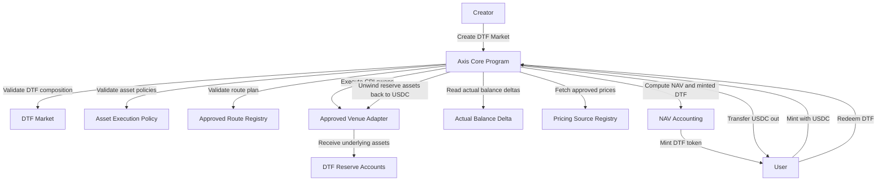

# Requirements Overview

## 1. Purpose

This document set translates the Axis v1 Open Design into implementation-grade requirements.

The goal is to make each protocol decision explicit enough that it can be turned into GitHub issues for engineering work.

## 2. Product Goal

Axis v1 should let users create, mint, and redeem DTFs on Solana.

A DTF is a tradable position token backed by a basket of underlying reserve assets.

Users should be able to:

```txt
1. Create a DTF with 2 to 5 assets
2. Define target weights
3. Mint the DTF with USDC
4. Have Axis compose underlying assets through CPI swaps
5. Hold the DTF token
6. Redeem the DTF back to USDC
```

## 3. Protocol Goal

Axis v1 must be:

```txt
- open
- reserve-backed
- deterministic in accounting
- controlled in execution
- safe under per-asset and per-transaction limits
- independent from external routers
- compatible with future router integrations
```

## 4. Core Architecture Requirement

Axis Core is responsible for:

```txt
- DTF market creation
- DTF mint lifecycle
- reserve accounting
- mint execution
- redeem execution
- pricing source validation
- NAV calculation
- execution policy validation
- approved CPI route validation
```

External systems may help with:

```txt
- route discovery
- quote building
- account assembly
- UI display prices
- distribution / routing into Axis markets
```

But external systems must not be required for Axis Core accounting.

## 5. Requirement Naming

Requirements use the following IDs:

```txt
AXIS-CORE-*   global protocol and architecture requirements
DTF-*         DTF market requirements
MINT-*        mint flow requirements
REDEEM-*      redeem flow requirements
EXEC-*        swap CPI execution requirements
PRICE-*       pricing and NAV requirements
POLICY-*      execution policy and risk control requirements
ASSET-*       asset universe requirements
ADMIN-*       admin, safety, and emergency requirements
NFR-*         non-functional requirements
TEST-*        testing requirements
```

## 6. System Workflow



## 7. Implementation Phasing

### Phase 0: Docs and Design Freeze

```txt
- finalize requirements
- turn requirements into GitHub issues
- define MVP account and instruction surfaces
- define test plan
```

### Phase 1: Core State and Validation

```txt
- ProtocolConfig
- AssetRegistry
- AssetExecutionPolicy
- PricingSourceRegistry
- ApprovedRouteRegistry
- DTFMarket creation
- composition validation
```

### Phase 2: Pricing and NAV

```txt
- reserve accounting
- pricing source validation
- NAV calculation
- actual balance delta measurement
```

### Phase 3: CPI Spike

```txt
- Orca Whirlpool CPI spike
- measure compute and account limits
- validate Pinocchio / no_std integration feasibility
```

### Phase 4: Mint / Redeem MVP

```txt
- mint with controlled CPI execution
- redeem with controlled CPI execution
- min_out and balance delta checks
- end-to-end tests
```

### Phase 5: Additional Venues and Asset Universe

```txt
- Raydium CPMM adapter
- PumpSwap adapter
- route readiness classification
- 500 asset universe launch readiness
```
