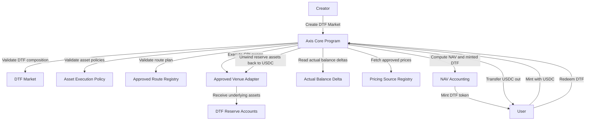

# Requirements Overview

## 1. Purpose

This document set translates the Axis v1 Open Design into implementation-grade requirements.

The goal is to make each protocol decision explicit enough that it can be turned into GitHub issues for engineering work.

## 2. Product Goal

Axis v1 should let users create, mint, and redeem DTFs on Solana.

A DTF is a tradable position token backed by a basket of underlying reserve assets.

Users should be able to:

```txt
1. Create a DTF with 2 to 5 assets
2. Define target weights
3. Mint the DTF with USDC
4. Have Axis compose underlying assets through CPI swaps
5. Hold the DTF token
6. Redeem the DTF back to USDC
```

## 3. Protocol Goal

Axis v1 must be:

```txt
- open
- reserve-backed
- deterministic in accounting
- controlled in execution
- safe under per-asset and per-transaction limits
- independent from external routers
- compatible with future router integrations
```

## 4. Core Architecture Requirement

Axis Core is responsible for:

```txt
- DTF market creation
- DTF mint lifecycle
- reserve accounting
- mint execution
- redeem execution
- pricing source validation
- NAV calculation
- execution policy validation
- approved CPI route validation
```

External systems may help with:

```txt
- route discovery
- quote building
- account assembly
- UI display prices
- distribution / routing into Axis markets
```

But external systems must not be required for Axis Core accounting.

## 5. Requirement Naming

Requirements use the following IDs:

```txt
AXIS-CORE-*   global protocol and architecture requirements
DTF-*         DTF market requirements
MINT-*        mint flow requirements
REDEEM-*      redeem flow requirements
EXEC-*        swap CPI execution requirements
PRICE-*       pricing and NAV requirements
POLICY-*      execution policy and risk control requirements
ASSET-*       asset universe requirements
ADMIN-*       admin, safety, and emergency requirements
NFR-*         non-functional requirements
TEST-*        testing requirements
DEVNET-*      Devnet Alpha scope and end-to-end launch requirements
```

## 6. System Workflow



## 7. Implementation Phasing

### Phase 0: Docs and Design Freeze

```txt
- finalize requirements
- define first Devnet Alpha scope
- turn requirements into GitHub issues
- define MVP account and instruction surfaces
- define test plan
```

### Phase 1: Functional Devnet Alpha

The first Devnet release must not be a state-only skeleton.

The goal of Phase 1 is to prove that Axis Core can create and operate a minimal DTF market end-to-end.

Required capabilities:

```txt
- initialize protocol config
- register assets
- set asset execution policies
- set pricing sources
- register approved CPI routes
- create a 2-asset DTF market
- mint DTF tokens with USDC
- execute a real CPI execution path with controlled liquidity
- execute approved CPI swaps into reserve assets
- measure actual reserve balance deltas
- calculate actual added value
- mint DTF tokens based on pre-trade NAV
- redeem DTF tokens
- execute approved CPI swaps from reserve assets back to USDC
- enforce min_out
- transfer actual USDC output to user
- verify actual token balance deltas after CPI execution
```

Phase 1 constraints:

```txt
- 2-asset DTF end-to-end is required
- 3-5 asset account structure may be supported, but 3-5 asset execution is not required for first Devnet Alpha
- one controlled CPI adapter is required for Functional Devnet Alpha
- production venue adapters are validated separately in Venue Integration Devnet
- direct USDC <-> asset routes only
- no split routing
- no routed SOL intermediate path
- ManualFixedPrice pricing source is allowed for Devnet Alpha
- fees are disabled or set to zero
- rebalance is out of scope
- Titan integration is out of scope
```


### Phase 2: Multi-Asset and Execution Hardening

```txt
- test 3-5 asset DTF execution feasibility
- measure compute and account limits
- improve route validation
- improve pricing deviation checks
- improve failure handling and error codes
- add more integration tests
```

### Phase 3: Additional Venue Adapters

```txt
- Orca Whirlpool production adapter hardening
- Raydium CPMM adapter
- PumpSwap adapter
- venue-specific compute/account benchmarking
```

### Phase 4: Asset Universe and Public Devnet Readiness

```txt
- route readiness classification
- pricing readiness classification
- initial launch-ready asset list
- frontend/client integration
- public/internal Devnet testing
```

