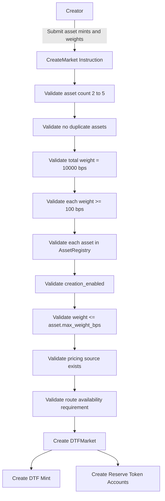
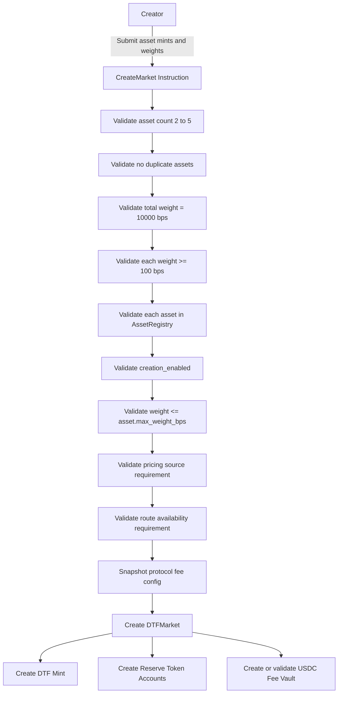

# DTF Market Requirements

## 1. Overview

A DTF market represents one tradable basket position.

Each market has:

```txt
- creator
- DTF mint
- 2 to 5 underlying assets
- target weights
- reserve token accounts
- fee configuration
- status flags
```

## 2. Market Creation Workflow



## 3. Requirements

### DTF-001: Market must have at least 2 assets

The program must reject any market creation request with fewer than 2 assets.

```txt
asset_count >= 2
```

Acceptance criteria:

```txt
- CreateMarket with 0 assets fails
- CreateMarket with 1 asset fails
- CreateMarket with 2 assets succeeds if all other checks pass
```

### DTF-002: Market must have at most 5 assets

The program must reject any market creation request with more than 5 assets.

```txt
asset_count <= 5
```

Acceptance criteria:

```txt
- 5 asset market can be created
- 6 asset market fails
```

### DTF-003: Duplicate assets are not allowed

The program must reject markets where the same asset mint appears more than once.

Acceptance criteria:

```txt
- [SOL, BONK] passes duplicate check
- [SOL, SOL] fails duplicate check
```

### DTF-004: Total weights must equal 10000 bps

The sum of all target weights must equal 10000 bps.

```txt
sum(weight_bps_i) == 10000
```

Acceptance criteria:

```txt
- 5000 + 5000 passes
- 3333 + 3333 + 3334 passes
- 5000 + 4000 fails
- 6000 + 6000 fails
```

### DTF-005: Each weight must be at least 100 bps

Each component must have weight greater than or equal to 1%.

```txt
weight_bps_i >= 100
```

Acceptance criteria:

```txt
- 100 bps passes
- 99 bps fails
```

### DTF-006: Each weight must be below the asset maximum

Each component must respect the asset-level max weight.

```txt
weight_bps_i <= asset.max_weight_bps
```

Acceptance criteria:

```txt
- Long-tail max_weight_bps = 1000
- 10% long-tail passes
- 15% long-tail fails
```

### DTF-007: Each asset must exist in AssetRegistry

All market assets must be part of the Axis asset universe or otherwise explicitly registered.

Acceptance criteria:

```txt
- registered asset passes
- unknown mint fails
```

### DTF-008: Each asset must be creation-enabled

The program must check:

```txt
asset.creation_enabled == true
```

Acceptance criteria:

```txt
- creation_enabled=false prevents new DTF creation using the asset
- existing DTFs are not automatically deleted
```

### DTF-009: Market-level TVL cap must not be required

Open Version must not require market-level TVL caps.

Acceptance criteria:

```txt
- no market_tvl_cap field is required for normal market operation
- per-transaction constraints still apply
```

### DTF-010: Market must have reserve token accounts

Each underlying asset must have an associated reserve token account controlled by Axis.

Acceptance criteria:

```txt
- reserve account is derived or validated per market and asset
- reserve account mint matches asset mint
- reserve owner/authority is Axis-controlled
```

### DTF-011: Market must have a DTF mint

Each market must have exactly one DTF mint.

Acceptance criteria:

```txt
- DTF mint is unique per market
- DTF mint authority is Axis-controlled
```

### DTF-012: Market should track status

Market status should support at least:

```txt
Created
Active
Paused
Deprecated
```

Acceptance criteria:

```txt
- paused market blocks mint
- paused market may still allow redeem depending on emergency policy
```
### DTF-013: Market must store creator fee state

Each DTF market must store creator and fee-related state.

Creator fee is a required Axis v1 protocol concept and must not be treated as a future extension.

Acceptance criteria:

```txt
- creator is stored in DTF market state
- creator_fee_destination is stored in DTF market state
- mint_fee_bps is stored in DTF market state
- redeem_fee_bps is stored in DTF market state
- creator_share_bps is stored in DTF market state
- protocol_share_bps is stored in DTF market state
```

### DTF-014: Market fee configuration must be derived from protocol config

Creators must not be able to customize fee bps per market.

Market fee configuration must be derived from protocol-level fee config or a protocol-approved preset at market creation time.

Acceptance criteria:

```txt
- mint_fee_bps is not creator-customizable
- redeem_fee_bps is not creator-customizable
- creator_share_bps is not creator-customizable
- protocol_share_bps is not creator-customizable
- market fee config is copied or derived from protocol config at market creation
```

### DTF-015: Market fee configuration must be immutable after creation

Market-level fee configuration must not be changed after market creation.

Acceptance criteria:

```txt
- mint_fee_bps cannot be changed after market creation
- redeem_fee_bps cannot be changed after market creation
- creator_share_bps cannot be changed after market creation
- protocol_share_bps cannot be changed after market creation
- no market-level SetFee instruction exists for v1 unless defined by a future spec
```

### DTF-016: Market must track accrued fee balances

Each DTF market must track accrued creator and protocol fee balances.

Acceptance criteria:

```txt
- accrued_creator_fee_usdc is tracked
- accrued_protocol_fee_usdc is tracked
- accrued fees are denominated in USDC or USDC smallest units
- accrued fees are claimable through explicit fee claim instructions
- accrued fees are not counted as reserves
- accrued fees are not included in NAV
```

### DTF-017: Market fee custody must be separate from reserve custody

Fee custody must be separate from reserve custody.

Acceptance criteria:

```txt
- fee custody account is distinct from reserve token accounts
- fee vault balance is not included in reserve value
- fee vault balance is not included in NAV
- fee vault balance is not treated as DTF backing
- fee claim does not change reserve balances
```

## 4. Market State Diagram



## 5. Issue Candidates

```txt
- Implement DTFMarket account
- Implement MarketAssetWeight account
- Implement reserve account derivation
- Implement DTF mint authority model
- Implement CreateMarket validation
- Implement duplicate asset validation
- Implement weight validation
- Implement market status handling
- Add creator field to DTFMarket
- Add creator_fee_destination to DTFMarket
- Add market fee config snapshot to DTFMarket
- Add accrued creator/protocol fee counters
- Implement fee config snapshot at market creation
- Enforce immutable market fee config
- Implement fee vault derivation or validation
- Ensure fee vault is excluded from NAV
- Add market creation tests for fee config
```
