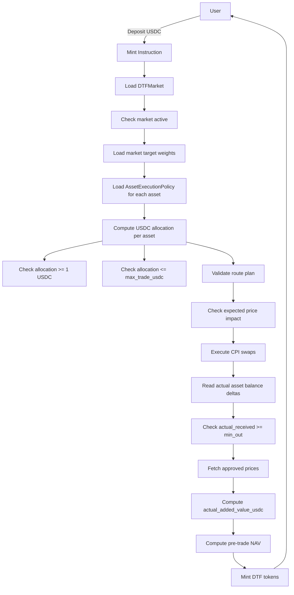

# Mint Requirements

## 1. Overview

Minting a DTF means the user deposits USDC and receives DTF tokens.

Axis must compose the underlying reserve assets through approved CPI swaps and mint DTF tokens based on actual received value.

## 2. Mint Workflow



## 3. Requirements

### MINT-001: User must mint with USDC

Mint input must be USDC.

Acceptance criteria:

```txt
- user source token account mint must equal configured USDC mint
- non-USDC mint input fails
```

### MINT-002: Mint must validate market status

Mint must only proceed if the market is active and minting is allowed.

Acceptance criteria:

```txt
- active market can mint
- paused market blocks mint
- deprecated market blocks mint
```

### MINT-003: Mint must compute allocation from target weights

For each asset:

```txt
asset_allocation_usdc_i = mint_amount_usdc × weight_bps_i / 10000
```

Acceptance criteria:

```txt
- 100 USDC mint, 50/50 basket -> 50 USDC allocation each
- 100 USDC mint, 99/1 basket -> 99 and 1 USDC allocation
```

### MINT-004: Each allocation must be at least 1 USDC

```txt
asset_allocation_usdc_i >= 1 USDC
```

Acceptance criteria:

```txt
- 100 USDC mint with 1% asset passes
- 50 USDC mint with 1% asset fails because allocation = 0.5 USDC
```

### MINT-005: Each allocation must not exceed max_trade_usdc

```txt
asset_allocation_usdc_i <= asset.max_trade_usdc
```

Acceptance criteria:

```txt
- long-tail max_trade_usdc = 250
- 10% long-tail in 2,500 USDC mint passes
- 10% long-tail in 3,000 USDC mint fails
```

### MINT-006: Asset must be mint-enabled

```txt
asset.mint_enabled == true
```

Acceptance criteria:

```txt
- mint_enabled=false blocks new mint
- redeem may remain enabled
```

### MINT-007: Mint must use approved routes

Each asset swap must use an approved route.

Acceptance criteria:

```txt
- route exists and enabled -> pass
- route missing -> fail
- route disabled -> fail
- wrong venue/pool -> fail
```

### MINT-008: Mint must enforce min_out

Each CPI swap must have a minimum output.

```txt
actual_received_i >= min_out_i
```

Acceptance criteria:

```txt
- actual_received >= min_out passes
- actual_received < min_out fails entire transaction
```

### MINT-009: Mint must measure actual received assets using balance deltas

Accounting must use actual reserve balance delta.

```txt
actual_received_i = post_reserve_balance_i - pre_reserve_balance_i
```

Acceptance criteria:

```txt
- quote output is not used as final accounting truth
- actual reserve balance delta is used
```

### MINT-010: Minted DTF must be based on actual added value

```txt
actual_added_value_usdc = Σ(actual_received_asset_i × approved_price_i)
minted_dtf = actual_added_value_usdc / pre_trade_nav
```

Acceptance criteria:

```txt
- minted amount changes based on actual execution
- optimistic quote cannot over-mint DTF
```

### MINT-011: Initial mint must use initial NAV if supply is zero

```txt
initial_nav = 1 USDC
```

Acceptance criteria:

```txt
- if total_supply == 0, pre_trade_nav = 1 USDC
```

### MINT-012: Mint must be all-or-nothing

If any swap or validation fails, the entire mint transaction fails.

Acceptance criteria:

```txt
- partial DTF mint cannot occur
- partial reserve composition cannot succeed without DTF mint accounting
```

### MINT-013: Mint must check pricing source

Each received asset must have an enabled pricing source for accounting.

Acceptance criteria:

```txt
- pricing source exists and valid -> pass
- missing pricing source -> fail
- stale pricing source -> fail
```

### MINT-014: Mint must check price impact

Expected and/or execution price impact must be within policy.

```txt
price_impact_bps <= asset.max_price_impact_bps
```

Acceptance criteria:

```txt
- price impact below threshold passes
- price impact above threshold fails
```

### MINT-015: Mint should emit useful events/logs

Implementation should log or emit:

```txt
- market id
- user
- usdc amount in
- actual received per asset
- minted DTF amount
- pre-trade NAV
- actual added value
```

## 4. Issue Candidates

```txt
- Implement mint allocation calculator
- Implement mint market validation
- Implement mint asset policy validation
- Implement min allocation check
- Implement max trade check
- Implement route validation
- Implement min_out validation
- Implement actual reserve balance delta accounting
- Implement minted DTF calculation
- Implement initial NAV handling
- Implement mint event/log output
```
