# Mint Requirements

## 1. Overview

Minting a DTF means the user deposits USDC and receives DTF tokens.

Axis must compose the underlying reserve assets through approved CPI swaps and mint DTF tokens based on actual received reserve value.

Axis v1 uses a USDC-side mint fee model.

Mint fee is deducted from gross user USDC input before reserve composition.

Only net USDC after fee deduction may be used to compose reserve assets.

Core rule:

```txt
DTF mint amount must be based on net actual reserve value, not gross user input.
```

Mint accounting must use actual reserve balance deltas as protocol truth.

Quotes, estimates, and expected outputs must not be used as final accounting truth.

## 2. Mint Workflow

```mermaid
flowchart TD
    User[User] -->|Deposit USDC| Mint[Mint Instruction]
    Mint --> Market[Load DTFMarket]
    Market --> Status[Check market active]
    Status --> FeeConfig[Load market fee config]
    FeeConfig --> Gross[Measure gross user USDC input]
    Gross --> MintFee[Calculate mint fee]
    MintFee --> NetUSDC[Compute net USDC for composition]
    NetUSDC --> Weights[Load market target weights]
    Weights --> Policy[Load AssetExecutionPolicy for each asset]
    Policy --> Allocation[Compute net USDC allocation per asset]
    Allocation --> MinAlloc[Check allocation >= 1 USDC]
    MinAlloc --> MaxTrade[Check allocation <= max_trade_usdc]
    MaxTrade --> RoutePlan[Validate route plan]
    RoutePlan --> PriceImpact[Check expected price impact]
    PriceImpact --> PricingSource[Validate pricing sources]
    PricingSource --> PreState[Snapshot pre-trade reserves and pre-trade NAV]
    PreState --> FeeCustody[Move or retain mint fee in fee custody]
    FeeCustody --> CPI[Execute CPI swaps using net USDC]
    CPI --> Delta[Read actual reserve balance deltas]
    Delta --> MinOut[Check actual_received >= min_out]
    MinOut --> Pricing[Fetch approved prices]
    Pricing --> Value[Compute actual_added_value_usdc]
    Value --> FeeAccrual[Accrue creator and protocol fees]
    FeeAccrual --> MintDTF[Mint DTF tokens from actual added value]
    MintDTF --> User
```



The implementation may reorder internal bookkeeping steps if Solana transaction atomicity preserves the same result.

However, the following invariants must hold:

```txt
- mint fee is calculated from gross user USDC input
- reserve composition uses only net USDC after mint fee deduction
- actual reserve balance deltas determine actual_added_value_usdc
- DTF mint amount is based on actual_added_value_usdc
- fee accrual is only finalized if the full mint succeeds
- failed mint must not accrue fees
- failed mint must not mint DTF tokens
```

## 3. Requirements

### MINT-001: User must mint with USDC

Mint input must be USDC.

Acceptance criteria:

```txt
- user source token account mint must equal configured USDC mint
- non-USDC mint input fails
- gross_user_usdc_in is measured in USDC or USDC smallest units
```

### MINT-002: Mint must validate market status

Mint must only proceed if the market is active and minting is allowed.

Acceptance criteria:

```txt
- active market can mint
- paused market blocks mint
- deprecated market blocks mint
- market status is checked before execution
```

### MINT-003: Mint must deduct fee before allocation

Mint must calculate the mint fee from gross user USDC input before computing asset allocations.

For v1 launch:

```txt
mint_fee_bps = 100
creator_share_bps = 4000
protocol_share_bps = 6000
```

Formula:

```txt
mint_fee_usdc = gross_user_usdc_in × mint_fee_bps / 10000
net_usdc_for_composition = gross_user_usdc_in - mint_fee_usdc
```

Fee split:

```txt
creator_fee_usdc = mint_fee_usdc × creator_share_bps / 10000
protocol_fee_usdc = mint_fee_usdc - creator_fee_usdc
```

Acceptance criteria:

```txt
- 1000 USDC mint input charges 10 USDC mint fee
- 4 USDC accrues to creator fees
- 6 USDC accrues to protocol fees
- 990 USDC is used for reserve composition
- mint fee is not used for reserve composition
- mint fee is not counted as DTF reserve value
- mint_fee_usdc is retained in or transferred to fee custody
- net_usdc_for_composition is the only amount used for CPI reserve composition
```

### MINT-004: Mint must compute allocation from net USDC for composition

For each asset, allocation must be computed from net USDC after mint fee deduction.

```txt
asset_allocation_usdc_i = net_usdc_for_composition × weight_bps_i / 10000
```

Acceptance criteria:

```txt
- 1000 USDC mint with 1% fee leaves 990 USDC for composition
- 990 USDC net composition value, 50/50 basket -> 495 USDC allocation each
- 990 USDC net composition value, 99/1 basket -> 980.1 and 9.9 USDC allocation
- gross_user_usdc_in is not used directly for asset allocation
```

### MINT-005: Each net allocation must be at least 1 USDC

Each asset allocation must be calculated from `net_usdc_for_composition` and must be at least 1 USDC.

```txt
asset_allocation_usdc_i >= 1 USDC
```

Acceptance criteria:

```txt
- 1000 USDC gross input with 1% mint fee leaves 990 USDC net
- 1% asset allocation = 9.9 USDC and passes
- 100 USDC gross input with 1% mint fee leaves 99 USDC net
- 1% asset allocation = 0.99 USDC and fails
- allocation check uses net USDC after fee deduction
```

### MINT-006: Each net allocation must not exceed max_trade_usdc

Each net allocation must respect the asset-level maximum trade size.

```txt
asset_allocation_usdc_i <= asset.max_trade_usdc
```

Acceptance criteria:

```txt
- max_trade_usdc check uses net allocation after fee deduction
- long-tail max_trade_usdc = 250
- 10% long-tail in 2,500 USDC gross mint with 1% fee results in 247.5 USDC net allocation and passes
- 10% long-tail in 3,000 USDC gross mint with 1% fee results in 297 USDC net allocation and fails
```

### MINT-007: Asset must be mint-enabled

Each asset must be mint-enabled.

```txt
asset.mint_enabled == true
```

Acceptance criteria:

```txt
- mint_enabled=true allows mint if all other checks pass
- mint_enabled=false blocks new mint
- redeem may remain enabled even when mint is disabled
```

### MINT-008: Mint must use approved routes

Each asset swap must use an approved route.

Acceptance criteria:

```txt
- route exists and enabled -> pass
- route missing -> fail
- route disabled -> fail
- wrong venue fails
- wrong pool fails
- wrong input mint fails
- wrong output mint fails
```

### MINT-009: Mint must enforce min_out

Each CPI swap must have a minimum output.

```txt
actual_received_i >= min_out_i
```

Acceptance criteria:

```txt
- actual_received >= min_out passes
- actual_received < min_out fails entire transaction
- min_out is checked against actual received amount
- min_out is not checked only against quote
```

### MINT-010: Mint must measure actual received assets using balance deltas

Accounting must use actual reserve balance delta.

```txt
actual_received_i = post_reserve_balance_i - pre_reserve_balance_i
```

Acceptance criteria:

```txt
- pre-reserve balances are captured before CPI execution
- post-reserve balances are captured after CPI execution
- actual reserve balance delta is used as accounting truth
- quote output is not used as final accounting truth
- expected output is not used as final accounting truth
```

### MINT-011: Minted DTF must be based on actual added value

Minted DTF amount must be calculated from actual reserve value added after fee deduction and execution.

```txt
actual_added_value_usdc = Σ(actual_received_asset_i × approved_price_i)
minted_dtf = actual_added_value_usdc / pre_trade_nav
```

Acceptance criteria:

```txt
- minted amount changes based on actual execution
- optimistic quote cannot over-mint DTF
- gross_user_usdc_in is not used as minted DTF value
- net_usdc_for_composition is not used directly as minted DTF value
- actual reserve balance deltas determine actual_added_value_usdc
- mint fee is excluded from actual_added_value_usdc
- fee amounts are not treated as reserve value
```

### MINT-012: Initial mint must use initial NAV if supply is zero

If DTF supply is zero, initial NAV must be used.

```txt
initial_nav = 1 USDC
```

Acceptance criteria:

```txt
- if total_supply == 0, pre_trade_nav = 1 USDC
- initial mint uses actual_added_value_usdc / 1 USDC
- mint fee is excluded before initial mint accounting
```

### MINT-013: Mint must snapshot pre-trade NAV before reserve mutation

Minted DTF amount must be calculated using pre-trade NAV.

Pre-trade NAV must be based on reserve state before the mint mutates reserves.

Acceptance criteria:

```txt
- pre-trade reserve balances are read before CPI execution
- pre-trade NAV is computed before reserve balance mutation
- post-trade reserve balances are not used to compute pre-trade NAV
- minted DTF amount uses pre_trade_nav
```

### MINT-014: Mint must be all-or-nothing

If any swap, fee calculation, policy validation, pricing validation, or accounting check fails, the entire mint transaction must fail.

Acceptance criteria:

```txt
- partial DTF mint cannot occur
- partial reserve composition cannot succeed without DTF mint accounting
- failed CPI execution reverts the full transaction
- failed min_out check reverts the full transaction
- failed pricing validation reverts the full transaction
- failed fee accounting reverts the full transaction
- failed mint does not accrue fees
- failed mint does not mint DTF tokens
```

### MINT-015: Mint must check pricing source

Each received asset must have an enabled pricing source for accounting.

Acceptance criteria:

```txt
- pricing source exists and valid -> pass
- missing pricing source -> fail
- stale pricing source -> fail
- disabled pricing source -> fail
- pricing source is used for actual_added_value_usdc
```

### MINT-016: Mint must check price impact

Expected and/or execution price impact must be within policy.

```txt
price_impact_bps <= asset.max_price_impact_bps
```

Acceptance criteria:

```txt
- price impact below threshold passes
- price impact above threshold fails
- price impact policy is enforced per asset
- price impact failure reverts the full transaction
```

### MINT-017: Mint must accrue creator and protocol fees

Mint must accrue creator and protocol fee amounts using the market fee configuration.

Fees must be accrued and claimed later.

Fees must not be immediately transferred to final recipients during mint.

Acceptance criteria:

```txt
- creator fee amount is added to accrued_creator_fee_usdc
- protocol fee amount is added to accrued_protocol_fee_usdc
- accrued fees are denominated in USDC or USDC smallest units
- accrued fees are not counted as reserves
- accrued fees are not included in NAV
- failed mint does not accrue fees
- fee accrual is consistent with mint_fee_usdc
- creator/protocol split is consistent with market fee config
```

### MINT-018: Mint must preserve fee and reserve separation

Mint must keep fee custody separate from DTF reserve custody.

Acceptance criteria:

```txt
- mint fee remains in fee custody, not reserve custody
- creator fee accrual does not change reserve balances
- protocol fee accrual does not change reserve balances
- fee vault balance is excluded from NAV
- reserve value includes only reserve token accounts
- fee claim cannot reduce reserve balances
```

### MINT-019: Mint should emit useful events/logs

Implementation should log or emit useful mint data.

Recommended fields:

```txt
- market id
- user
- gross_user_usdc_in
- mint_fee_usdc
- creator_fee_usdc
- protocol_fee_usdc
- net_usdc_for_composition
- actual received per asset
- actual added value
- pre-trade NAV
- minted DTF amount
```

## 4. Required Test Scenarios

### 4.1 Fee and Net Allocation Tests

```txt
- mint with 1000 USDC gross input and 1% fee
- verify 10 USDC mint fee
- verify 4 USDC creator fee accrual
- verify 6 USDC protocol fee accrual
- verify 990 USDC net composition amount
- verify 50/50 allocation uses 990 USDC, not 1000 USDC
- verify 1% allocation uses net USDC and can fail below 1 USDC
```

### 4.2 Actual Balance Delta Tests

```txt
- pre-reserve balance is recorded
- post-reserve balance is recorded
- actual_received_i is computed from balance delta
- quote output is ignored as accounting truth
- actual_added_value_usdc uses actual_received_i
```

### 4.3 Minted DTF Calculation Tests

```txt
- initial mint uses initial NAV = 1 USDC
- subsequent mint uses pre-trade NAV
- minted DTF excludes mint fee
- minted DTF uses actual_added_value_usdc
- optimistic quote cannot over-mint DTF
```

### 4.4 Failure Tests

```txt
- non-USDC input fails
- paused market fails
- disabled asset fails
- missing route fails
- disabled route fails
- wrong venue fails
- wrong pool fails
- actual_received < min_out fails
- missing pricing source fails
- stale pricing source fails
- price impact above threshold fails
- failed mint does not accrue fees
- failed mint does not mint DTF tokens
```

## 5. Issue Candidates

```txt
- Implement mint market validation
- Implement mint fee calculation
- Implement net USDC for composition calculation
- Implement mint allocation calculator
- Implement min allocation check
- Implement max trade check
- Implement mint asset policy validation
- Implement route validation
- Implement price impact validation
- Implement min_out validation
- Implement actual reserve balance delta accounting
- Implement actual added value calculation
- Implement initial NAV handling
- Implement pre-trade NAV snapshot
- Implement minted DTF calculation
- Implement creator/protocol fee split on mint
- Implement fee accrual during mint
- Ensure failed mint does not accrue fees
- Exclude mint fees from reserve accounting
- Exclude fee vault from NAV
- Implement mint event/log output
- Add mint fee tests
- Add net allocation tests
- Add creator/protocol split tests
- Add actual balance delta tests
- Add failed mint rollback tests
- Add price impact failure tests
```
