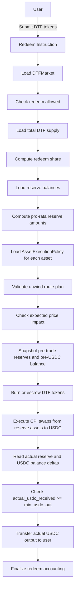

# Redeem Requirements

## 1. Overview

Redeeming a DTF means the user burns or submits DTF tokens and receives USDC output.

Axis must unwind the user's pro-rata share of underlying reserve assets through approved CPI execution and return actual USDC received to the user.

Axis v1 has no explicit redeem fee.

```txt id="1de6aj"
redeem_fee_bps = 0
max_redeem_fee_bps = 0
```

However, redeem still involves real market execution.

Redeem output may be affected by venue spread, slippage, price impact, and execution quality.

Therefore, redeem must enforce `min_usdc_out`.

Core rule:

```txt id="d0mnbs"
User redeem output is based on actual USDC received after reserve unwind.
```

For v1:

```txt id="fzshhz"
user_usdc_out = actual_usdc_received
```

There is no explicit Axis exit fee on redeem.

## 2. Redeem Fee vs Execution Spread

Axis v1 must clearly separate explicit protocol fees from execution spread.

### Explicit Axis Redeem Fee

Axis v1 does not charge an explicit creator or protocol fee on redeem.

```txt id="tmkdb2"
redeem_fee_bps = 0
```

This means:

```txt id="3gir2c"
- no creator fee is charged on redeem
- no protocol fee is charged on redeem
- no explicit Axis exit fee is deducted from actual USDC received
```

### Execution Spread

Execution spread means the cost or difference caused by market execution.

Execution spread may include:

```txt id="ekdl29"
- venue spread
- slippage
- price impact
- quote difference
- route execution cost
- pool execution loss
```

Execution spread is not an Axis redeem fee.

Redeem still requires `min_usdc_out` protection.

If actual USDC received is below `min_usdc_out`, the redeem transaction must fail.

## 3. Redeem Workflow



The implementation may reorder internal bookkeeping steps if Solana transaction atomicity preserves the same result.

However, the following invariants must hold:

```txt id="jr7h99"
- redeem share is based on DTF amount and pre-redeem total supply
- reserve amounts are based on pro-rata reserve share
- CPI execution must move real tokens
- actual USDC output must be measured using balance delta
- user output must be based on actual USDC received
- min_usdc_out must be enforced
- redeem_fee_bps = 0 for v1
- failed redeem must not burn DTF tokens permanently
- failed redeem must not transfer reserve assets permanently
```

## 4. Requirements

### REDEEM-001: User must redeem DTF tokens

Redeem input must be the DTF token for the target market.

Acceptance criteria:

```txt id="fix6ge"
- user source token account mint must equal market DTF mint
- wrong DTF mint fails
- non-DTF token input fails
- redeem amount must be greater than zero
```

### REDEEM-002: Redeem must validate market status

Redeem must only proceed if redeeming is allowed.

Acceptance criteria:

```txt id="8odfua"
- active market can redeem
- deprecated market may allow redeem if configured as exit-only
- paused market behavior follows emergency policy
- market status is checked before execution
```

### REDEEM-003: Redeem should remain available in exit-only mode when safe

Axis should prefer preserving user exit when minting or creation is disabled.

Acceptance criteria:

```txt id="5857tj"
- mint_enabled=false does not automatically disable redeem
- creation_enabled=false does not automatically disable redeem
- redeem can remain enabled in exit-only mode
- redeem may be disabled only if redemption itself is unsafe
```

### REDEEM-004: Redeem must compute pro-rata share from pre-redeem supply

Redeem share must be calculated using DTF amount in and total supply before redeem.

```txt id="h1h7qm"
redeem_share = dtf_amount_in / total_supply_before
```

Acceptance criteria:

```txt id="w5ojtu"
- total_supply_before is read before burn or supply mutation
- redeem_share uses pre-redeem supply
- redeem_share is not computed from post-burn supply
- redeem_share cannot exceed 100%
```

### REDEEM-005: Redeem must compute pro-rata reserve asset amounts

For each reserve asset:

```txt id="3belc0"
redeem_asset_amount_i = reserve_balance_i × redeem_share
```

Acceptance criteria:

```txt id="pfb6m4"
- reserve balances are read before unwind execution
- reserve amount is proportional to redeemed DTF share
- user cannot redeem more than their pro-rata reserve share
- rounding rules must be deterministic
```

### REDEEM-006: Redeem must validate reserve accounts

Redeem must validate all reserve accounts used for unwind execution.

Acceptance criteria:

```txt id="1826tk"
- reserve account belongs to the DTF market
- reserve account mint matches expected asset mint
- reserve account authority is Axis-controlled
- wrong reserve account fails
- missing reserve account fails
```

### REDEEM-007: Asset must be redeem-enabled

Each reserve asset must be redeem-enabled unless emergency policy explicitly allows a safer fallback.

```txt id="jg8dhw"
asset.redeem_enabled == true
```

Acceptance criteria:

```txt id="3dwi3n"
- redeem_enabled=true allows redeem if all other checks pass
- redeem_enabled=false blocks normal redeem for that asset
- blocked redeem behavior must be explicit
```

### REDEEM-008: Redeem must use approved unwind routes

Each reserve asset must be unwound through an approved route.

Acceptance criteria:

```txt id="i1gtyu"
- route exists and enabled -> pass
- route missing -> fail
- route disabled -> fail
- wrong venue fails
- wrong pool fails
- wrong input mint fails
- wrong output mint fails
```

### REDEEM-009: Redeem must enforce min_usdc_out

Redeem must enforce user-provided minimum USDC output.

```txt id="b7kph3"
actual_usdc_received >= min_usdc_out
```

Acceptance criteria:

```txt id="zqnf1g"
- actual_usdc_received >= min_usdc_out passes
- actual_usdc_received < min_usdc_out fails entire transaction
- min_usdc_out is checked against actual USDC balance delta
- min_usdc_out is not checked only against quote
```

### REDEEM-010: Redeem must measure actual USDC received using balance delta

Accounting must use actual USDC balance delta.

```txt id="k4yl0t"
actual_usdc_received = post_usdc_balance - pre_usdc_balance
```

Acceptance criteria:

```txt id="8i27o4"
- pre-USDC balance is captured before CPI execution
- post-USDC balance is captured after CPI execution
- actual USDC balance delta is used as accounting truth
- quote output is not used as final accounting truth
- expected output is not used as final accounting truth
```

### REDEEM-011: User output must be based on actual USDC received

User output must be calculated from actual USDC received after reserve unwind.

For v1:

```txt id="k3aky4"
redeem_fee_bps = 0
user_usdc_out = actual_usdc_received
```

Acceptance criteria:

```txt id="n7zqkt"
- user_usdc_out equals actual_usdc_received for v1
- no creator fee is deducted on redeem
- no protocol fee is deducted on redeem
- no explicit Axis exit fee is deducted on redeem
- quote output cannot determine final user output
```

### REDEEM-012: Redeem must not accrue creator or protocol fees in v1

Axis v1 must not accrue creator or protocol fees during redeem.

Acceptance criteria:

```txt id="s852u7"
- redeem_fee_bps = 0
- accrued_creator_fee_usdc is not increased by redeem
- accrued_protocol_fee_usdc is not increased by redeem
- fee vault balance is not increased by redeem fee
- redeem execution spread is not treated as Axis fee
```

### REDEEM-013: Redeem must distinguish execution spread from Axis fee

Redeem output may be affected by execution spread, but this must not be treated as an Axis protocol fee.

Acceptance criteria:

```txt id="z2zlxb"
- venue spread is not recorded as creator fee
- slippage is not recorded as protocol fee
- price impact is not recorded as Axis fee
- app and logs should distinguish estimated output from actual USDC received
```

### REDEEM-014: Redeem must check price impact

Expected and/or execution price impact must be within policy.

```txt id="vqyzei"
price_impact_bps <= asset.max_price_impact_bps
```

Acceptance criteria:

```txt id="0d7km7"
- price impact below threshold passes
- price impact above threshold fails
- price impact policy is enforced per asset
- price impact failure reverts the full transaction
```

### REDEEM-015: Redeem must check pricing source where required

If pricing is needed for validation, risk controls, NAV display, or accounting checks, each reserve asset must have an enabled pricing source.

Acceptance criteria:

```txt id="wp0l9d"
- pricing source exists and valid -> pass
- missing pricing source fails where pricing is required
- stale pricing source fails where pricing is required
- disabled pricing source fails where pricing is required
```

### REDEEM-016: Redeem must be all-or-nothing

If any validation, CPI execution, output check, or accounting check fails, the entire redeem transaction must fail.

Acceptance criteria:

```txt id="6yuf9m"
- partial redeem cannot occur
- failed CPI execution reverts the full transaction
- failed min_usdc_out check reverts the full transaction
- failed route validation reverts the full transaction
- failed reserve validation reverts the full transaction
- failed redeem must not permanently burn DTF tokens
- failed redeem must not permanently transfer reserve assets
- failed redeem must not transfer USDC to user
```

### REDEEM-017: Redeem must preserve reserve accounting

Redeem must reduce reserves only according to redeemed DTF share and actual unwind execution.

Acceptance criteria:

```txt id="hkr9jk"
- reserve asset amounts are based on redeem_share
- reserve assets transferred to venue execution do not exceed computed redeem amounts
- reserve balance deltas are measured after execution
- reserve accounting remains consistent after redeem
- user cannot drain reserves beyond pro-rata share
```

### REDEEM-018: Redeem must preserve fee and reserve separation

Redeem must not mix fee custody with reserve custody.

Acceptance criteria:

```txt id="874nxd"
- fee vault is not used as redeem reserve source
- fee vault balance is excluded from redeem accounting
- fee vault balance is excluded from NAV
- redeem does not reduce accrued creator fees
- redeem does not reduce accrued protocol fees
```

### REDEEM-019: Redeem should emit useful events/logs

Implementation should log or emit useful redeem data.

Recommended fields:

```txt id="2txg6u"
- market id
- user
- dtf_amount_in
- redeem_share
- reserve amount per asset
- actual USDC received
- min_usdc_out
- user_usdc_out
- execution spread or deviation where available
```

## 5. Required Test Scenarios

### 5.1 Redeem Share Tests

```txt id="r8eg38"
- redeem 10% of DTF supply
- redeem 50% of DTF supply
- redeem 100% of user position
- verify redeem_share uses pre-redeem total supply
- verify reserve amounts are proportional to redeem_share
- verify rounding is deterministic
```

### 5.2 Actual USDC Output Tests

```txt id="76yrv0"
- pre-USDC balance is recorded
- post-USDC balance is recorded
- actual_usdc_received is computed from balance delta
- quote output is ignored as accounting truth
- user_usdc_out equals actual_usdc_received
```

### 5.3 Zero Redeem Fee Tests

```txt id="jqagmy"
- redeem_fee_bps = 0
- creator fee does not accrue on redeem
- protocol fee does not accrue on redeem
- fee vault does not increase from redeem fee
- user_usdc_out equals actual_usdc_received
```

### 5.4 Execution Protection Tests

```txt id="gys62l"
- actual_usdc_received >= min_usdc_out passes
- actual_usdc_received < min_usdc_out fails
- price impact below threshold passes
- price impact above threshold fails
- disabled route fails
- wrong venue fails
- wrong pool fails
- wrong output mint fails
```

### 5.5 Failure Tests

```txt id="6l73ze"
- wrong DTF mint fails
- redeem amount = 0 fails
- paused market behavior follows emergency policy
- disabled redeem asset fails
- missing reserve account fails
- wrong reserve account fails
- missing route fails
- stale pricing source fails where pricing is required
- failed redeem does not burn DTF tokens
- failed redeem does not transfer reserve assets permanently
- failed redeem does not transfer USDC to user
```

## 6. Issue Candidates

```txt id="gj93c5"
- Implement redeem market validation
- Implement DTF input validation
- Implement redeem share calculation
- Implement pro-rata reserve amount calculation
- Implement reserve account validation
- Implement redeem asset policy validation
- Implement unwind route validation
- Implement price impact validation
- Implement min_usdc_out validation
- Implement actual USDC balance delta accounting
- Implement zero redeem fee behavior
- Ensure redeem does not accrue creator/protocol fees
- Implement all-or-nothing redeem behavior
- Implement reserve accounting checks
- Exclude fee vault from redeem accounting
- Implement redeem event/log output
- Add redeem share tests
- Add actual USDC output tests
- Add zero redeem fee tests
- Add min_usdc_out failure tests
- Add reserve drain prevention tests
- Add failed redeem rollback tests
```
