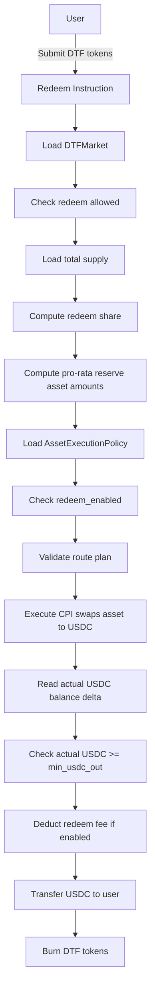

# Redeem Requirements

## 1. Overview

Redeeming a DTF means the user provides DTF tokens and receives USDC.

Axis must calculate the user's pro-rata share of reserve assets, unwind those reserve assets through approved CPI swaps, and transfer the actual received USDC to the user.

## 2. Redeem Workflow



## 3. Requirements

### REDEEM-001: User must redeem DTF tokens

Redeem input must be the market's DTF mint.

Acceptance criteria:

```txt
- user DTF token account mint matches market.dtf_mint
- wrong mint fails
```

### REDEEM-002: Redeem share must be calculated from total supply before redeem

```txt
redeem_share = dtf_amount_in / total_supply_before
```

Acceptance criteria:

```txt
- redeeming 10 DTF out of 100 supply = 10% share
```

### REDEEM-003: Redeem must calculate pro-rata reserve amounts

```txt
redeem_asset_amount_i = reserve_balance_i × redeem_share
```

Acceptance criteria:

```txt
- reserve SOL = 100, share = 10% -> redeem amount = 10 SOL
- reserve BONK = 1,000,000, share = 10% -> redeem amount = 100,000 BONK
```

### REDEEM-004: Asset must be redeem-enabled

```txt
asset.redeem_enabled == true
```

Acceptance criteria:

```txt
- redeem_enabled=true allows unwind
- redeem_enabled=false blocks redeem for that asset
```

### REDEEM-005: Redeem should remain available whenever possible

Emergency policy should prefer:

```txt
creation_enabled = false
mint_enabled = false
redeem_enabled = true
rebalance_enabled = false
```

Acceptance criteria:

```txt
- risky assets can block new mint while preserving exits
```

### REDEEM-006: Redeem must use approved routes

Each reserve asset unwind must use an approved route.

Acceptance criteria:

```txt
- approved asset -> USDC route passes
- missing or disabled route fails
```

### REDEEM-007: Redeem must enforce minimum USDC output

```txt
actual_usdc_received >= min_usdc_out
```

Acceptance criteria:

```txt
- actual output greater than or equal to min passes
- actual output below min fails entire redeem
```

### REDEEM-008: Redeem must measure USDC output using balance delta

```txt
actual_usdc_received = post_usdc_balance - pre_usdc_balance
```

Acceptance criteria:

```txt
- quote is not final accounting source
- actual token balance delta determines output
```

### REDEEM-009: Redeem must be all-or-nothing

If any swap fails or output check fails, the entire redeem fails.

Acceptance criteria:

```txt
- no partial redeem
- no partial asset unwind
- no DTF burn without correct accounting
```

### REDEEM-010: Redeem must burn or escrow DTF tokens consistently

The DTF tokens used for redeem must be removed from circulating supply or otherwise accounted for according to the implementation model.

Acceptance criteria:

```txt
- total supply decreases if burn model is used
- no double redeem possible
```

### REDEEM-011: Redeem must support fee deduction if fee model is enabled

Fee model is not finalized, but redeem should reserve space for:

```txt
redeem_fee_bps
creator_share_bps
protocol_share_bps
```

Acceptance criteria:

```txt
- current implementation can set fee to zero
- future fee fields can be enabled without changing core redeem math
```

### REDEEM-012: Redeem should emit useful events/logs

Implementation should log or emit:

```txt
- market id
- user
- dtf amount in
- redeem share
- reserve assets unwound
- actual USDC received
- user USDC out
```

## 4. Issue Candidates

```txt
- Implement redeem share calculation
- Implement pro-rata reserve calculation
- Implement redeem asset policy validation
- Implement redeem route validation
- Implement actual USDC balance delta accounting
- Implement min_usdc_out check
- Implement DTF burn/escrow model
- Implement redeem event/log output
```
