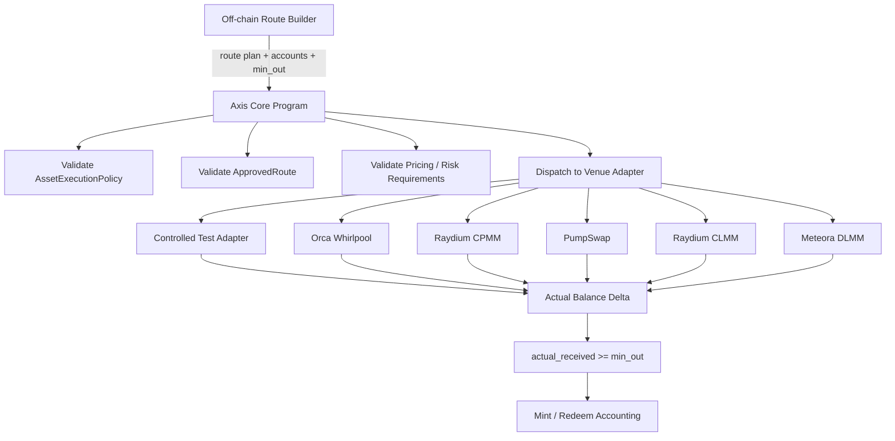

# Swap CPI Execution Requirements

## 1. Overview

Axis v1 must execute reserve composition and reserve unwind through controlled CPI execution paths.

Axis should not be a general-purpose DEX aggregator.

Route discovery, quote building, and account assembly may happen off-chain.

However, the on-chain Axis Core program must verify execution safety, route validity, balance deltas, and accounting correctness.

Core boundary:

```txt
Route discovery / quote / account assembly = off-chain
Execution / verification / accounting       = on-chain
```

Axis Core must not trust off-chain quotes as final accounting truth.

Axis Core must verify actual token balance deltas after CPI execution.

## 2. Execution Boundary

Off-chain systems may help with:

```txt
- route discovery
- quote building
- account assembly
- venue account lookup
- UI display estimates
```

Axis Core is responsible for:

```txt
- validating asset execution policy
- validating approved routes
- validating venue adapter
- validating input and output mints
- validating pool or venue accounts
- executing CPI
- enforcing min_out
- measuring actual balance deltas
- returning actual_received to mint/redeem accounting
```

The program must reject execution if the route plan cannot be validated on-chain.

### 2.1 Venue Roles

Axis uses venue integrations for distinct purposes:

```txt
Role A — underlying mint/redeem execution venue
  Axis Core uses an ApprovedRoute to compose reserves on mint or unwind reserves on redeem.

Role B — secondary settlement venue for Axis-controlled JIT liquidity / ClearCorrection
  The Axis Auction Program may use a venue only after a market-specific native-liquidity configuration is activated.
```

Role A preserves the existing Axis Core execution boundary: off-chain systems may discover routes and assemble accounts, while Axis Core validates ApprovedRoute, input/output token mints, venue accounts, min_out, and actual balance deltas on-chain.

Role B is separate from Role A readiness. A successful mint/redeem CPI integration does not prove that a venue can safely settle Axis-controlled JIT liquidity or ClearCorrection. Public third-party DTF/USDC pools are external liquidity and are not Role B merely because they use the same venue.

## 3. Adapter Architecture



## 4. Controlled Adapter Policy

Controlled adapters may be used for deterministic local tests and accounting validation.

Controlled adapters are useful for proving Axis Core invariants:

```txt
- CPI execution path works
- real SPL tokens move
- actual token balance deltas are measured
- min_out is enforced
- failed execution reverts
- mint/redeem accounting uses actual balance deltas
```

However, controlled adapters are not sufficient for mainnet readiness.

Controlled adapters validate Axis accounting invariants.

Production venue adapters validate launch execution readiness.

## 5. Production Venue Validation Policy

Axis v1 must validate at least two production venue integration paths before mainnet launch.

Required production venue paths:

```txt
1. Orca Whirlpool
2. Raydium CPMM fallback
```

The first production venue candidate is Orca Whirlpool.

The fallback production venue candidate is Raydium CPMM.

A venue is not considered Axis-ready only because an SDK can quote a route.

A venue is Axis-ready only when Axis Core can:

```txt
- validate the approved route
- execute the venue CPI
- move real tokens
- verify actual token balance deltas
- enforce min_out
- reject invalid venue accounts
- reject invalid input/output mints
- measure compute usage
- measure account usage
- document venue-specific risks
```

At least two production venue paths must be validated before mainnet launch so that Axis is not dependent on a single execution venue.

## 6. Fee vs Execution Spread

Execution spread is not an Axis fee.

Execution spread may include:

```txt
- venue spread
- slippage
- price impact
- quote difference
- route execution cost
- pool execution loss
```

Axis creator/protocol fees are defined separately in the fee model.

Mint fee is deducted from USDC before reserve composition.

Redeem has no explicit Axis exit fee.

However, both mint and redeem still require execution protection.

For mint:

```txt
actual_received_i >= min_out_i
```

For redeem:

```txt
actual_usdc_received >= min_usdc_out
```

Execution spread must not be recorded as creator fee or protocol fee.

## 7. Requirements

### EXEC-001: Axis must only execute approved venues

The program must reject CPI execution through unapproved venue programs.

Acceptance criteria:

```txt
- approved venue program id passes
- unknown program id fails
- disabled venue fails
- venue program id must match the expected adapter
```

### EXEC-002: Axis must only execute approved routes

Each swap must match an enabled ApprovedRoute.

Acceptance criteria:

```txt
- route_id exists and enabled -> pass
- route_id missing -> fail
- disabled route -> fail
- route must belong to the expected market or asset policy scope
```

### EXEC-003: Route must match expected input and output mint

The route must match the expected input and output mints for the execution direction.

Acceptance criteria:

```txt
- mint route direction supports USDC -> target asset
- redeem route direction supports reserve asset -> USDC
- mismatched input mint fails
- mismatched output mint fails
- Token / Token-2022 compatibility is validated where applicable
```

### EXEC-004: Route must match approved pool or venue account

The route must use the approved pool or venue account.

Acceptance criteria:

```txt
- pool_id equals approved pool -> pass
- wrong pool fails
- wrong Whirlpool account fails
- wrong Raydium pool account fails
- wrong vault account fails
```

### EXEC-005: Route must match execution direction

The route direction must match the operation.

Acceptance criteria:

```txt
- mint route direction is valid for USDC to asset
- redeem route direction is valid for asset to USDC
- reversed direction fails
- invalid direction fails
```

### EXEC-006: Swap must provide min_out

Each swap must include a minimum output threshold.

Acceptance criteria:

```txt
- missing min_out fails
- min_out of zero fails unless explicitly allowed for a test-only environment
- min_out is included in the route plan
- min_out is enforced against actual output
```

### EXEC-007: Swap must verify actual output

Axis Core must verify that actual output satisfies min_out.

```txt
actual_received >= min_out
```

Acceptance criteria:

```txt
- actual_received below min_out fails entire transaction
- actual_received equal to min_out passes
- actual_received above min_out passes
- quote output alone cannot satisfy this requirement
```

### EXEC-008: Swap accounting must use balance deltas

The program must compare pre- and post-execution balances.

Acceptance criteria:

```txt
- output balance delta must be positive
- input balance delta must move in expected direction
- balance delta must use token accounts controlled or validated by Axis
- actual balance delta is returned to mint/redeem accounting
- quote output is not used as accounting truth
```

### EXEC-009: Swap must enforce max_trade_usdc

Each asset execution must be within the asset's max trade limit.

Acceptance criteria:

```txt
- trade <= max_trade_usdc passes
- trade > max_trade_usdc fails
- max_trade_usdc is enforced per asset
- mint allocation uses net USDC after mint fee deduction
```

### EXEC-010: Swap must enforce max_price_impact_bps

Expected and/or execution price impact must stay within policy.

Acceptance criteria:

```txt
- estimated / execution price impact <= threshold passes
- price impact above threshold fails
- price impact policy is enforced per asset
- price impact failure reverts the full transaction
```

### EXEC-011: Route complexity must be bounded

Axis v1 should not support arbitrary route graphs.

Requirements:

```txt
- no split routing
- one route per asset per execution
- prefer direct USDC <-> asset routes
- SOL intermediate route is out of scope unless explicitly approved later
- multi-hop route support must be explicitly specified before use
```

Acceptance criteria:

```txt
- split route fails
- unsupported multi-hop route fails
- unsupported SOL intermediate route fails
- one approved route per asset passes
```

### EXEC-012: Axis must not assume Jupiter route readiness equals CPI readiness

Jupiter or off-chain quote availability must not be treated as Axis CPI readiness.

Acceptance criteria:

```txt
- Jupiter route_available field cannot auto-register ApprovedRoute
- SDK quote availability cannot auto-register ApprovedRoute
- approved route must map to a venue adapter executable by Axis
- approved route must define expected venue, pool, input mint, output mint, and direction
```

### EXEC-013: Controlled adapter may be used for local validation

Controlled adapters may be used for deterministic local tests and accounting validation.

Acceptance criteria:

```txt
- controlled adapter can be used in local tests
- controlled adapter can move real SPL tokens
- controlled adapter can validate actual balance delta accounting
- controlled adapter can test min_out failure behavior
- controlled adapter can test all-or-nothing execution
```

### EXEC-014: Controlled adapter is not sufficient for mainnet readiness

Controlled adapter success must not be treated as production venue readiness.

Acceptance criteria:

```txt
- controlled adapter tests do not satisfy production venue readiness
- production venue CPI tests are required before mainnet launch
- venue-specific compute/account usage must be measured separately
- venue-specific risks must be documented separately
```

### EXEC-015: Mainnet readiness requires at least two Role A production venue paths

Axis v1 must validate at least two production venue integration paths before mainnet launch.

Required paths:

```txt
1. Orca Whirlpool
2. Raydium CPMM fallback
```

Acceptance criteria:

```txt
- Orca Whirlpool CPI path is tested
- Raydium CPMM fallback CPI path is tested
- both paths execute real token movement
- both paths verify actual token balance deltas
- both paths enforce min_out
- both paths measure compute usage
- both paths measure account usage
- both paths document venue-specific risks
```

### EXEC-016: Orca Whirlpool is the first Role A production venue candidate

The first production venue candidate is Orca Whirlpool.

Orca Whirlpool integration must test:

```txt
- SwapV2 CPI feasibility
- compute per swap
- accounts per swap
- multi-swap transaction feasibility
- Pinocchio / no_std integration issues
- Token / Token-2022 gotchas
- direct USDC <-> asset route feasibility
- failure behavior for invalid Whirlpool accounts
```

Acceptance criteria:

```txt
- Orca Whirlpool program id is verified
- Whirlpool accounts are validated
- input and output mints are validated
- SwapV2 CPI succeeds in local or fork-based tests
- actual balance deltas are verified
- invalid account tests fail safely
```

### EXEC-017: Raydium CPMM is the Role A fallback production venue candidate

The fallback production venue candidate is Raydium CPMM.

Raydium CPMM integration must test:

```txt
- Raydium CPMM CPI feasibility
- compute per swap
- accounts per swap
- direct USDC <-> asset route feasibility
- pool account validation
- vault account validation
- Token / Token-2022 gotchas
- failure behavior for invalid Raydium accounts
```

Acceptance criteria:

```txt
- Raydium CPMM program id is verified
- CPMM pool accounts are validated
- input and output mints are validated
- Raydium CPMM CPI succeeds in local or fork-based tests
- actual balance deltas are verified
- invalid account tests fail safely
```

### EXEC-018: PumpSwap and other venues are later candidates

PumpSwap, Raydium CLMM, and Meteora DLMM may be evaluated after the first two production paths.

Acceptance criteria:

```txt
- PumpSwap may be evaluated for meme and long-tail asset coverage
- Raydium CLMM may be evaluated after CPMM fallback validation
- Meteora DLMM may be evaluated after core production paths are stable
- later venue candidates must meet the same production venue readiness criteria
```

### EXEC-019: Adapter interface should be stable

The adapter interface should conceptually support:

```txt
execute_swap(
  direction,
  input_mint,
  output_mint,
  amount_in,
  min_out,
  route_accounts,
  venue_specific_data
) -> actual_received
```

Acceptance criteria:

```txt
- Axis Core can call adapter without hardcoding venue-specific accounting
- venue-specific accounts are still strictly validated
- actual_received is derived from balance delta
- adapter failure reverts the parent mint or redeem operation
```

### EXEC-020: Execution must be all-or-nothing

Swap execution must not partially succeed in a way that breaks mint or redeem accounting.

Acceptance criteria:

```txt
- failed CPI execution reverts the full parent transaction
- failed min_out check reverts the full parent transaction
- failed route validation reverts the full parent transaction
- failed venue validation reverts the full parent transaction
- failed mint does not mint DTF tokens
- failed redeem does not permanently burn DTF tokens
```

### EXEC-021: Secondary settlement venue feasibility must be evaluated separately

Axis-controlled JIT liquidity / ClearCorrection requires a separate Role B settlement-venue spike. Orca Whirlpool is the first Role B candidate.

The spike must not be treated as mint/redeem execution readiness, and a passing Role A Orca integration must not be treated as Role B readiness.

Acceptance criteria:

```txt
- create or reference a DTF/USDC Orca Whirlpool suitable for the spike
- validate the controlled Whirlpool position ownership or authority model
- perform the ordered increase-liquidity, correction-swap, and decrease-liquidity path
- measure required accounts, tick arrays, compute units, and transaction size
- evaluate whether the complete authorized path fits in one transaction
- evaluate a Jito bundle fallback only if one-transaction settlement is infeasible
- require any Jito fallback to demonstrate ordered atomic execution and non-winner interception protection
- record that no public third-party pool receives an Axis-native LVR-mitigation claim from this spike alone
```

## 8. Role A Venue Priority

Current Role A production venue priority:

```txt
1. Orca Whirlpool
2. Raydium CPMM fallback
3. PumpSwap
4. Raydium CLMM
5. Meteora DLMM
```

Mainnet readiness requires at least:

```txt
- Orca Whirlpool production path validation
- Raydium CPMM fallback path validation
```

PumpSwap, Raydium CLMM, and Meteora DLMM are important future candidates but are not required as the first mainnet launch gate unless later explicitly decided.

## 9. Required Test Scenarios

### 9.1 Controlled Adapter Tests

```txt
- controlled adapter moves real SPL tokens
- actual balance deltas are measured
- min_out success path passes
- min_out failure path reverts
- failed controlled adapter execution reverts parent transaction
```

### 9.2 Orca Whirlpool Role A Tests

```txt
- verify Orca Whirlpool program id
- validate Whirlpool accounts
- execute SwapV2 CPI in local or fork-based test
- verify output balance delta
- enforce min_out
- measure compute usage
- measure account usage
- invalid Whirlpool account fails
- wrong input mint fails
- wrong output mint fails
```

### 9.3 Raydium CPMM Role A Tests

```txt
- verify Raydium CPMM program id
- validate CPMM pool accounts
- execute Raydium CPMM CPI in local or fork-based test
- verify output balance delta
- enforce min_out
- measure compute usage
- measure account usage
- invalid pool account fails
- wrong input mint fails
- wrong output mint fails
```

### 9.4 Route Validation Tests

```txt
- missing ApprovedRoute fails
- disabled ApprovedRoute fails
- wrong venue fails
- wrong pool fails
- wrong direction fails
- wrong input mint fails
- wrong output mint fails
- unsupported split route fails
- unsupported SOL intermediate route fails
```

### 9.5 Accounting Tests

```txt
- quote output is ignored as final accounting truth
- actual balance delta determines actual_received
- mint accounting uses actual reserve balance deltas
- redeem accounting uses actual USDC balance delta
- execution spread is not recorded as Axis fee
```

### 9.6 Orca Secondary Settlement Spike Tests

These are proposed technical-spike tests, not Role A mint/redeem readiness tests and not a general mainnet launch blocker.

```txt
- create or reference a DTF/USDC Orca Whirlpool for the spike
- validate controlled position ownership or authority
- increase liquidity, execute the bounded correction swap, and decrease liquidity in the required order
- measure required accounts, tick arrays, compute units, and transaction size
- attempt the complete path in one transaction
- evaluate Jito only if one transaction is infeasible
- verify wrong authority, wrong pool, stale pricing/NAV, replay, expiry, and failed-correction behavior fail safely
- verify failed correction does not record successful auction payment or affect Axis Core reserve accounting
```

## 10. Secondary Settlement Venue Spike

The Orca Role B spike is gated by the Axis Auction Program and per-market activation requirements in `18-secondary-market-and-clear-correction-requirements.md`. It does not enable a DTF market or create an Axis-native LVR-mitigation claim until those requirements are met.

Preferred execution mode is one transaction. Jito bundles are a fallback only under the conditions in EXEC-021.

## 11. Issue Candidates

```txt
- Define ApprovedRoute account
- Define VenueType enum
- Define RouteDirection enum
- Define production venue readiness criteria
- Define controlled adapter interface
- Implement controlled adapter for local tests
- Implement generic adapter dispatch interface
- Implement route validation
- Implement actual balance delta helper
- Implement min_out enforcement
- Implement price impact validation
- Implement Orca Whirlpool CPI spike
- Implement Orca Whirlpool invalid account tests
- Measure Orca Whirlpool compute/account limits
- Implement Raydium CPMM fallback CPI spike
- Implement Raydium CPMM invalid account tests
- Measure Raydium CPMM compute/account limits
- Document Jupiter quote vs Axis CPI readiness distinction
- Document execution spread vs Axis fee distinction
- Add production venue fork-based tests
- Add route validation tests
- Add all-or-nothing execution tests
- Implement Orca Whirlpool secondary settlement feasibility spike
- Measure Orca secondary settlement account, tick-array, compute, and transaction-size requirements
- Document controlled Whirlpool position authority model
- Evaluate one-transaction ClearCorrection settlement and constrained Jito fallback
```
