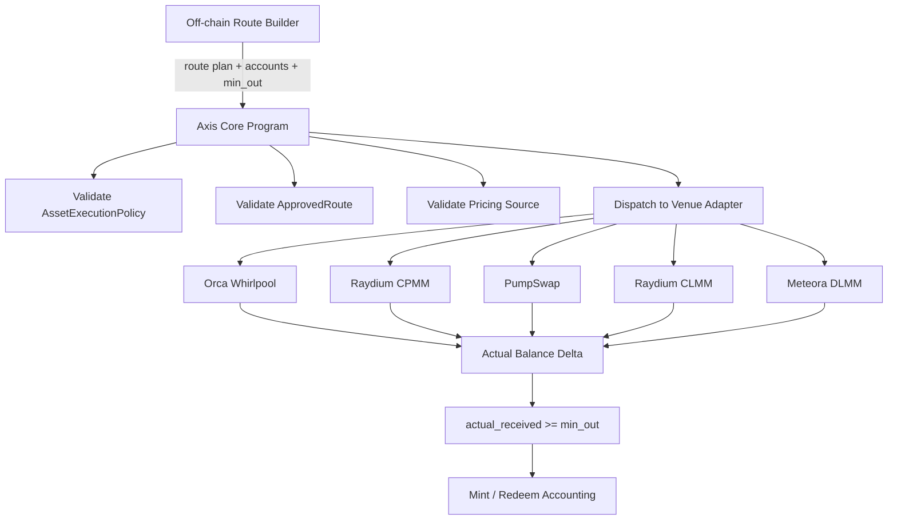

# Swap CPI Execution Requirements

## 1. Overview

Axis v1 must execute swaps through controlled CPI adapters.

Axis should not be a general-purpose DEX aggregator. Route discovery and account assembly may happen off-chain, but the on-chain program must verify execution safety.

## 2. Execution Boundary

```txt
Route discovery / quote / account assembly = off-chain
Execution / verification / accounting       = on-chain
```

## 3. Adapter Architecture



## 4. Requirements

### EXEC-001: Axis must only execute approved venues

The program must reject CPI execution through unapproved venue programs.

Acceptance criteria:

```txt
- approved venue program id passes
- unknown program id fails
```

### EXEC-002: Axis must only execute approved routes

Each swap must match an enabled ApprovedRoute.

Acceptance criteria:

```txt
- route_id exists and enabled -> pass
- route_id missing -> fail
- disabled route -> fail
```

### EXEC-003: Route must match expected input and output mint

Acceptance criteria:

```txt
- mint input route: USDC -> target asset
- redeem output route: reserve asset -> USDC
- mismatched input mint fails
- mismatched output mint fails
```

### EXEC-004: Route must match approved pool

Acceptance criteria:

```txt
- pool_id equals approved pool -> pass
- wrong pool -> fail
```

### EXEC-005: Route must match execution direction

Acceptance criteria:

```txt
- mint route direction is valid for USDC to asset
- redeem route direction is valid for asset to USDC
- reversed or invalid direction fails
```

### EXEC-006: Swap must provide min_out

Each swap must include a minimum output threshold.

Acceptance criteria:

```txt
- missing min_out fails
- min_out of zero should be rejected unless explicitly allowed for a test-only environment
```

### EXEC-007: Swap must verify actual output

```txt
actual_received >= min_out
```

Acceptance criteria:

```txt
- actual_received below min_out fails entire transaction
```

### EXEC-008: Swap accounting must use balance deltas

The program must compare pre and post balances.

Acceptance criteria:

```txt
- output balance delta must be positive
- input balance delta must move in expected direction
- balance delta must use token accounts controlled or validated by Axis
```

### EXEC-009: Swap must enforce max_trade_usdc

Each asset execution must be within the asset's max trade limit.

Acceptance criteria:

```txt
- trade <= max_trade_usdc passes
- trade > max_trade_usdc fails
```

### EXEC-010: Swap must enforce max_price_impact_bps

Acceptance criteria:

```txt
- estimated / execution price impact <= threshold passes
- above threshold fails
```

### EXEC-011: Route complexity must be bounded

v1 should not support arbitrary route graphs.

Requirements:

```txt
- no split routing
- one route per asset per execution
- prefer direct USDC <-> asset routes
- SOL intermediate route only if explicitly approved later
```

### EXEC-012: Axis must not assume Jupiter route readiness equals CPI readiness

Acceptance criteria:

```txt
- Jupiter route_available field cannot auto-register ApprovedRoute
- approved route must map to venue adapter executable by Axis
```

### EXEC-013: First CPI spike should target Orca Whirlpool

The first venue spike should test:

```txt
- SwapV2 CPI feasibility
- compute per swap
- accounts per swap
- multi-swap transaction feasibility
- Pinocchio / no_std integration issues
- Token-2022 / transfer hook gotchas
```

### EXEC-014: Adapter interface should be stable

The adapter interface should conceptually support:

```txt
execute_swap(
  direction,
  input_mint,
  output_mint,
  amount_in,
  min_out,
  route_accounts,
  venue_specific_data
) -> actual_received
```

Acceptance criteria:

```txt
- Axis Core can call adapter without hardcoding venue-specific accounting
- venue-specific accounts are still strictly validated
```

## 5. Venue Priority

Current priority:

```txt
1. Orca Whirlpool CPI Spike
2. Raydium CPMM CPI Spike
3. PumpSwap CPI Spike
4. Raydium CLMM
5. Meteora DLMM
```

## 6. Issue Candidates

```txt
- Define ApprovedRoute account
- Define VenueType enum
- Define RouteDirection enum
- Implement route validation
- Implement generic adapter interface
- Implement Orca Whirlpool CPI spike
- Measure compute/account limits
- Implement actual balance delta helper
- Implement min_out enforcement
- Implement price impact validation
```
