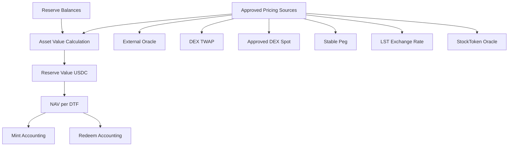

# Pricing & NAV Requirements

## 1. Overview

Axis DTF accounting must be based on actual reserve balances and approved pricing sources.

Target weights are not accounting truth.

## 2. NAV Workflow



## 3. Requirements

### PRICE-001: NAV must be based on actual reserve balances

```txt
asset_value_usdc_i = reserve_balance_i × approved_price_i
reserve_value_usdc = Σ asset_value_usdc_i
nav_per_dtf = reserve_value_usdc / total_dtf_supply
```

Acceptance criteria:

```txt
- target weights are not used as reserve balances
- actual reserve token account balances are used
```

### PRICE-002: Initial NAV must be 1 USDC

If total supply is zero:

```txt
initial_nav = 1 USDC
```

Acceptance criteria:

```txt
- first mint can calculate DTF amount
- first mint does not divide by zero supply
```

### PRICE-003: Pricing source must be asset-specific

Each asset must have an approved pricing source.

Acceptance criteria:

```txt
- stable assets can use StablePeg with depeg checks
- LST assets can use LstExchangeRate
- StockTokens require stronger pricing / manual review
- long-tail may use approved DEX spot under strict caps
```

### PRICE-004: Pricing Source Registry must support multiple source types

Supported source types:

```txt
ExternalOracle
DexTwap
DexSpot
StablePeg
LstExchangeRate
StockTokenOracle
```

### PRICE-005: External oracle prices must be freshness-checked

Acceptance criteria:

```txt
- stale oracle price fails
- configured max_staleness_slots is enforced
```

### PRICE-006: DEX spot pricing must be strictly capped

DEX spot can only be used when the asset policy permits it.

Acceptance criteria:

```txt
- spot-only pricing for StockTokens fails
- spot pricing for long-tail requires strict max_trade_usdc and max_weight_bps
```

### PRICE-007: Stable peg pricing must include depeg checks

Acceptance criteria:

```txt
- USDC assumed base
- non-USDC stable must have depeg threshold
- depegged stable fails pricing check
```

### PRICE-008: LST pricing must use exchange rate and SOL/USD

```txt
lst_value_usdc = lst_sol_exchange_rate × sol_usd_price
```

Acceptance criteria:

```txt
- stale exchange rate fails
- stale SOL/USD fails
```

### PRICE-009: StockToken pricing must require manual review

StockTokens require stronger assumptions.

Acceptance criteria:

```txt
- manual_review_required=true for StockToken assets
- spot-only StockToken pricing fails
- issuer / underlying / restriction notes are required off-chain
```

### PRICE-010: UI price and accounting price must be separated

```txt
UI price != accounting price
```

Acceptance criteria:

```txt
- UI/indexer price cannot be final mint/redeem accounting source
- on-chain approved pricing source is used for protocol accounting
```

### PRICE-011: Pricing deviation must be checked

```txt
deviation_bps = abs(execution_price - reference_price) / reference_price × 10000
deviation_bps <= max_pricing_deviation_bps
```

Acceptance criteria:

```txt
- deviation within threshold passes
- deviation above threshold fails
```

### PRICE-012: Minted DTF must use actual added value

```txt
actual_added_value_usdc = Σ(actual_received_asset_i × approved_price_i)
minted_dtf = actual_added_value_usdc / pre_trade_nav
```

### PRICE-013: Redeem output must use actual USDC received

```txt
actual_usdc_received = post_usdc_balance - pre_usdc_balance
```

## 4. Pricing Tiers

```txt
Oracle Required:
  stable, LST, StockToken, majors

TWAP Allowed:
  meme blue-chip, meme mid-cap, selected DeFi assets

Spot with Strict Caps:
  long-tail memes, experimental assets

Disabled Until Pricing Source:
  no valid pricing source
```

## 5. Issue Candidates

```txt
- Define PricingSource account
- Define PricingSourceType enum
- Implement price freshness checks
- Implement NAV calculator
- Implement initial NAV handling
- Implement pricing deviation checks
- Implement LST exchange rate pricing path
- Implement stable peg/depeg checks
- Implement StockToken pricing restrictions
```
