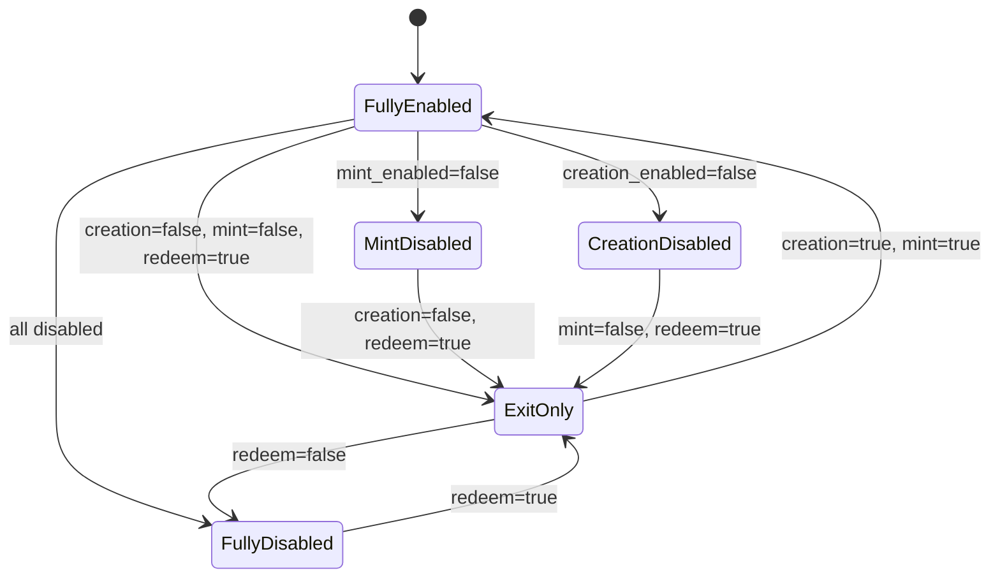

# Execution Policy & Risk Controls

## 1. Overview

Axis v1 Open Version does not use market-level TVL caps.

Risk is controlled through per-asset and per-transaction rules.

## 2. Risk Control Model

```txt
market_tvl_cap = none
```

Risk controls:

```txt
- composition rules
- asset max weight
- asset max trade per transaction
- max price impact
- min_out
- approved route
- pricing deviation
- actual balance delta check
- asset flags
```

## 3. Requirements

### POLICY-001: Market TVL cap must not be required

Acceptance criteria:

```txt
- DTF market can grow beyond any fixed cap
- each individual mint/redeem is still constrained by asset policy
```

### POLICY-002: Each asset must have AssetExecutionPolicy

```txt
AssetExecutionPolicy {
  asset_mint

  creation_enabled
  mint_enabled
  redeem_enabled
  rebalance_enabled

  hard_min_allocation_usdc

  max_trade_usdc
  max_weight_bps
  max_price_impact_bps

  pricing_requirement
  max_pricing_deviation_bps

  approved_route_required
  manual_review_required
}
```

### POLICY-003: hard_min_allocation_usdc must be 1 USDC

```txt
hard_min_allocation_usdc = 1
```

### POLICY-004: Default policy presets must be available

```txt
Core / Stable / LST:
max_trade_usdc = 50,000
max_weight_bps = 10000
max_price_impact_bps = 100

Major / Blue-chip:
max_trade_usdc = 10,000
max_weight_bps = 5000
max_price_impact_bps = 200

Volatile / Mid-cap:
max_trade_usdc = 1,000
max_weight_bps = 2500
max_price_impact_bps = 300

Long-tail:
max_trade_usdc = 250
max_weight_bps = 1000
max_price_impact_bps = 500

StockToken / Restricted:
max_trade_usdc = 1,000
max_weight_bps = 2000
max_price_impact_bps = 300
```

### POLICY-005: Presets must be overrideable per asset

Acceptance criteria:

```txt
- BONK can be treated differently from random long-tail memes
- specific asset policy overrides category default
```

### POLICY-006: Runtime mint must enforce allocation minimum and maximum

```txt
asset_allocation_usdc_i >= 1 USDC
asset_allocation_usdc_i <= asset.max_trade_usdc
```

### POLICY-007: Runtime market creation must enforce max weight

```txt
weight_bps_i <= asset.max_weight_bps
```

### POLICY-008: Runtime execution must enforce max price impact

```txt
price_impact_bps <= asset.max_price_impact_bps
```

### POLICY-009: Single mint max should emerge from asset policy

```txt
single_mint_max_usdc = min(asset.max_trade_usdc / asset.weight_fraction)
```

Example:

```txt
DTF:
90% SOL
10% Long-tail meme

Long-tail max_trade_usdc = 250

single_mint_max_usdc = 250 / 0.10 = 2,500 USDC
```

### POLICY-010: Asset flags must be independent

```txt
AssetExecutionFlags {
  creation_enabled
  mint_enabled
  redeem_enabled
  rebalance_enabled
}
```

### POLICY-011: Emergency exit-only mode must be supported

```txt
creation_enabled = false
mint_enabled = false
redeem_enabled = true
rebalance_enabled = false
```

Acceptance criteria:

```txt
- new creation blocked
- new mint blocked
- existing users can still redeem if route/pricing available
```

## 4. Asset Policy State Machine



## 5. Issue Candidates

```txt
- Implement AssetExecutionPolicy account
- Implement policy preset constants
- Implement policy override handling
- Implement asset flags
- Implement emergency exit-only mode
- Implement single mint max helper
- Implement policy validation tests
```
