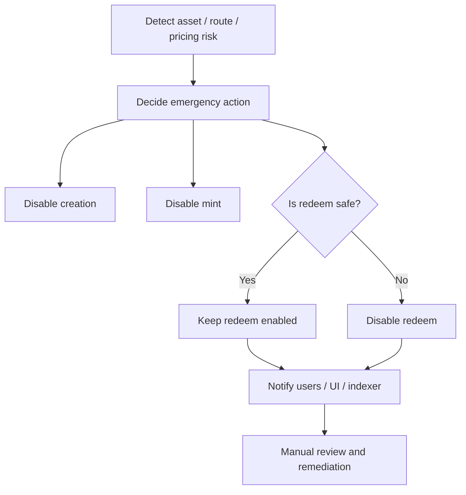

# Admin / Safety Requirements

## 1. Overview

Axis v1 Open Version still needs admin and emergency controls.

The goal is not to limit market TVL, but to stop unsafe actions quickly.

## 2. Requirements

### ADMIN-001: ProtocolConfig must define authorities

Recommended authorities:

```txt
authority
pause_authority
asset_registry_authority
route_registry_authority
pricing_registry_authority
protocol_treasury
```

### ADMIN-002: Asset policy must be updateable by authorized role

Acceptance criteria:

```txt
- unauthorized update fails
- authorized update succeeds
- update is logged/emitted
```

### ADMIN-003: Asset flags must be updateable quickly

Acceptance criteria:

```txt
- emergency can disable creation/mint
- redeem can remain enabled
```

### ADMIN-004: Approved routes must be updateable by route authority

Acceptance criteria:

```txt
- route can be added
- route can be disabled
- route cannot be changed by unauthorized user
```

### ADMIN-005: Pricing sources must be updateable by pricing authority

Acceptance criteria:

```txt
- pricing source can be added
- pricing source can be disabled
- stale/unsafe source can be replaced
```

### ADMIN-006: Market pause must be supported

Acceptance criteria:

```txt
- paused market blocks mint
- paused market may allow redeem depending on policy
- unpause restores normal behavior
```

### ADMIN-007: Dangerous asset response should prefer exit-only mode

Recommended flow:

```txt
1. Set creation_enabled=false
2. Set mint_enabled=false
3. Keep redeem_enabled=true if route/pricing are still valid
4. Disable rebalance
5. Later disable redeem only if redemption itself becomes unsafe
```

## 3. Emergency Workflow



## 4. Issue Candidates

```txt
- Implement ProtocolConfig account
- Implement authority validation
- Implement SetAssetExecutionPolicy
- Implement SetAssetExecutionFlags
- Implement RegisterApprovedRoute
- Implement DisableApprovedRoute
- Implement SetPricingSource
- Implement PauseMarket
- Implement UnpauseMarket
- Implement emergency tests
```
