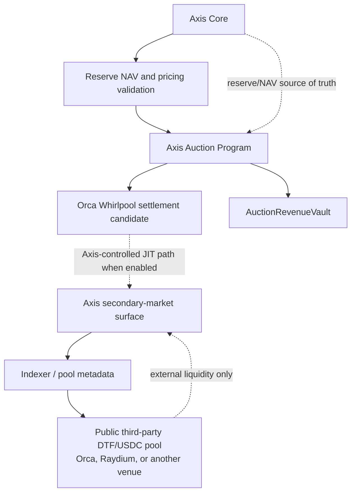

# Auction and LVR Design Research

## 1. Purpose and Status

This document records the resolved design direction and the remaining technical research for Axis-controlled secondary liquidity.

It is not an authorization to claim LVR mitigation for every DTF or every DTF/USDC pool. The implementation-facing requirements are in `18-secondary-market-and-clear-correction-requirements.md`.

The immediate v1 requirement is a launch-day secondary-market surface. Production-grade ClearCorrection and the Axis Auction Program are separately gated by technical-spike results; they are not an August launch blocker.

## 2. Resolved Decisions

### 2.1 Secondary Market at Launch

Axis v1 launches with a secondary-market surface so that created DTFs can be traded, distributed, and used in partner or sponsor campaigns from day one.

This requirement does not require an Axis-native pool or production JIT liquidity for every market at launch.

### 2.2 External Public Pools

Third parties may create public DTF/USDC pools on external venues, including Orca and Raydium. Such pools are external liquidity:

```txt
- they are not part of Axis Core reserve custody or accounting
- they may be indexed or displayed by Axis
- they are not Axis-native liquidity
- Axis must not claim they are protected from LVR by Axis
```

The existence of a public pool does not make its price a reserve NAV source. See `06-pricing-nav-requirements.md`.

### 2.3 LVR Mitigation Scope

Axis-native LVR mitigation applies only to a market that is actively using Axis-controlled auction/JIT liquidity. It is not an attribute of a DTF token, an external venue, or a generic DTF/USDC pair.

### 2.4 Preferred Native-Liquidity Path

The preferred research path is:

```txt
Axis-controlled JIT liquidity on Orca
```

Orca Whirlpool is the first settlement-venue candidate for this path. This is an Axis-controlled JIT/NAV-correction decision, separate from the existing mint/redeem execution policy:

```txt
Mint/redeem: Orca Whirlpool first; Raydium CPMM remains an important fallback.
Native JIT research: Orca Whirlpool first.
Raydium: important mint/redeem fallback and possible external liquidity, not the first native JIT settlement target.
```

### 2.5 Compatibility Is Not Activation

All DTF markets must be architecturally compatible with Axis-controlled JIT liquidity and NAV Correction Auctions. This means the DTF architecture must not preclude later auction/JIT integration.

It does not mean that all DTFs are enabled for auction/JIT liquidity on day one. Per-market activation requires the readiness gates defined in `18-secondary-market-and-clear-correction-requirements.md`.

### 2.6 Program Boundary

ClearCorrection and NAV Correction Auction logic belong in a separate Axis Auction Program.

```txt
Axis Core:
- creates DTF markets
- mints and redeems DTFs
- owns reserve custody and reserve accounting
- calculates NAV and validates pricing sources
- accounts for mint/redeem fees

Axis Auction Program:
- records and validates correction auctions
- authorizes the winning correction executor
- validates correction bounds and settlement preconditions
- coordinates correction settlement
- settles auction payment and emits auction events
```

The Auction Program must not own DTF reserve accounting or convert auction receipts into DTF backing.

### 2.7 Settlement Atomicity

The preferred ClearCorrection execution mode is one transaction. The transaction must either complete the authorized correction and its auction settlement or fail without a partial successful correction.

Jito bundles are a fallback only if the one-transaction path is infeasible and a technical spike proves both of the following:

```txt
- ordered, all-or-nothing execution for the complete correction sequence
- protection against interception by a non-winner between the ordered steps
```

A multi-transaction design that lacks those properties is not an acceptable correction-settlement fallback.

### 2.8 Auction Revenue Separation

Auction revenue is distinct from:

```txt
- DTF reserve assets and NAV
- mint fees
- redeem fees, if introduced in a future version
```

The expected model is an `AuctionRevenueVault` or equivalent dedicated account boundary. Revenue distribution, claim mechanics, denomination, and recipients are configurable/TBD; no revenue split is decided here.

## 3. Architecture



An indexed external pool remains external even if it is displayed next to an enabled native-liquidity configuration. The app and indexer must expose that distinction.

## 4. ClearCorrection Working Model

ClearCorrection is a bounded, winner-authorized settlement action that moves an enabled Axis-controlled liquidity configuration toward verified reserve NAV. It is not a generic right to access or trade Axis reserves.

At a conceptual level, a successful settlement must establish all of the following:

```txt
- the auction is open, unexpired, and associated with the stated DTF market
- the caller is the valid winner for that auction
- the target pool and venue configuration are the enabled Axis-controlled configuration
- required NAV and pricing inputs meet freshness and validation requirements
- the correction direction and result meet configured bounds
- the winning payment is settled to dedicated auction-revenue accounting
- Axis Core reserve, NAV, and mint/redeem accounting remain correct and isolated
```

The final on-chain account layout and instruction arguments are not yet specified. In particular, correction-size limits, deviation triggers, auction duration, bid selection rules, and revenue allocation are configurable/TBD.

## 5. Relationship to Mint and Redeem

Mint and redeem remain the primary, reserve-backed lifecycle and remain governed by Axis Core. They stay atomic, route-builder prepared, ApprovedRoute validated, and balance-delta verified as specified in `03-mint-requirements.md`, `04-redeem-requirements.md`, and `05-swap-cpi-execution-requirements.md`.

A correction strategy may economically involve minting or redeeming, but that does not move reserve accounting into the Auction Program. Any interaction between the two programs must preserve the Axis Core validation boundary and must be proved in the technical spike.

Route-builder candidate competition remains useful for primary mint/redeem planning. It is not Axis's LVR mitigation mechanism and must not be described as one.

## 6. Technical Feasibility Questions Still Open

The following are implementation questions, not unresolved product-direction decisions.

### 6.1 Orca Whirlpool JIT Control

```txt
- Can the required Whirlpool liquidity-position and swap operations be invoked with the required authorities and account model?
- Can Axis control the JIT lifecycle tightly enough to enforce winner-only correction settlement?
- Which tick-array, position, token-account, and authority inputs are required for the bounded correction path?
```

### 6.2 One-Transaction Feasibility

```txt
- Does the complete correction sequence fit Solana account and compute limits?
- Can the sequence include auction validation, pricing validation, JIT liquidity changes, settlement, payment transfer, and event emission in one transaction?
- What DTF asset-count and route conditions remain feasible for the initial path?
```

### 6.3 NAV, Pricing, and Route Inputs

```txt
- Which verified NAV/pricing inputs can be supplied and checked during settlement?
- How are stale or incomplete component prices rejected without blocking safe exits from Axis Core?
- Can the correction path obtain all required route and venue-account inputs under the ApprovedRoute model?
```

### 6.4 Authorization and Interception Resistance

```txt
- How are winner authority, expiry, replay protection, and pool binding enforced on-chain?
- How is a non-winner prevented from copying the correction opportunity or observing intermediate state?
- If Jito is necessary, do its validated bundle semantics preserve the required order and atomicity?
```

### 6.5 Failure and Recovery

```txt
- What happens when the winner does not settle before expiry?
- Can the auction expire or be retried without changing reserves, incorrectly collecting payment, or leaving a JIT position exposed?
- What pause and disable controls are needed for a market-specific native-liquidity configuration?
```

## 7. Required Technical Spikes

The research is complete enough to direct bounded implementation spikes:

1. **Orca Whirlpool JIT spike** — prove the required JIT liquidity and bounded settlement operations against realistic Whirlpool accounts.
2. **Atomic ClearCorrection spike** — measure a one-transaction path that validates auction state and fresh pricing, performs the authorized settlement, accounts for revenue, and rolls back on failure.
3. **Core/Auction boundary spike** — prove that any correction strategy involving mint or redeem preserves Axis Core as the reserve, NAV, and accounting authority.
4. **Jito fallback spike, only if needed** — demonstrate ordered atomic execution and non-winner interception protection; otherwise reject the fallback.
5. **Safety and adversarial-path spike** — test stale pricing, wrong pool, wrong winner, replay, expired auction, partial-failure attempts, and incorrect revenue-vault routing.

The spikes must report account count, compute usage, required authorities, transaction ordering assumptions, failure behavior, and any DTF market classes that cannot safely activate.

## 8. Activation Outcome

The spike result may enable Axis-controlled JIT liquidity only for market configurations that satisfy every readiness gate. It may also conclude that the launch-day secondary-market surface remains external-only while native settlement research continues.

Either outcome preserves the v1 launch requirement. Only the first outcome permits a market-specific Axis-native LVR-mitigation claim.

## 9. Deferred Parameter Decisions

Do not set protocol defaults in this document for:

```txt
- deviation or correction thresholds
- maximum correction size
- auction duration or bidding schedule
- bid type or winner-selection method
- JIT liquidity range and inventory limits
- auction revenue split or recipients
- supported initial market subset
```

These are configurable/TBD and can be selected only after the technical spikes establish the safe implementation envelope.
