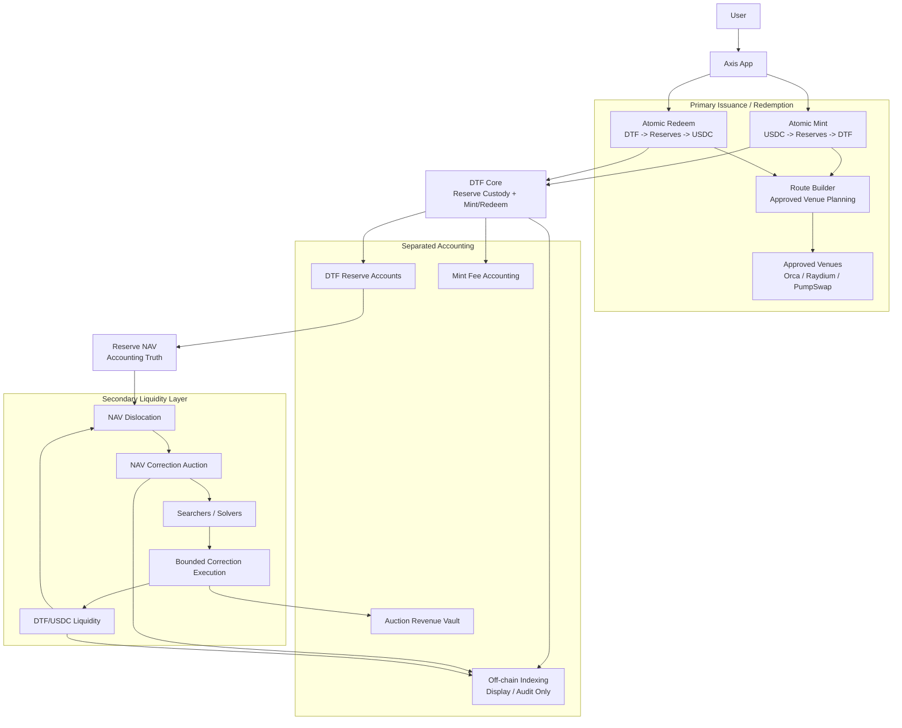
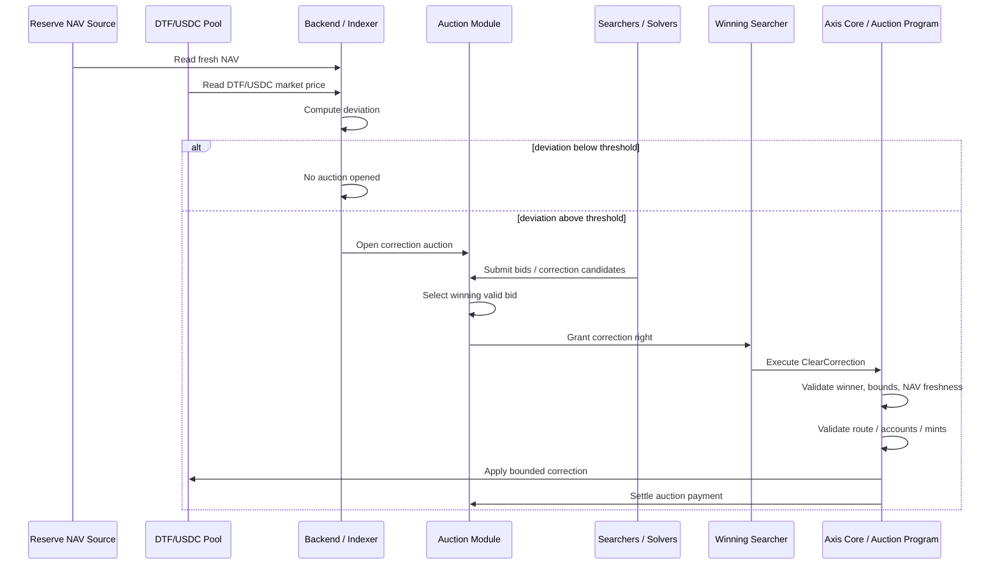
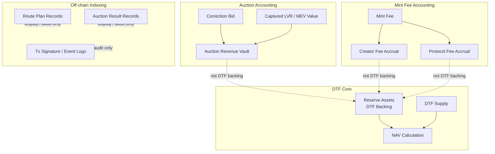

# Auction and LVR Design Research

## 1. Overview

This document is a design research memo for the Axis v1 auction mechanism.

It is not yet a final requirements document.

The goal is to decide how Axis should redesign its original PFDA / Periodic Batch Auction direction for the current DTF v1 architecture.

Axis should not directly reuse Uniswap-style PFDA.

Axis should not treat a simple backend route candidate auction as sufficient LVR mitigation.

Axis must design a DTF-native auction mechanism that is compatible with:

```txt
- reserve-backed DTFs
- atomic mint / redeem
- DTF NAV accounting
- secondary DTF liquidity
- Solana execution constraints
- ApprovedRoute constraints
- Jito / searcher competition
- creator / protocol fee accounting
```

## 2. Starting Point

The original Axis whitepaper used the following principle:

```txt
Asset custody and price formation are separate concerns.
```

In the original design:

```txt
axis-vault:
- holds assets
- creates ETFs
- mints / burns ETF tokens
- handles deposit / withdrawal
- handles fee accounting

pfda-amm-3:
- forms prices
- batches swap requests
- clears batches at oracle-bounded prices
- internalizes searcher competition through Jito bids
```

The current DTF v1 redesign changes the product architecture.

Current DTF v1 direction:

```txt
DTF Core:
- creates DTF markets
- holds underlying reserves
- mints DTF with USDC
- redeems DTF to USDC
- validates actual balance deltas
- computes NAV from actual reserves
- handles creator/protocol fee accounting

Route Builder:
- prepares mint/redeem route plans
- references ApprovedRoute
- assembles venue accounts
- suggests min_out / min_usdc_out
- remains advisory

Production Venues:
- Orca Whirlpool
- Raydium CPMM fallback
- PumpSwap later
```

The design challenge is to restore the original auction-first market structure without breaking the new reserve-backed DTF accounting model.

## 3. Core Problem

Without an auction-aware market structure, Axis risks becoming:

```txt
reserve-backed basket token issuance
+
ordinary secondary LP
```

This is not enough.

If a DTF/USDC pool is a normal passive AMM, the LP is exposed to NAV dislocation.

The likely failure mode:

```txt
1. Underlying reserve assets move in price.
2. DTF reserve NAV changes.
3. DTF/USDC pool price lags behind NAV.
4. Searchers arbitrage the stale pool price.
5. LPs absorb LVR / adverse selection.
6. Arbitrage value leaks to searchers / validators instead of protocol / LPs / creators.
```

For Axis, this problem is amplified because a DTF is not a single asset.

A DTF represents a multi-asset reserve-backed position.

Therefore, DTF/USDC liquidity is exposed to the combined price movement of multiple underlying assets.

## 4. Key Design Conclusion

A backend route candidate auction is not enough.

It can improve mint/redeem execution quality, but it does not stop searchers from arbitraging stale DTF/USDC liquidity.

The real LVR mitigation surface is the DTF/USDC liquidity layer.

Therefore, Axis needs an auction-gated DTF liquidity mechanism.

The auction should not sell a generic protocol fee discount.

The auction should sell a bounded right to correct DTF market price toward reserve NAV.

Working term:

```txt
Axis NAV Correction Auction
```

or:

```txt
Axis Correction Right Auction
```

## 5. Design Principle

Axis should preserve the original separation:

```txt
DTF Core holds and accounts for reserves.
Auction Layer forms or corrects prices.
```

Updated version:

```txt
DTF Core:
- reserve custody
- DTF mint / redeem
- actual balance delta accounting
- fee accounting
- NAV source of truth

Auction Layer:
- secondary DTF/USDC liquidity
- NAV correction rights
- batch or bounded clearing
- searcher competition
- LVR / MEV capture
```

The auction layer must not compromise reserve accounting.

The auction layer must not treat auction revenue as DTF backing.

The auction layer must not give searchers arbitrary access to DTF reserves.

## 6. What Must Not Be Done

### 6.1 Do not directly copy Uniswap PFDA

Uniswap-style PFDA is a useful reference, but the mechanism does not map directly onto Axis.

Reasons:

```txt
- Axis is reserve-backed DTF infrastructure, not a single AMM pool.
- Axis DTF price is anchored by reserve NAV.
- Axis mint/redeem is atomic and accounting-sensitive.
- Axis execution depends on ApprovedRoute and venue adapters.
- Solana MEV is mediated through Jito bundle infrastructure, not Ethereum PBS.
- DTF liquidity can involve multi-asset NAV drift, not only single-pair price drift.
```

### 6.2 Do not treat route builder candidate selection as LVR mitigation

Route builder candidate selection helps with:

```txt
- best execution
- route quality
- quote comparison
- venue fallback
- solver participation
```

But it does not solve:

```txt
- passive DTF/USDC LP being picked off
- NAV dislocation leakage
- stale pool price arbitrage
- secondary market LVR
```

### 6.3 Do not mix auction liquidity with DTF reserve backing

DTF reserve accounts are backing assets for DTF holders.

Auction liquidity, LP inventory, solver bids, and auction revenue are separate accounting categories.

## 7. Architecture



## 8. Auction Surfaces

Axis has two auction-related surfaces.

### 8.1 Execution Candidate Competition

This is useful but not sufficient for LVR.

Purpose:

```txt
Find the best valid atomic execution plan for user mint/redeem.
```

Used for:

```txt
- mint route planning
- redeem route planning
- venue selection
- solver quote comparison
```

This belongs mostly in:

```txt
16-route-builder-backend-api-requirements.md
```

It should remain secondary to the main LVR mitigation mechanism.

### 8.2 NAV Correction Auction

This is the core LVR mitigation surface.

Purpose:

```txt
Auction the right to correct DTF/USDC market price toward reserve NAV.
```

Used for:

```txt
- DTF/USDC secondary liquidity
- NAV dislocation correction
- searcher competition
- LP LVR reduction / recapture
- protocol / LP / creator value capture
```

This belongs in:

```txt
17-auction-and-lvr-design-research.md
```

and later:

```txt
17-auction-and-lvr-mitigation-requirements.md
```

## 9. NAV Correction Auction: Concept

The NAV Correction Auction sells a bounded correction right.

The auctioned right:

```txt
The right to execute a correction trade that moves DTF/USDC market price toward reserve NAV within strict protocol-defined bounds.
```

The winner may profit from the NAV dislocation, but only after bidding for the right.

The bid or capture value can be redirected to:

```txt
- protocol
- LPs
- creators
- market-level incentive bucket
```

The exact distribution is not finalized in this document.

## 10. NAV Correction Flow



## 11. Where LVR Is Controlled

The key control point is not user transaction planning.

The key control point is the ability to trade against stale DTF/USDC liquidity.

Therefore, Axis-native DTF liquidity must be auction-gated.

Possible policy:

```txt
Small ordinary swaps:
- may be allowed within normal bounds

Large NAV correction trades:
- require winning correction right

Price-moving arbitrage trades:
- must either pay protocol capture or go through auction
```

Open question:

```txt
Should all DTF/USDC swaps be batch-cleared, or only NAV correction / arbitrage-sized swaps?
```

## 12. Auction-Gated Pool Model

The DTF/USDC liquidity pool should not be a normal passive AMM if Axis wants to mitigate LVR.

The pool should include:

```txt
- NAV reference
- deviation threshold
- correction window
- auction winner account
- correction direction
- max correction size
- price improvement rule
- bid settlement rule
- expiry slot
```

A correction trade should be valid only if:

```txt
- caller is winning searcher / solver
- auction window is active
- NAV is fresh
- market price deviation exceeds threshold
- trade moves price toward NAV
- trade does not exceed max correction size
- bid / capture payment is settled
- DTF reserve backing is not corrupted
```

## 13. ClearCorrection Instruction Concept

A future Axis auction module may expose an instruction similar to:

```txt
ClearCorrection
```

Conceptual responsibilities:

```txt
- verify auction state
- verify winning searcher
- verify DTF market
- verify DTF/USDC pool
- verify fresh NAV / oracle inputs
- verify correction direction
- verify max size
- verify price improvement
- execute correction trade
- settle auction payment
- emit correction event
```

This instruction should be atomic.

If correction fails:

```txt
- no pool state is partially updated
- no auction payment is settled as successful
- no DTF reserve accounting is affected
```

## 14. Relationship to Mint / Redeem

Mint and redeem remain primary issuance and redemption flows.

They should stay atomic.

They should not become fully asynchronous batch auction flows unless a separate design explicitly chooses that direction.

Current recommendation:

```txt
Mint/Redeem:
- atomic
- reserve-backed
- route builder prepared
- ApprovedRoute validated
- actual balance delta verified

Secondary DTF Liquidity:
- auction-gated
- NAV correction rights
- LVR mitigation surface
```

However, mint/redeem can be part of a correction strategy.

Example premium correction:

```txt
DTF market price > NAV
-> searcher mints DTF near NAV
-> searcher sells DTF into secondary market
-> premium compresses
```

Example discount correction:

```txt
DTF market price < NAV
-> searcher buys DTF from secondary market
-> searcher redeems DTF near NAV
-> discount compresses
```

The design must specify whether these correction strategies are permissionless, auction-gated, or size-gated.

## 15. Relationship to Existing PFDA-3

Original PFDA-3 features worth preserving:

```txt
- discrete clearing windows
- aggregated order state
- searcher competition
- Jito-mediated clearing
- bid proceeds to protocol treasury
- oracle-bounded clearing prices
- no per-order clearing loop
- O(1) batch clearing property
```

Original PFDA-3 features that may not directly fit DTF v1:

```txt
- fixed 3-token pool constraint
- SwapRequest / Claim async UX for all users
- reserve-ratio price formation as primary pricing path
- PFDA pool independence from DTF market state
- lack of direct DTF NAV integration
- lack of creator fee / DTF market metadata integration
```

Design translation:

```txt
PFDA-3 ClearBatch
-> NAV Correction / Auction-Gated Clearing

PFDA-3 Searcher Bid
-> Correction Right Bid

PFDA-3 Oracle-Bounded Price
-> NAV / Oracle / Reserve-Bounded Correction

PFDA-3 BatchQueue
-> Correction Window / Aggregated Intent Queue, if needed

PFDA-3 Claim
-> Optional asynchronous settlement, only if batch order flow is used
```

## 16. Design Options

### Option A: Ordinary AMM + Route Builder

Description:

```txt
DTF/USDC liquidity is provided through ordinary AMMs.
Route builder handles mint/redeem.
```

Assessment:

```txt
- easiest to ship
- does not solve LVR
- weak moat
- searchers can still extract NAV dislocation
```

Recommendation:

```txt
Reject as long-term market structure.
May be acceptable only as temporary external liquidity path.
```

### Option B: Execution Candidate Auction Only

Description:

```txt
Backend selects best mint/redeem execution candidate.
```

Assessment:

```txt
- improves user execution
- useful for route planning
- does not control secondary LP LVR
- does not prevent direct arbitrage
```

Recommendation:

```txt
Keep as part of route builder, but do not call it the core LVR solution.
```

### Option C: Auction-Gated NAV Correction Pool

Description:

```txt
DTF/USDC liquidity includes auction-gated correction rights.
Large NAV correction trades require winning auction rights.
```

Assessment:

```txt
- directly targets LVR leakage
- preserves atomic mint/redeem
- compatible with DTF reserve NAV
- requires new auction module / pool rules
```

Recommendation:

```txt
Preferred design direction.
```

### Option D: Full Asynchronous Periodic Batch Auction

Description:

```txt
All DTF/USDC swaps go through SwapRequest -> ClearBatch -> Claim.
```

Assessment:

```txt
- closest to original PFDA-3
- strongest auction-first design
- heavier UX
- more complex implementation
- may be difficult for retail instant swaps
```

Recommendation:

```txt
Study as future or advanced version.
May be used for large orders, rebalances, or dedicated auction markets.
```

## 17. Recommended Direction

Recommended current direction:

```txt
Axis should design an auction-gated DTF/USDC liquidity layer.

The first LVR-focused auction surface should be NAV Correction Auction.

The auction should sell correction rights, not generic fee discounts.

Mint/redeem should remain atomic.

Route builder candidate competition should remain useful but should not be treated as the LVR solution.
```

Design path:

```txt
v1 architecture:
- DTF Core
- atomic mint/redeem
- backend route builder
- ApprovedRoute execution
- auction-aware design hooks
- NAV correction auction specification

v1 implementation target:
- minimum viable auction-gated DTF liquidity path, if feasible
- otherwise no public claim that LVR is solved

v1.1:
- external solver participation
- explicit correction bid market
- Jito bundle integration
- auction revenue accounting

v2:
- full batch clearing
- permissionless correction auctions
- larger basket-aware auction markets
```

## 18. Required Research Questions

Before converting this into requirements, the following questions must be answered.

### 18.1 Market Structure

```txt
- Is Axis-native DTF/USDC liquidity required for v1 launch?
- If yes, is it an auction-gated pool or a batch auction market?
- Are ordinary swaps allowed at all?
- Should only large correction trades be auction-gated?
- What threshold defines a correction trade?
```

### 18.2 Auction Right

```txt
- What exactly is being sold?
- Correction right?
- Clearing right?
- Priority execution right?
- Rebalance right?
- How long does the right last?
- Can it be transferred?
- Can it be cancelled?
```

### 18.3 Searcher / Solver

```txt
- Who can bid?
- Is bidding permissionless?
- Is there a solver registry?
- Are bids submitted through Jito bundles?
- Are bids submitted to backend first?
- Are bids visible on-chain?
```

### 18.4 On-Chain Enforcement

```txt
- How does the program prevent direct arbitrage bypassing the auction?
- Does the DTF/USDC pool reject correction-sized swaps from non-winners?
- How is correction size measured?
- How is price improvement verified?
- What happens if the winner fails to clear?
```

### 18.5 NAV / Oracle

```txt
- What NAV source is used?
- How fresh must NAV be?
- Is NAV computed on-chain or provided with verification inputs?
- What oracle sources are required?
- What happens if one asset oracle is stale?
- Is strict all-feed freshness required?
```

### 18.6 Accounting

```txt
- Where does auction bid revenue go?
- Is revenue distributed to LPs, protocol, creators, or market treasury?
- Is auction revenue claim-based?
- Is it denominated in USDC, SOL, DTF, or underlying assets?
- How is it separated from DTF reserve backing?
```

### 18.7 UX

```txt
- Does the user experience remain instant for small swaps?
- Do large swaps become batch-cleared?
- Does mint/redeem remain synchronous?
- How does the app explain auction delay or correction windows?
```

## 19. Mermaid: Accounting Separation



## 20. Interim Decision

The current interim decision is:

```txt
Do not finalize auction requirements yet.

First, complete the auction / LVR design research.

Then convert the selected design into requirements.
```

Current preferred design hypothesis:

```txt
Axis should implement or at least architect around an auction-gated DTF/USDC liquidity layer where searchers bid for NAV correction rights.

This is the actual LVR mitigation surface.

A backend execution candidate auction is useful, but not sufficient.
```

## 21. Next Steps

Recommended next steps:

```txt
1. Research Ethereum LVR mitigation mechanisms.
2. Research Diamond AMM / PFDA / batch auction designs.
3. Research Solana-specific Jito / bundle / searcher infrastructure.
4. Compare original PFDA-3 with current DTF v1 architecture.
5. Decide whether v1 requires auction-gated secondary liquidity at launch.
6. Decide whether small swaps remain immediate and large corrections are auction-gated.
7. Define NAV Correction Auction state machine.
8. Define required on-chain accounts and instructions.
9. Convert this research memo into 17-auction-and-lvr-mitigation-requirements.md.
```

## 22. Open Questions

```txt
- Is auction-gated DTF/USDC liquidity mandatory for v1 launch?
- Should ordinary DTF/USDC swaps be allowed outside auction?
- What size or deviation threshold triggers auction gating?
- Should correction rights be first-price auctions?
- Should winner selection happen on-chain, via Jito bundle inclusion, or through backend coordination?
- How does Axis prevent non-winners from bypassing the correction auction?
- How is NAV computed and verified during correction?
- How is auction revenue distributed?
- Can correction auctions work for 2 to 5 asset DTFs without excessive compute?
- Should the initial implementation support only 2 or 3 asset DTFs for auction markets?
```
