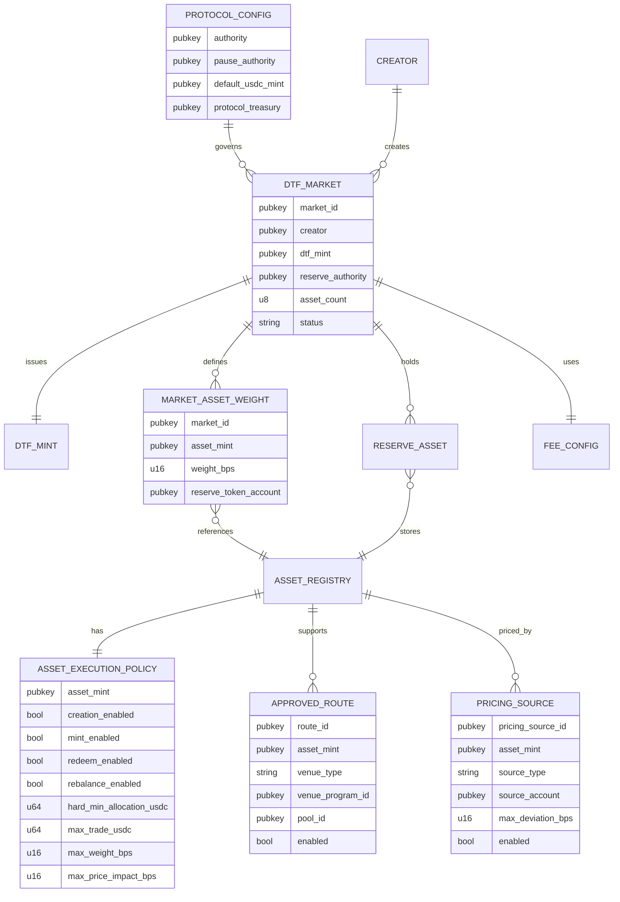

# Accounts Spec

## 1. ProtocolConfig

Global configuration account.

```txt
ProtocolConfig {
  authority: Pubkey
  pause_authority: Pubkey
  asset_registry_authority: Pubkey
  route_registry_authority: Pubkey
  pricing_registry_authority: Pubkey
  default_usdc_mint: Pubkey
  protocol_treasury: Pubkey

  mint_fee_bps: u16          // = 100
  redeem_fee_bps: u16        // = 0
  creator_share_bps: u16     // = 4000
  protocol_share_bps: u16    // = 6000
  max_mint_fee_bps: u16      // = 300
  max_redeem_fee_bps: u16    // = 0

  bump: u8
}
```

Requirements:

```txt
- must be initialized once per deployment
- must define default USDC mint
- must define all authorities
- must define protocol fee config (source of truth for market fee snapshots)
- mint_fee_bps <= max_mint_fee_bps and redeem_fee_bps <= max_redeem_fee_bps
- creator_share_bps + protocol_share_bps == 10000
```

## 2. DTFMarket

Represents one DTF market.

```txt
DTFMarket {
  market_id: Pubkey
  creator: Pubkey
  dtf_mint: Pubkey
  reserve_authority: Pubkey
  asset_count: u8
  status: MarketStatus
  total_weight_bps: u16
  fee_config: Pubkey
  created_at_slot: u64
  bump: u8
}
```

Status:

```txt
Created
Active
Paused
Deprecated
```

## 3. MarketAssetWeight

One account or packed entry per market asset.

```txt
MarketAssetWeight {
  market: Pubkey
  asset_mint: Pubkey
  weight_bps: u16
  reserve_token_account: Pubkey
  index: u8
}
```

Requirements:

```txt
- asset_mint must be registered
- weight_bps >= 100
- sum across market must equal 10000
```

## 4. AssetRegistry

Asset metadata and universe membership.

```txt
AssetRegistry {
  asset_mint: Pubkey
  symbol_hash: [u8; 32]
  category: AssetCategory
  decimals: u8
  is_universe_asset: bool
  is_placeholder: bool
  manual_review_required: bool
}
```

AssetCategory:

```txt
MemeBlueChip
MemeMidCap
MemeLongTail
StockToken
SolanaDeFiInfra
AIDePINAgent
StableLSTYield
Experimental
```

## 5. AssetExecutionPolicy

```txt
AssetExecutionPolicy {
  asset_mint: Pubkey

  creation_enabled: bool
  mint_enabled: bool
  redeem_enabled: bool
  rebalance_enabled: bool

  hard_min_allocation_usdc: u64

  max_trade_usdc: u64
  max_weight_bps: u16
  max_price_impact_bps: u16

  pricing_requirement: PricingRequirement
  max_pricing_deviation_bps: u16

  approved_route_required: bool
  manual_review_required: bool
}
```

PricingRequirement:

```txt
OracleRequired
TwapAllowed
SpotWithStrictCaps
DisabledUntilPricingSource
```

## 6. ApprovedRoute

```txt
ApprovedRoute {
  route_id: Pubkey
  asset_mint: Pubkey
  quote_mint: Pubkey
  direction: RouteDirection
  venue_type: VenueType
  venue_program_id: Pubkey
  pool_id: Pubkey
  input_mint: Pubkey
  output_mint: Pubkey
  max_trade_usdc: u64
  max_price_impact_bps: u16
  max_accounts: u16
  requires_token_2022: bool
  enabled: bool
}
```

RouteDirection:

```txt
UsdcToAsset
AssetToUsdc
```

VenueType:

```txt
OrcaWhirlpool
RaydiumCPMM
PumpSwap
RaydiumCLMM
MeteoraDLMM
```

## 7. PricingSource

```txt
PricingSource {
  pricing_source_id: Pubkey
  asset_mint: Pubkey
  source_type: PricingSourceType
  source_account: Pubkey
  quote_mint: Pubkey
  max_staleness_slots: u64
  max_deviation_bps: u16
  enabled: bool
}
```

PricingSourceType:

```txt
ExternalOracle
DexTwap
DexSpot
StablePeg
LstExchangeRate
StockTokenOracle
```

## 8. Fee State

Fee model is confirmed and required from Axis v1 launch. See `requirements/13-fee-model-requirements.md`.

Protocol-level fee config (source of truth for fee values):

```txt
ProtocolFeeConfig {
  mint_fee_bps: u16          // = 100
  redeem_fee_bps: u16        // = 0
  creator_share_bps: u16     // = 4000
  protocol_share_bps: u16    // = 6000
  max_mint_fee_bps: u16      // = 300
  max_redeem_fee_bps: u16    // = 0
  protocol_treasury: Pubkey
}
```

Market-level fee state (derived from protocol config / preset at market creation, immutable afterward):

```txt
MarketFeeState {
  creator: Pubkey
  creator_fee_destination: Pubkey
  mint_fee_bps: u16
  redeem_fee_bps: u16
  creator_share_bps: u16
  protocol_share_bps: u16
  accrued_creator_fee_usdc: u64
  accrued_protocol_fee_usdc: u64
}
```

Constraints:

```txt
- market fee bps are not creator-customizable
- market fee config is immutable after market creation
- accrued fees are not reserves and are excluded from NAV
- fee custody must be separate from reserve custody
```

## 9. Reserve Token Accounts

Reserve token accounts should be controlled by Axis.

Requirements:

```txt
- one reserve token account per market asset
- mint matches asset_mint
- owner/authority matches expected reserve authority
- balance delta used for accounting
```

## 10. ER Diagram


